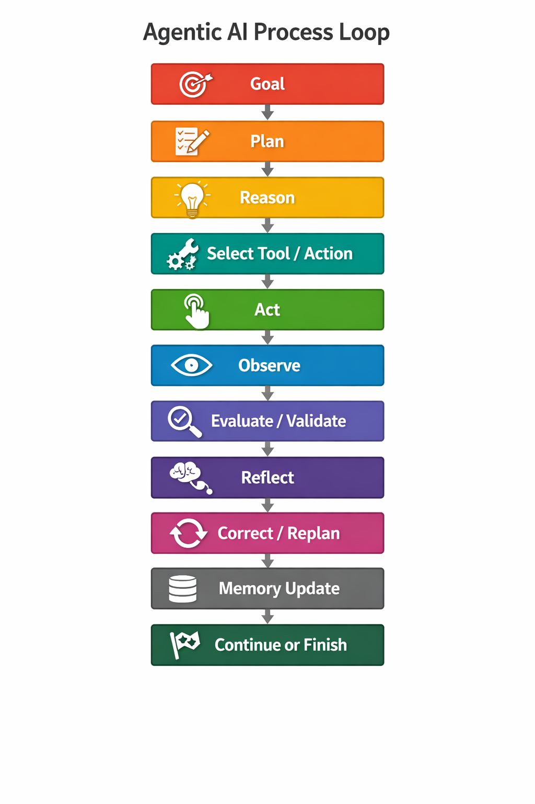
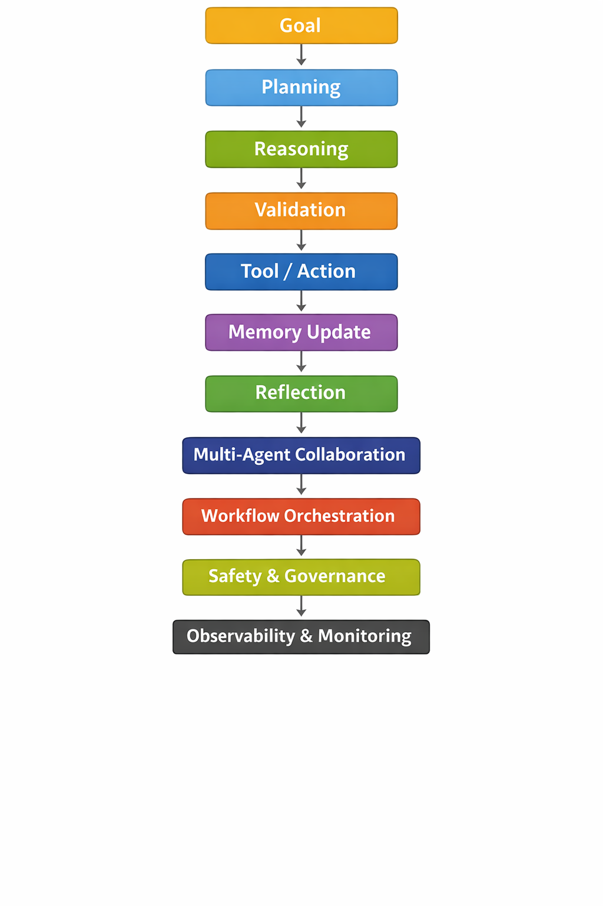

# Agentic AI Process



# Agentic AI Pattern Categories
| Order | Pattern Category                                   | Purpose                                               |
| ----- | -------------------------------------------------- | ----------------------------------------------------- |
| 1     | **Planning Cognitive Patterns**                    | Define goal and create execution plan                 |
| 2     | **Reasoning Cognitive Patterns**                   | Analyze information and decide strategy               |
| 3     | **Validation Patterns**                            | Verify plan, constraints, and safety before execution |
| 4     | **Tool-Use / Action Patterns**                     | Execute actions using tools, APIs, or systems         |
| 5     | **Memory Patterns**                                | Retrieve and store contextual knowledge               |
| 6     | **Reflection / Self-Improvement Patterns**         | Evaluate results and improve reasoning                |
| 7     | **Multi-Agent Collaboration Patterns**             | Coordinate with other agents if needed                |
| 8     | **Orchestration & Workflow Patterns**              | Manage workflow execution and task coordination       |
| 9     | **Safety, Governance & Guardrail Patterns**        | Ensure compliance, policies, and safe operations      |
| 10    | **Learning & Optimization Patterns**               | Improve strategies using feedback and experience      |
| 11    | **Observability, Monitoring & Debugging Patterns** | Monitor, trace, and debug agent behavior              |

# Pattern Usage Frequency (Very Important)
| Pattern Category | Usage Frequency |
| ---------------- | --------------- |
| Planning         | ⭐⭐⭐⭐⭐           |
| Reasoning        | ⭐⭐⭐⭐⭐           |
| Tool Use         | ⭐⭐⭐⭐⭐           |
| Memory           | ⭐⭐⭐⭐            |
| Reflection       | ⭐⭐⭐⭐            |
| Validation       | ⭐⭐⭐⭐            |
| Orchestration    | ⭐⭐⭐             |
| Multi-Agent      | ⭐⭐⭐             |
| Safety           | ⭐⭐⭐⭐            |
| Learning         | ⭐⭐              |
| Observability    | ⭐⭐⭐⭐            |




- **Core cognitive loop** → always used
- **System capabilities** → used only when needed
- **Platform capabilities** → run around the agent continuously


# The Real Agent Execution Flow

## Core Cognitive Loop (Always Used)

```
Goal
 ↓
Planning
 ↓
Reasoning
 ↓
Validation
 ↓
Tool / Action
 ↓
Observation
 ↓
Reflection
 ↓
Memory Update
 ↓
Continue or Finish
```

| Layer           | Categories                                  | Purpose                            |
| --------------- | ------------------------------------------- | ---------------------------------- |
| Cognitive Layer | Planning, Reasoning, Validation, Reflection | Agent thinking                     |
| Execution Layer | Tool Use, Memory                            | Agent interaction with environment |
| System Layer    | Multi-Agent, Orchestration, Safety          | Agent system control               |
| Platform Layer  | Learning, Observability                     | Improvement & monitoring           |


## Complete System Flow

```
User Goal
   ↓
Planning
   ↓
Reasoning
   ↓
Validation
   ↓
Tool / Action
   ↓
Observation
   ↓
Reflection
   ↓
Memory Update
```

## Real Example Architecture

```
                Observability
                     │
              Learning & Optimization
                     │
      Safety / Governance / Guardrails
                     │
        Orchestration & Multi-Agent
                     │
             ┌─────────────────┐
             │  Cognitive Loop │
             │                 │
             │ Planning        │
             │ Reasoning       │
             │ Validation      │
             │ Tool Action     │
             │ Reflection      │
             │ Memory          │
             └─────────────────┘
```

## Enterprise Autonomous Agent

```
Planning
Reasoning
Validation
Tool Use
Memory
Reflection
Multi-Agent
Orchestration
Safety
Learning
Observability
```

## Medium Agent (RAG Assistant)

```
Planning
Reasoning
Validation
Tool Use
Memory
Reflection
Safety
Observability
```

## Simple Agent (Chatbot)

```
Planning
Reasoning
Tool Use
Memory
Reflection
Observability
```


# Planning Cognitive Patterns

| #  | Pattern                   | Description                                         | Example                                                           |
| -- | ------------------------- | --------------------------------------------------- | ----------------------------------------------------------------- |
| 1  | Plan-Then-Execute         | Create a full plan first, then execute step by step | Agent plans steps to deploy an application before running scripts |
| 2  | Plan-Act-Reflect          | Plan → execute → evaluate results → improve         | Incident remediation agent fixes issue then evaluates logs        |
| 3  | Iterative Planning        | Plan improves after each step                       | Agent troubleshooting a server adjusts plan after each check      |
| 4  | Goal Decomposition        | Break goal into smaller objectives                  | “Fix outage” → check DB → check API → restart service             |
| 5  | Task Decomposition        | Divide tasks into atomic actions                    | Deploy app → build → test → deploy                                |
| 6  | Hierarchical Planning     | Multi-level planning (strategic → tasks)            | Cloud provisioning: infra plan → network → compute → storage      |
| 7  | Milestone Planning        | Plan based on checkpoints                           | Software release pipeline stages                                  |
| 8  | Contingency Planning      | Backup plan if failure occurs                       | If DB restart fails → failover to replica                         |
| 9  | Risk-Aware Planning       | Evaluate risk before actions                        | Agent avoids deleting production resources                        |
| 10 | Budget-Aware Planning     | Plan within cost limits                             | FinOps agent chooses cheaper cloud instance                       |
| 11 | Deadline-Aware Planning   | Plan optimized for time constraints                 | CI/CD pipeline ensuring deployment before deadline                |
| 12 | Resource-Aware Planning   | Consider CPU, memory, tools available               | Agent schedules batch jobs based on cluster capacity              |
| 13 | Dependency Planning       | Plan tasks based on dependencies                    | Database must start before API                                    |
| 14 | Backtracking Planning     | Revert plan when path fails                         | Agent tries alternative troubleshooting steps                     |
| 15 | Scenario Planning         | Plan for multiple possible outcomes                 | If traffic spike → auto-scale service                             |
| 16 | Planner-Validator Loop    | Plan validated before execution                     | Security policy checks plan before running                        |
| 17 | Opportunistic Planning    | Use opportunities discovered during execution       | Agent uses cached results to skip redundant tasks                 |
| 18 | Approval-Aware Planning   | Plan includes human approval steps                  | Production DB change requires manager approval                    |
| 19 | Adaptive Planning         | Plan changes dynamically with new data              | Monitoring agent adjusts strategy after anomaly detection         |
| 20 | Parallel Planning         | Plan tasks that can run simultaneously              | Data pipeline processes multiple partitions                       |
| 21 | Autonomous Loop Planning  | Agent continuously plans in loop                    | Autonomous monitoring agent resolving incidents                   |
| 22 | Predictive Planning       | Plan based on predicted future state                | Predict traffic spikes and scale resources early                  |
| 23 | Reinforcement Planning    | Improve planning via feedback/rewards               | RL agent optimizing resource allocation                           |
| 24 | Simulation-Based Planning | Test plan in simulation before execution            | Disaster recovery simulation                                      |
| 25 | Multi-Agent Planning      | Multiple agents collaborate to plan                 | Planner agent + security agent + executor agent                   |
| 26 | Dynamic Planning          | Plan updated when environment changes               | Kubernetes autoscaling agent adjusting plan                       |
| 27 | Strategic Planning        | Long-term objective planning                        | AI roadmap planning for enterprise transformation                 |
| 28 | Tactical Planning         | Mid-term operational planning                       | Weekly infrastructure upgrades                                    |
| 29 | Reactive Planning         | Immediate response planning                         | Agent responding to service outage                                |
| 30 | Proactive Planning        | Plan to prevent issues before they happen           | Predictive maintenance agent                                      |

# Reasoning Cognitive Patterns
| #  | Pattern                    | Description                                       | Example                                            |
| -- | -------------------------- | ------------------------------------------------- | -------------------------------------------------- |
| 1  | Chain-of-Thought (CoT)     | Step-by-step reasoning before answering           | Agent explains steps while diagnosing server issue |
| 2  | Tree-of-Thought (ToT)      | Explore multiple reasoning branches               | Agent evaluates several remediation strategies     |
| 3  | Graph-of-Thought (GoT)     | Non-linear reasoning graph                        | Complex research agent connecting ideas            |
| 4  | Hypothesis Testing         | Generate and test hypotheses                      | API failure → check network → check DB             |
| 5  | Self-Consistency Reasoning | Generate multiple reasoning paths and select best | LLM runs multiple solutions to choose correct one  |
| 6  | Analogical Reasoning       | Solve new problems using similar past cases       | Incident similar to previous outage                |
| 7  | Deductive Reasoning        | Apply rules to reach conclusion                   | If CPU >90% then scale service                     |
| 8  | Inductive Reasoning        | Infer pattern from data                           | Logs show repeated timeout errors                  |
| 9  | Abductive Reasoning        | Find most likely explanation                      | Error spike likely due to DB overload              |
| 10 | Causal Reasoning           | Identify cause-effect relationships               | Memory leak causing system slowdown                |
| 11 | Counterfactual Reasoning   | Consider alternate scenarios                      | If we restart DB, will latency drop?               |
| 12 | Multi-Step Reasoning       | Combine several reasoning stages                  | Analyze logs → metrics → network                   |
| 13 | Recursive Reasoning        | Reason about reasoning steps                      | Agent checks its own logic chain                   |
| 14 | Reflective Reasoning       | Self-evaluate reasoning                           | Agent checks if its conclusion makes sense         |
| 15 | Debate Reasoning           | Multiple agents argue different viewpoints        | Risk agent vs performance agent                    |
| 16 | Critic-Generator Loop      | One agent generates, another critiques            | Code generation + review agent                     |
| 17 | Evaluator-Optimizer        | Evaluate output and refine it                     | Content agent improves generated report            |
| 18 | Verification Reasoning     | Check correctness of reasoning                    | Verify data from monitoring system                 |
| 19 | Confidence Estimation      | Assign probability/confidence to answer           | 80% confidence DB is root cause                    |
| 20 | Evidence-Based Reasoning   | Use evidence before conclusions                   | Metrics confirm high CPU                           |
| 21 | Constraint-Based Reasoning | Solve within constraints                          | Cannot restart production DB                       |
| 22 | Decision Tree Reasoning    | Use rule-based decision trees                     | If network error → check gateway                   |
| 23 | Monte Carlo Reasoning      | Explore probabilistic outcomes                    | Predict best scaling option                        |
| 24 | Bayesian Reasoning         | Update belief with new evidence                   | Probability of network issue increases             |
| 25 | Heuristic Reasoning        | Use shortcuts based on experience                 | Most outages caused by config change               |
| 26 | Comparative Reasoning      | Compare alternatives                              | Restart vs scale service                           |
| 27 | Sequential Reasoning       | Solve tasks step-by-step                          | Diagnose application failure                       |
| 28 | Scenario Reasoning         | Evaluate different scenarios                      | Traffic spike vs code bug                          |
| 29 | Meta-Reasoning             | Reason about how to reason                        | Decide which reasoning method to use               |
| 30 | Consensus Reasoning        | Multiple agents vote on solution                  | Security + reliability agents decide fix           |

# Validation Pattern
| #  | Pattern                     | Description                               | Example                        |
| -- | --------------------------- | ----------------------------------------- | ------------------------------ |
| 1  | Input Validation            | Validate incoming user input              | Reject malformed request       |
| 2  | Output Validation           | Validate generated output                 | Ensure JSON format correct     |
| 3  | Plan Validation             | Verify generated plan before execution    | Validate deployment plan       |
| 4  | Tool Input Validation       | Validate parameters before calling tool   | Check SQL query parameters     |
| 5  | Tool Output Validation      | Verify tool response integrity            | Validate API response schema   |
| 6  | Policy Validation           | Ensure plan follows policy rules          | Security policy enforcement    |
| 7  | Constraint Validation       | Validate constraints like budget/time     | Prevent exceeding cost limit   |
| 8  | Schema Validation           | Validate structured data format           | JSON schema validation         |
| 9  | Data Consistency Validation | Ensure data consistency                   | Validate database records      |
| 10 | Dependency Validation       | Check dependencies before execution       | Ensure DB service running      |
| 11 | Permission Validation       | Verify agent permissions                  | RBAC permission check          |
| 12 | Safety Validation           | Check action safety                       | Prevent destructive commands   |
| 13 | Environment Validation      | Verify system environment                 | Ensure correct cluster context |
| 14 | Resource Validation         | Validate resource availability            | Ensure enough CPU/memory       |
| 15 | Precondition Validation     | Check prerequisites before execution      | Confirm service running        |
| 16 | Postcondition Validation    | Validate outcome after execution          | Verify deployment succeeded    |
| 17 | Result Verification         | Verify correctness of result              | Check output accuracy          |
| 18 | Multi-Agent Validation      | Multiple agents validate result           | Validator agent approves       |
| 19 | Cross-Source Validation     | Validate against multiple sources         | Compare monitoring systems     |
| 20 | Confidence Validation       | Accept output only above threshold        | Require confidence > 80%       |
| 21 | Simulation Validation       | Validate action in simulation             | Test infra change first        |
| 22 | Dry-Run Validation          | Simulate tool execution                   | Terraform plan preview         |
| 23 | Human Validation            | Human approves result                     | Security approval              |
| 24 | Compliance Validation       | Validate regulatory compliance            | GDPR check                     |
| 25 | Consistency Validation      | Compare multiple outputs                  | Ensure results match           |
| 26 | Quality Validation          | Check output quality metrics              | Validate summary completeness  |
| 27 | Data Integrity Validation   | Verify data accuracy                      | Check checksum                 |
| 28 | Context Validation          | Validate contextual correctness           | Ensure correct user context    |
| 29 | Runtime Validation          | Validate during execution                 | Detect runtime errors          |
| 30 | Continuous Validation       | Validate continuously throughout workflow | Monitor deployment success     |


# Reflection / Self-Improvement Patterns
| #  | Pattern                    | Description                                         | Example                                           |
| -- | -------------------------- | --------------------------------------------------- | ------------------------------------------------- |
| 1  | Reflexion                  | Agent critiques its previous answer and improves it | Code agent reviews its own generated code         |
| 2  | Self-Critique              | Evaluate output quality before returning            | Agent checks if explanation is correct            |
| 3  | Retry with Feedback        | Retry task using feedback from previous attempt     | LLM regenerates SQL query after error             |
| 4  | Learning from Failure      | Store failures to avoid repeating them              | Incident agent remembers failed remediation       |
| 5  | Output Review              | Validate output quality internally                  | Generated report checked for completeness         |
| 6  | Error Detection            | Detect incorrect reasoning or output                | Agent detects hallucinated data                   |
| 7  | Root Cause Reflection      | Analyze why an error happened                       | Agent identifies incorrect assumption             |
| 8  | Self-Verification          | Verify results with tools or data                   | Validate API response with monitoring data        |
| 9  | Iterative Improvement      | Improve output through multiple iterations          | Improve generated code step-by-step               |
| 10 | Reflection Loop            | Continuous reflect → improve cycle                  | Research agent refining findings                  |
| 11 | Performance Feedback Loop  | Improve based on performance metrics                | Agent adjusts strategy based on success rate      |
| 12 | Confidence Adjustment      | Modify output based on confidence level             | Agent lowers confidence if uncertain              |
| 13 | Peer Review                | Another agent evaluates the result                  | Critic agent reviews planner output               |
| 14 | Self-Consistency Check     | Compare multiple generated outputs                  | Select most consistent answer                     |
| 15 | Corrective Reasoning       | Adjust reasoning after reflection                   | Recalculate plan after mistake                    |
| 16 | Plan Revision              | Update plan after evaluating results                | Modify troubleshooting plan                       |
| 17 | Memory Reinforcement       | Store successful patterns for future                | Save best remediation solution                    |
| 18 | Reward-Based Improvement   | Improve behavior using reward signals               | RL agent optimizing strategy                      |
| 19 | Negative Feedback Learning | Learn from negative outcomes                        | Agent avoids unsafe actions                       |
| 20 | Quality Scoring            | Score output quality before finalizing              | Evaluate report accuracy                          |
| 21 | Error Recovery Strategy    | Recover from failed attempts                        | Agent retries different approach                  |
| 22 | Hypothesis Revision        | Modify hypothesis after new evidence                | Adjust root cause analysis                        |
| 23 | Reflection-Guided Planning | Reflection influences next plan                     | Adjust troubleshooting steps                      |
| 24 | Audit Reflection           | Review execution logs to improve                    | Compliance agent reviewing actions                |
| 25 | Safety Reflection          | Check if action violates safety rules               | Prevent destructive operations                    |
| 26 | Confidence Calibration     | Adjust confidence based on evidence                 | Lower confidence if data limited                  |
| 27 | Continuous Learning        | Improve from historical data                        | Customer support agent learning from past tickets |
| 28 | Meta-Reflection            | Reflect on reasoning strategy itself                | Decide better reasoning approach                  |
| 29 | Self-Optimization          | Improve efficiency or performance                   | Reduce unnecessary tool calls                     |
| 30 | Knowledge Update           | Update internal knowledge or memory                 | Store new troubleshooting steps                   |

# Tool-Use / Action Patterns
| #  | Pattern                   | Description                                   | Example                                    |
| -- | ------------------------- | --------------------------------------------- | ------------------------------------------ |
| 1  | Tool Selection            | Agent chooses the appropriate tool for a task | Choose `kubectl` to restart a pod          |
| 2  | Function Calling          | Call predefined functions or APIs             | LLM calls `get_weather(city)`              |
| 3  | API Invocation            | Use external APIs to perform actions          | Call payment gateway API                   |
| 4  | CLI Execution             | Execute command line tools                    | Run `kubectl scale deployment`             |
| 5  | Database Query Tool       | Retrieve or update data in databases          | Query PostgreSQL for logs                  |
| 6  | Search Tool               | Use search engines or knowledge base          | Agent searches documentation               |
| 7  | Retrieval Tool            | Fetch documents from vector DB or RAG system  | Retrieve knowledge from Pinecone           |
| 8  | Tool Chaining             | Sequentially combine multiple tools           | Query DB → analyze results → update record |
| 9  | Parallel Tool Execution   | Run multiple tools simultaneously             | Check logs and metrics at the same time    |
| 10 | Conditional Tool Use      | Select tools based on conditions              | If CPU > 90% → scale cluster               |
| 11 | Tool Retry                | Retry tool when execution fails               | Retry API call after timeout               |
| 12 | Tool Fallback             | Switch to alternative tool if one fails       | Use backup monitoring API                  |
| 13 | Tool Validation           | Validate tool inputs and outputs              | Ensure SQL query syntax correct            |
| 14 | Tool Result Parsing       | Convert tool output into structured data      | Parse JSON response from API               |
| 15 | Tool Composition          | Combine outputs of multiple tools             | Merge metrics and logs                     |
| 16 | Tool Loop Execution       | Repeatedly call tool until condition met      | Poll system health until stable            |
| 17 | Tool Approval             | Require human approval before tool execution  | Approve production DB change               |
| 18 | Tool Safety Guard         | Prevent unsafe tool usage                     | Block `delete database` command            |
| 19 | Tool Rate Limiting        | Limit tool calls to prevent overload          | Restrict API calls per minute              |
| 20 | Tool Cost Control         | Monitor cost of tool usage                    | Limit expensive API calls                  |
| 21 | Tool Monitoring           | Track tool performance and success            | Log API latency and success rate           |
| 22 | Tool Logging              | Record tool calls for auditing                | Save all executed commands                 |
| 23 | Tool Timeout Handling     | Handle tool execution timeout                 | Retry command if timeout occurs            |
| 24 | Tool Result Caching       | Cache tool outputs for reuse                  | Cache API results                          |
| 25 | Tool Delegation           | Assign tool execution to another agent        | Executor agent performs CLI command        |
| 26 | Multi-Tool Orchestration  | Coordinate multiple tools in workflow         | Monitor → diagnose → remediate             |
| 27 | Tool Capability Discovery | Agent discovers available tools dynamically   | Query tool registry                        |
| 28 | Tool Context Injection    | Provide context when calling tools            | Pass user session to API                   |
| 29 | Tool Simulation           | Simulate tool execution before real action    | Test infrastructure change                 |
| 30 | Tool Sandbox Execution    | Run tool in safe sandbox environment          | Test script in isolated container          |

# Memory Patterns
| #  | Pattern                  | Description                                | Example                                  |
| -- | ------------------------ | ------------------------------------------ | ---------------------------------------- |
| 1  | Short-Term Memory        | Temporary memory during task execution     | Agent remembers conversation context     |
| 2  | Long-Term Memory         | Persistent memory across sessions          | Store past troubleshooting solutions     |
| 3  | Episodic Memory          | Store past events or experiences           | Record incident remediation history      |
| 4  | Semantic Memory          | Store factual knowledge                    | Knowledge base of company policies       |
| 5  | Procedural Memory        | Store how-to knowledge or workflows        | Runbook for database recovery            |
| 6  | Context Memory           | Maintain conversation context              | Chatbot remembering previous question    |
| 7  | Task Memory              | Store progress of ongoing task             | Multi-step workflow state                |
| 8  | Session Memory           | Memory limited to current session          | Temporary user preferences               |
| 9  | Shared Memory            | Memory shared across agents                | Multi-agent collaboration context        |
| 10 | Agent-Specific Memory    | Memory unique to one agent                 | Planner agent storing planning patterns  |
| 11 | Retrieval Memory         | Fetch memory using embeddings or indexes   | Vector DB search                         |
| 12 | Vector Memory            | Store embeddings in vector database        | Pinecone storing knowledge vectors       |
| 13 | Graph Memory             | Knowledge stored as relationships          | Knowledge graph linking incidents        |
| 14 | Key-Value Memory         | Store structured data as key-value pairs   | Redis storing session info               |
| 15 | Event Memory             | Store system events                        | Log monitoring history                   |
| 16 | Temporal Memory          | Time-aware memory storage                  | Track system behavior over time          |
| 17 | Incremental Memory       | Continuously update memory                 | Add new support cases to knowledge       |
| 18 | Memory Consolidation     | Merge related memories                     | Combine repeated troubleshooting results |
| 19 | Memory Compression       | Summarize memory to reduce size            | Compress long conversation history       |
| 20 | Memory Pruning           | Remove irrelevant or outdated memory       | Delete obsolete logs                     |
| 21 | Priority Memory          | Store high-priority knowledge first        | Critical outage runbooks                 |
| 22 | Memory Versioning        | Track versions of stored knowledge         | Different versions of system configs     |
| 23 | Memory Validation        | Verify stored knowledge accuracy           | Confirm runbook correctness              |
| 24 | Memory Retrieval Ranking | Rank retrieved memory results              | Choose best troubleshooting case         |
| 25 | Contextual Memory Recall | Retrieve memory relevant to current task   | Incident similar to previous outage      |
| 26 | Memory Reinforcement     | Strengthen frequently used knowledge       | Popular solution reused often            |
| 27 | Memory Sharing           | Share knowledge across multiple agents     | Planner shares context with executor     |
| 28 | Privacy-Aware Memory     | Protect sensitive stored information       | Mask user credentials                    |
| 29 | Policy-Aware Memory      | Store memory according to compliance rules | GDPR compliant data storage              |
| 30 | Learning Memory          | Update memory based on agent learning      | Improve troubleshooting recommendations  |

# Multi-Agent Collaboration Patterns
| #  | Pattern                     | Description                               | Example                                                      |
| -- | --------------------------- | ----------------------------------------- | ------------------------------------------------------------ |
| 1  | Planner-Executor Pattern    | One agent plans, another executes         | Planner agent creates deployment plan, executor runs scripts |
| 2  | Supervisor Pattern          | One agent supervises others               | Supervisor agent monitors worker agents                      |
| 3  | Hierarchical Agents         | Multi-level command structure             | Manager agent coordinating specialist agents                 |
| 4  | Peer-to-Peer Collaboration  | Agents communicate directly               | Two research agents share findings                           |
| 5  | Specialist Agents           | Each agent has domain expertise           | Security agent + DevOps agent                                |
| 6  | Role-Based Agents           | Agents assigned predefined roles          | Planner, Executor, Validator                                 |
| 7  | Agent Delegation            | Agent assigns subtask to another          | Research agent delegates data analysis                       |
| 8  | Coordinator Agent           | Central agent coordinates workflow        | Workflow orchestration agent                                 |
| 9  | Consensus Decision          | Agents vote on decision                   | Risk agents vote before approving action                     |
| 10 | Debate Pattern              | Agents argue different perspectives       | Security agent vs performance agent                          |
| 11 | Critic-Generator Pattern    | One agent generates, another critiques    | Code generator + code reviewer                               |
| 12 | Multi-Agent Planning        | Multiple agents contribute to plan        | Infrastructure + security planning                           |
| 13 | Agent Pipeline              | Sequential agent workflow                 | Research → summarize → report                                |
| 14 | Parallel Agents             | Agents run tasks simultaneously           | Data processing across nodes                                 |
| 15 | Blackboard Architecture     | Shared workspace for agents               | Agents update shared task board                              |
| 16 | Agent Market / Bidding      | Agents bid to perform task                | Agent with best capability executes                          |
| 17 | Task Routing                | Route tasks to best agent                 | Customer query routed to billing agent                       |
| 18 | Negotiation Pattern         | Agents negotiate resource allocation      | Compute resource distribution                                |
| 19 | Conflict Resolution         | Resolve disagreement between agents       | Security vs performance trade-off                            |
| 20 | Shared Memory Collaboration | Agents share context memory               | Planner shares context with executor                         |
| 21 | Event-Driven Collaboration  | Agents triggered by events                | Alert triggers remediation agent                             |
| 22 | Chain-of-Agents             | Agents pass results sequentially          | Data extraction → analysis → visualization                   |
| 23 | Federated Agents            | Agents operate across distributed systems | Multi-cloud monitoring agents                                |
| 24 | Swarm Agents                | Large number of small agents collaborate  | Distributed web crawling agents                              |
| 25 | Dynamic Agent Creation      | Agents created on demand                  | Temporary agents for specific task                           |
| 26 | Agent Termination Pattern   | Remove agents when task finished          | Temporary worker agent shuts down                            |
| 27 | Agent Capability Discovery  | Agents discover other agents' skills      | Agent registry lookup                                        |
| 28 | Leader-Follower Pattern     | Leader agent coordinates workers          | Master agent managing tasks                                  |
| 29 | Agent Orchestration         | Central system orchestrates agents        | LangGraph workflow                                           |
| 30 | Multi-Agent Learning        | Agents learn from each other              | Knowledge sharing among agents                               |

# Safety, Governance & Guardrail Patterns
| #  | Pattern                               | Description                                          | Example                                          |
| -- | ------------------------------------- | ---------------------------------------------------- | ------------------------------------------------ |
| 1  | Input Validation                      | Validate user inputs before processing               | Reject malformed API request                     |
| 2  | Output Validation                     | Verify generated output before returning             | Ensure SQL query is safe                         |
| 3  | Policy Enforcement                    | Ensure actions follow enterprise policies            | Block deleting production DB                     |
| 4  | Role-Based Access Control (RBAC)      | Restrict agent actions based on role                 | Dev agent cannot modify security rules           |
| 5  | Attribute-Based Access Control (ABAC) | Access based on attributes like user, time, location | Only admin allowed during maintenance window     |
| 6  | Approval Workflow                     | Require human approval before critical actions       | Approve infrastructure changes                   |
| 7  | Human-in-the-Loop                     | Pause execution for human decision                   | Security review before deployment                |
| 8  | Risk Assessment                       | Evaluate risk before action                          | Agent checks blast radius before scaling cluster |
| 9  | Safety Filters                        | Detect harmful or restricted actions                 | Block data deletion commands                     |
| 10 | Sensitive Data Masking                | Hide confidential information                        | Mask credit card numbers                         |
| 11 | PII Protection                        | Detect and protect personal data                     | Redact personal details in logs                  |
| 12 | Compliance Enforcement                | Follow regulatory requirements                       | GDPR data processing checks                      |
| 13 | Action Allowlist                      | Only allow predefined safe actions                   | Only approved APIs callable                      |
| 14 | Action Blocklist                      | Block specific dangerous actions                     | Block `DROP DATABASE`                            |
| 15 | Budget Guardrails                     | Prevent exceeding cost limits                        | Stop agent after spending threshold              |
| 16 | Rate Limiting                         | Limit request frequency                              | Restrict API calls per minute                    |
| 17 | Tool Permission Control               | Restrict which tools agents can use                  | Agent cannot call destructive CLI commands       |
| 18 | Safety Sandbox                        | Execute actions in isolated environment              | Test commands in container sandbox               |
| 19 | Execution Dry Run                     | Simulate action before real execution                | Preview Terraform changes                        |
| 20 | Confidence Threshold                  | Only execute if confidence high enough               | Require >80% certainty                           |
| 21 | Multi-Agent Validation                | Multiple agents verify action                        | Security agent validates deployment              |
| 22 | Audit Logging                         | Record all actions for traceability                  | Log every CLI command executed                   |
| 23 | Traceability                          | Track reasoning and decisions                        | Maintain reasoning trace                         |
| 24 | Policy-Aware Planning                 | Plan actions based on governance rules               | Avoid risky infrastructure changes               |
| 25 | Kill Switch                           | Emergency shutdown of agent                          | Disable autonomous remediation                   |
| 26 | Timeout Guardrail                     | Stop long-running tasks                              | Abort infinite loops                             |
| 27 | Escalation Policy                     | Escalate issues to human operators                   | Notify SRE team for critical incidents           |
| 28 | Context Isolation                     | Prevent cross-session data leakage                   | Separate user contexts                           |
| 29 | Trust Verification                    | Verify external data sources                         | Validate monitoring API data                     |
| 30 | Ethical Compliance                    | Ensure ethical AI behavior                           | Prevent harmful recommendations                  |

# Orchestration & Workflow Patterns
| #  | Pattern                     | Description                                         | Example                                 |
| -- | --------------------------- | --------------------------------------------------- | --------------------------------------- |
| 1  | Centralized Orchestrator    | One central controller manages all tasks and agents | Workflow engine controlling all agents  |
| 2  | Decentralized Orchestration | Agents coordinate without a central controller      | Peer agents collaborating directly      |
| 3  | Workflow Pipeline           | Tasks executed sequentially in stages               | Data ingestion → processing → reporting |
| 4  | Event-Driven Workflow       | Tasks triggered by events                           | Alert triggers remediation workflow     |
| 5  | State Machine Workflow      | Execution based on defined states                   | Incident lifecycle management           |
| 6  | DAG Workflow                | Directed Acyclic Graph task dependencies            | ETL pipelines                           |
| 7  | Step-by-Step Workflow       | Execute tasks one step at a time                    | Troubleshooting process                 |
| 8  | Parallel Workflow           | Multiple tasks executed simultaneously              | Multi-region monitoring checks          |
| 9  | Conditional Workflow        | Execution based on conditions                       | If CPU > 90% then scale cluster         |
| 10 | Retry Workflow              | Automatically retry failed tasks                    | Retry failed API call                   |
| 11 | Fallback Workflow           | Use alternative workflow if primary fails           | Switch to backup service                |
| 12 | Loop Workflow               | Repeat task until condition satisfied               | Poll service until healthy              |
| 13 | Branching Workflow          | Workflow splits into multiple paths                 | Different remediation strategies        |
| 14 | Aggregation Workflow        | Combine results from multiple tasks                 | Merge analysis results                  |
| 15 | Approval Workflow           | Require approval before next step                   | Production change approval              |
| 16 | Human Task Workflow         | Human performs part of workflow                     | Manual security review                  |
| 17 | Multi-Agent Workflow        | Multiple agents participate in workflow             | Planner → Executor → Validator          |
| 18 | Task Queue Workflow         | Tasks distributed via queue                         | Worker agents consuming tasks           |
| 19 | Microservice Orchestration  | Coordinate microservices                            | Order processing pipeline               |
| 20 | Saga Workflow               | Manage distributed transactions                     | Payment processing rollback             |
| 21 | Compensation Workflow       | Undo previous steps if failure occurs               | Rollback deployment                     |
| 22 | Long-Running Workflow       | Workflow that runs for extended duration            | Data processing jobs                    |
| 23 | Checkpoint Workflow         | Save progress at checkpoints                        | Resume workflow after failure           |
| 24 | Streaming Workflow          | Process continuous data streams                     | Real-time log processing                |
| 25 | Dynamic Workflow            | Workflow generated at runtime                       | AI agent generates execution plan       |
| 26 | Policy-Aware Workflow       | Workflow controlled by policy rules                 | Security compliance checks              |
| 27 | Resource-Aware Workflow     | Allocate resources dynamically                      | Scale compute for heavy tasks           |
| 28 | Budget-Aware Workflow       | Optimize workflow based on cost                     | Choose cheaper compute nodes            |
| 29 | Observability Workflow      | Monitor execution metrics                           | Track workflow performance              |
| 30 | Self-Healing Workflow       | Automatically recover from failures                 | Restart failed pipeline stage           |

# Learning & Optimization Patterns
| #  | Pattern                        | Description                                  | Example                                         |
| -- | ------------------------------ | -------------------------------------------- | ----------------------------------------------- |
| 1  | Reinforcement Learning         | Learn optimal actions through reward signals | Agent improves resource allocation              |
| 2  | Feedback Learning              | Improve outputs based on feedback            | User feedback improves chatbot responses        |
| 3  | Human Feedback Learning (RLHF) | Learn from human corrections                 | Human ranks best generated answer               |
| 4  | Self-Learning                  | Agent learns from its own experiences        | Agent stores successful solutions               |
| 5  | Continuous Learning            | Incrementally update knowledge               | Customer support agent learning from tickets    |
| 6  | Online Learning                | Learn in real time during operation          | Fraud detection model updating with new data    |
| 7  | Offline Learning               | Train using historical data                  | Train agent with past incident logs             |
| 8  | Experience Replay              | Reuse past experiences for learning          | Replay past system failures                     |
| 9  | Reward Optimization            | Maximize reward signals                      | Optimize cloud cost savings                     |
| 10 | Policy Optimization            | Improve action policies                      | Update decision rules                           |
| 11 | Adaptive Learning              | Adjust behavior dynamically                  | Adjust scaling strategy based on load           |
| 12 | Meta-Learning                  | Learn how to learn better                    | Agent improves problem-solving strategies       |
| 13 | Transfer Learning              | Apply knowledge to new tasks                 | Apply troubleshooting knowledge across services |
| 14 | Curriculum Learning            | Learn tasks from simple to complex           | Train agent gradually                           |
| 15 | Exploration-Exploitation       | Balance trying new vs known strategies       | Try new scaling strategies                      |
| 16 | Performance Monitoring         | Track system performance metrics             | Monitor agent success rate                      |
| 17 | Self-Optimization              | Improve efficiency automatically             | Reduce unnecessary tool calls                   |
| 18 | Cost Optimization              | Optimize actions to minimize cost            | Choose cheaper cloud instance                   |
| 19 | Latency Optimization           | Reduce execution time                        | Optimize query execution                        |
| 20 | Resource Optimization          | Efficient resource allocation                | Optimize compute usage                          |
| 21 | Error Pattern Learning         | Learn from repeated failures                 | Recognize recurring outage patterns             |
| 22 | Strategy Adaptation            | Modify strategy based on outcomes            | Change incident response strategy               |
| 23 | Behavior Tuning                | Adjust agent behavior parameters             | Adjust retry strategy                           |
| 24 | Knowledge Expansion            | Expand knowledge base over time              | Add new troubleshooting guides                  |
| 25 | Multi-Agent Learning           | Agents learn from each other                 | Share knowledge across agents                   |
| 26 | Reward Shaping                 | Modify reward signals to guide learning      | Encourage faster solutions                      |
| 27 | Confidence Calibration         | Adjust confidence estimation                 | Improve answer reliability                      |
| 28 | Automated Benchmarking         | Evaluate performance against benchmarks      | Compare agent performance across tasks          |
| 29 | Continuous Evaluation          | Evaluate outputs continuously                | Monitor response quality                        |
| 30 | Autonomous Improvement Loop    | Self-improving feedback loop                 | Agent improves remediation strategies           |

# Observability, Monitoring & Debugging Patterns
| #  | Pattern                       | Description                              | Example                              |
| -- | ----------------------------- | ---------------------------------------- | ------------------------------------ |
| 1  | Execution Tracing             | Track full execution path of an agent    | Trace planner → executor → validator |
| 2  | Reasoning Trace               | Capture reasoning steps for debugging    | Log chain-of-thought steps           |
| 3  | Tool Call Logging             | Record all tool/API calls                | Log every API request                |
| 4  | Telemetry Collection          | Collect runtime metrics                  | Track token usage                    |
| 5  | Metrics Monitoring            | Monitor performance metrics              | Response latency dashboard           |
| 6  | Agent Health Monitoring       | Monitor agent availability               | Alert when agent crashes             |
| 7  | Error Logging                 | Record system errors                     | Log failed API calls                 |
| 8  | Failure Analysis              | Analyze causes of failures               | Identify tool timeout errors         |
| 9  | Incident Detection            | Detect anomalies automatically           | Alert when agent behaves abnormally  |
| 10 | Performance Profiling         | Analyze resource usage                   | CPU usage per agent                  |
| 11 | Token Usage Tracking          | Monitor token consumption                | Optimize LLM cost                    |
| 12 | Latency Monitoring            | Track response time                      | Measure agent decision time          |
| 13 | Action Auditing               | Record actions for compliance            | Audit infrastructure changes         |
| 14 | Decision Transparency         | Show reasoning behind decisions          | Explain why agent chose action       |
| 15 | Workflow Visualization        | Visualize agent workflow                 | Graph view of execution path         |
| 16 | Trace Correlation             | Link logs across systems                 | Connect logs from multiple agents    |
| 17 | Distributed Tracing           | Trace across distributed agents          | Multi-agent workflow tracing         |
| 18 | Debug Mode Execution          | Run agent in debug mode                  | Print reasoning steps                |
| 19 | Replay Debugging              | Replay agent execution                   | Replay past incident resolution      |
| 20 | Simulation Debugging          | Test scenarios without production impact | Simulate outage                      |
| 21 | Root Cause Debugging          | Identify root cause of agent failures    | Analyze reasoning path               |
| 22 | Observability Dashboard       | Central monitoring dashboard             | AgentOps monitoring panel            |
| 23 | Alerting System               | Notify when anomalies occur              | PagerDuty alert                      |
| 24 | Event Logging                 | Track system events                      | Log workflow transitions             |
| 25 | State Monitoring              | Monitor workflow state transitions       | Track LangGraph states               |
| 26 | Trace Sampling                | Sample traces to reduce overhead         | Log 10% of requests                  |
| 27 | Compliance Logging            | Maintain compliance logs                 | Record all regulated actions         |
| 28 | Explainability Logging        | Provide explanations for decisions       | Explain remediation choice           |
| 29 | Agent Behavior Analytics      | Analyze patterns in agent actions        | Detect abnormal decisions            |
| 30 | Continuous Observability Loop | Monitor → analyze → improve cycle        | Continuous agent optimization        |

