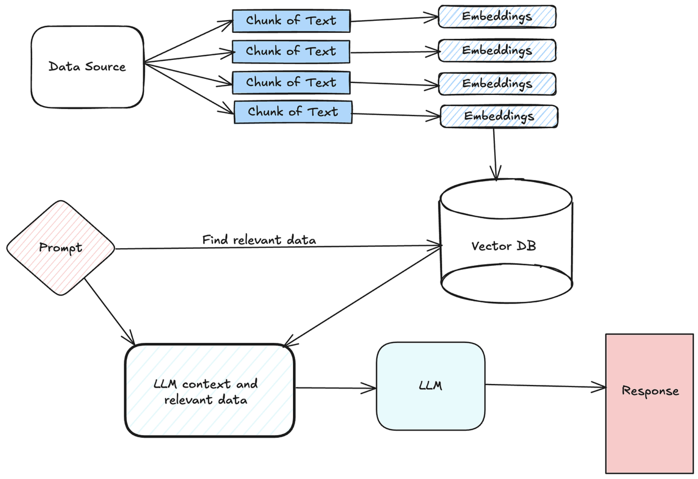
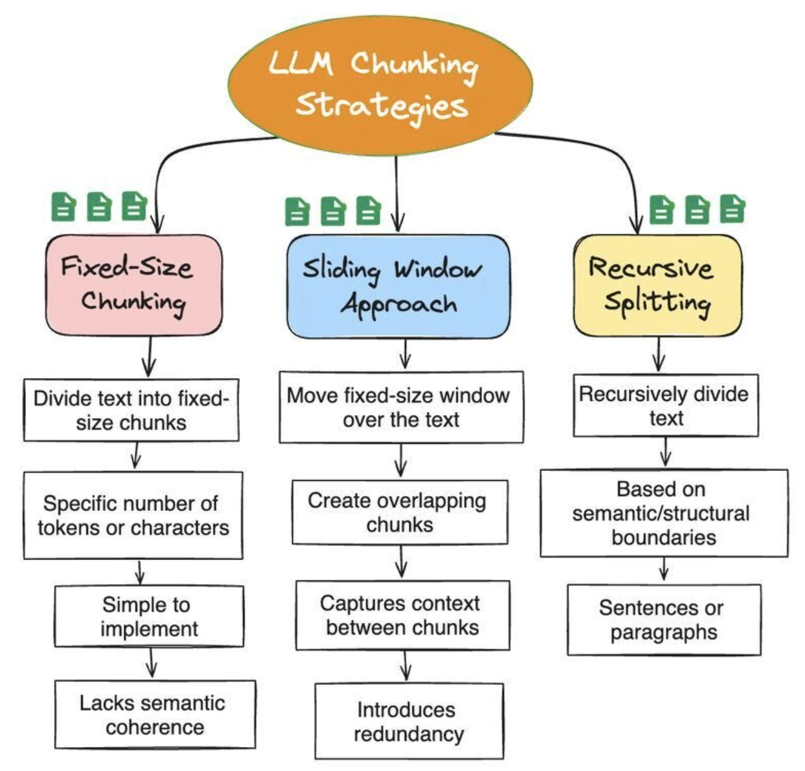
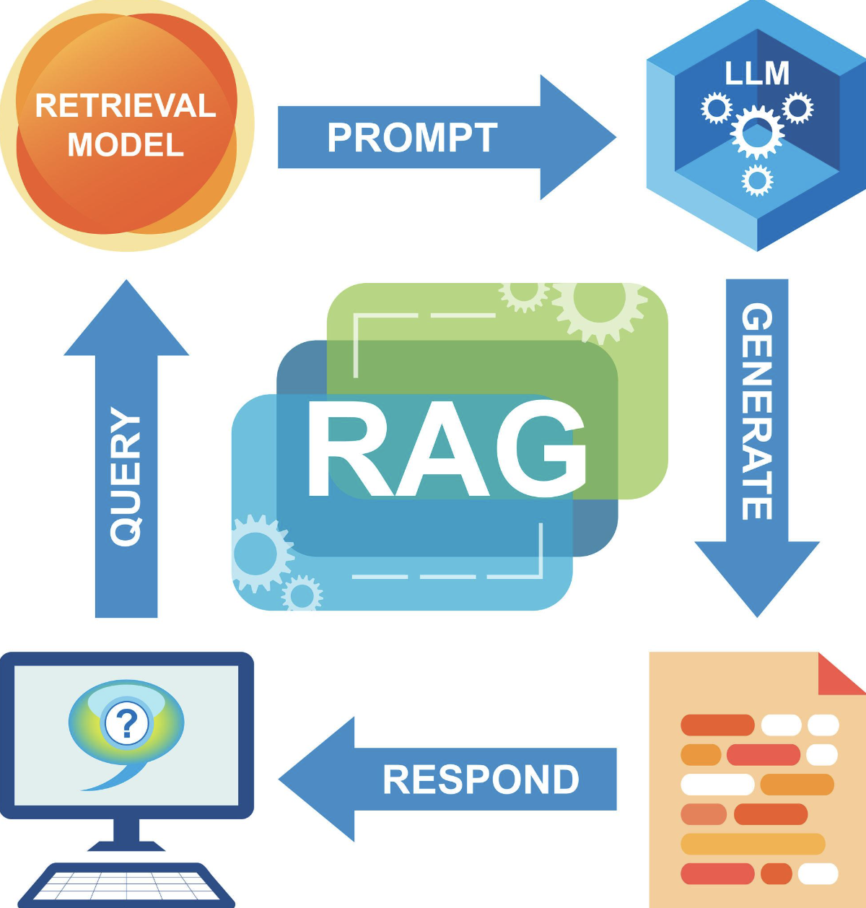

# Best chunking strategies for RAG

Choosing the right chunking strategy is one of the highest-impact decisions in RAG—it directly affects retrieval accuracy, hallucination rate, and cost.

## Best Chunking Strategies for RAG







👉 LLMs cannot process entire documents efficiently

👉 So we split data into chunks → embed → retrieve

## 🔰 1. Fixed-Size Chunking (Baseline)

**📌 How it works:**

- Split text into equal sizes (e.g., 500 tokens)

✅ Pros:

- Simple
- Fast
- Works for most cases

❌ Cons:

- Breaks context
- May cut sentences/meaning

**Example:**

```
Chunk 1: "The invoice total is..."
Chunk 2: "...missing due to system error"
```

👉 Meaning split → poor retrieval

## 2. Overlapping Chunking (MOST USED)

**📌 How it works:**

- Add overlap between chunks (e.g., 20–30%)

**Example:**

```
Chunk 1: tokens 1–500
Chunk 2: tokens 400–900
```

✅ Pros:

- Preserves context
- Improves retrieval accuracy


❌ Cons:
- More storage
- Slightly higher cost

**🏆 Recommended:**

👉 Default strategy for production RAG


## 3. Semantic Chunking (SMART CHUNKING)

**📌 How it works:**

- Split based on meaning (not size)
- Uses:
    - Sentence boundaries
    - Topic shifts
    - Embedding similarity

✅ Pros:

- Best context preservation
- High accuracy

❌ Cons:

- More complex
- Slower preprocessing


**Example:**

Instead of splitting randomly:

```
Chunk 1: "Invoice details..."
Chunk 2: "Payment terms..."
```

👉 Each chunk = complete idea

## 4. Structure-Based Chunking (BEST FOR YOUR USE CASE)

**📌 How it works:**

Split based on document structure:

- Headings
- Sections
- Tables
- Paragraphs

**✅ Best for:**

- OCR documents
- PDFs
- Contracts
- Forms

**Example:**

```
Chunk 1: Header section
Chunk 2: Invoice table
Chunk 3: Footer terms
```

## 5. Recursive Chunking (Hybrid Approach)

**📌 How it works:**

Split hierarchically:

1. Paragraph
2. Sentence
3. Token

**✅ Pros:**

- Adaptive
- Maintains context

**Used in:**

- LangChain recursive splitter

## 6. Sliding Window Retrieval (Advanced)

**📌 How it works:**

- Retrieve multiple adjacent chunks dynamically

**✅ Pros:**

- Reconstructs context at query time
- Reduces need for large chunks


## 7. Chunk Size Selection (CRITICAL)

**Recommended Sizes**

| Use Case     | Chunk Size      |
| ------------ | --------------- |
| General RAG  | 300–500 tokens  |
| Complex docs | 500–1000 tokens |
| Code         | 100–300 tokens  |
| OCR / forms  | 200–400 tokens  |


**Golden Rule:**

👉 Chunk should contain **ONE COMPLETE IDEA**

| Small Chunks     | Large Chunks   |
| ---------------- | -------------- |
| Better precision | Better context |
| Faster retrieval | Fewer chunks   |
| May lose context | Higher cost    |


## 8. Real Example (OCR System)

**Problem:**

Validate extracted document content

**✅ Best Strategy:**

👉 Combine:

1. Structure-based chunking
2. Overlap (20%)
3. Semantic grouping


**Pipeline:**

`OCR → Layout detection → Structured chunks → Embeddings → Vector DB`

## 9. Advanced Architect Patterns

**1. Multi-Granularity Chunking**

Store:

- Small chunks (precision)
- Large chunks (context)

👉 Retrieve both

**2. Metadata-Aware Chunking**

Attach metadata:

- Page number
- Section name
- Table ID

👉 Improves filtering

**3. Parent-Child Chunking**

- Store small chunks
- Link to parent document

👉 Retrieve:

- Small chunk → Expand to full context

**4. Dynamic Chunking (Query-Aware)**

- Adjust chunk size based on query
- Advanced systems only

## ⚠️ Common Mistakes

❌ Too large chunks (bad retrieval)

❌ No overlap

❌ Ignoring document structure

❌ Same chunking for all data types

❌ No evaluation

## Final Recommendation (Production)

🏆 Best Default Setup:

👉 Chunk size: 400–600 tokens

👉 Overlap: 20–30%

👉 Strategy:

- Structure-aware + recursive

## ✅ Final Summary

👉 Chunking = foundation of RAG accuracy

👉 Best strategy = Hybrid (structure + overlap + semantic)

👉 Always:
    
`Test with real queries (Recall@K)`


