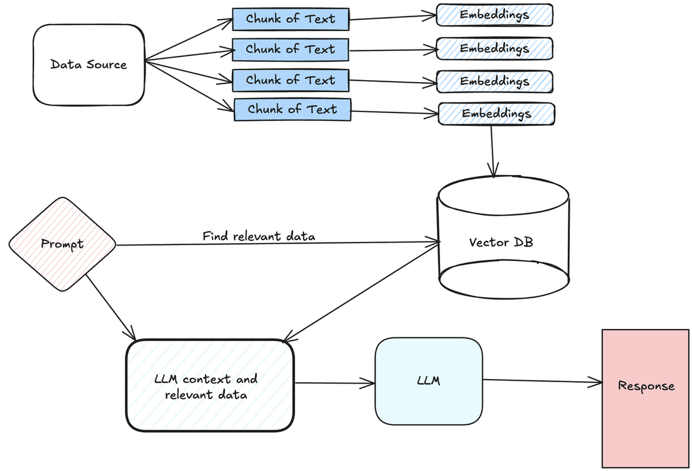
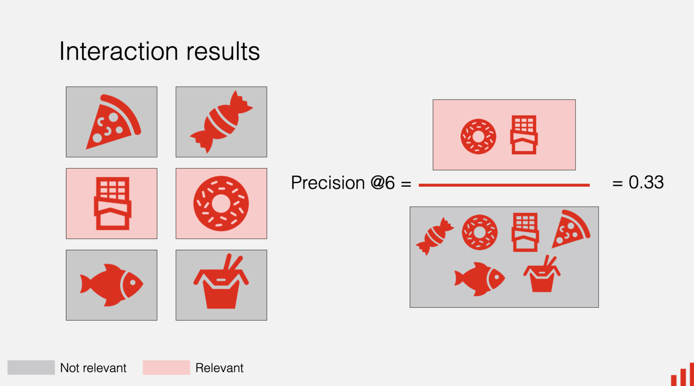
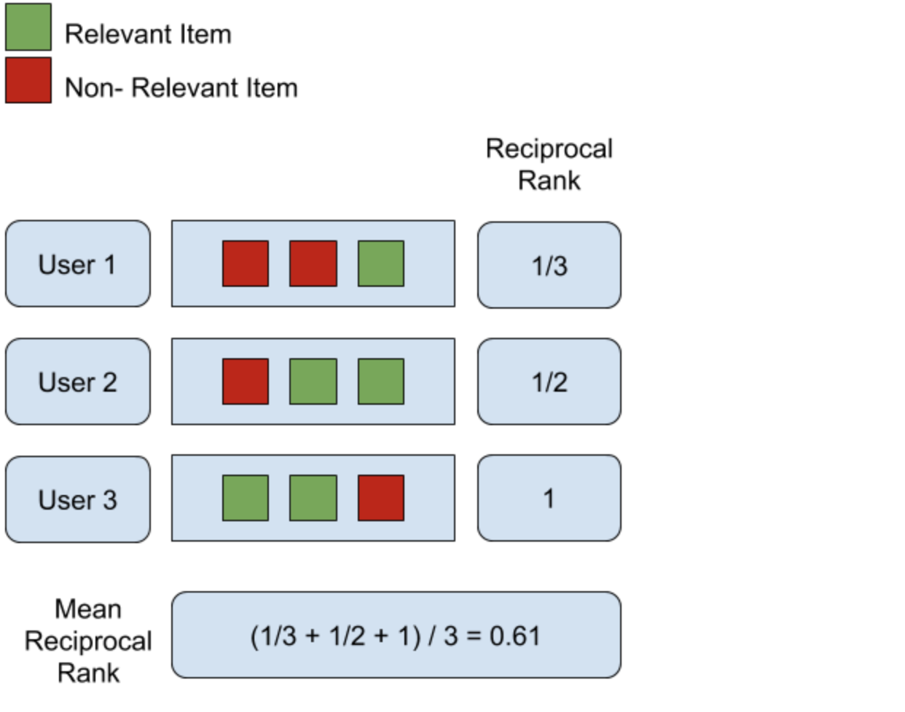
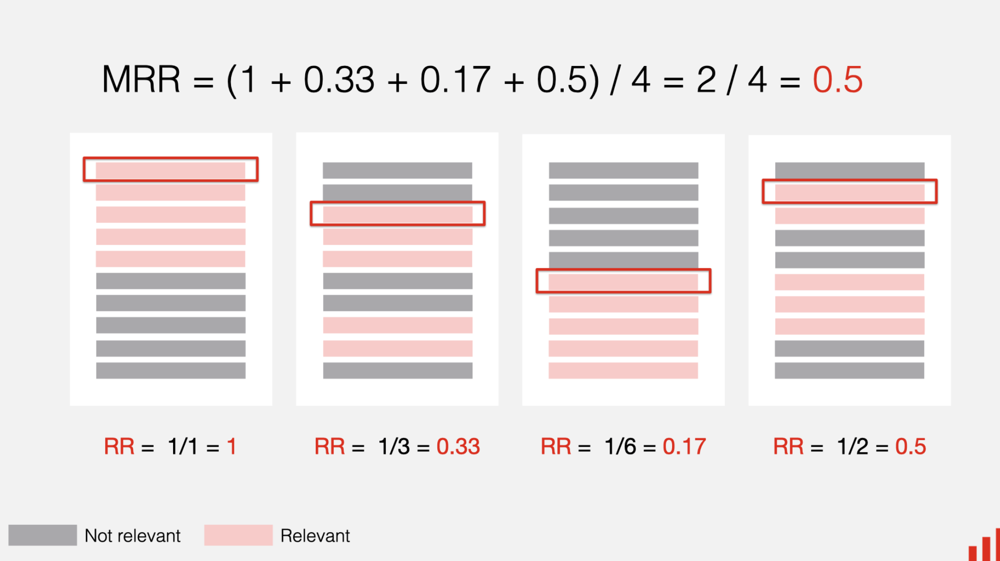
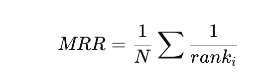

# Evaluation framework for chunking (Recall@K, MRR)

## Why Evaluate Chunking?










**Chunking directly impacts:**

- What gets retrieved
- What context LLM sees
- Final answer quality

👉 Bad chunking = bad retrieval = hallucinations

## 1. Core Metrics

## 1. Recall@K (Coverage Metric)

**📌 Definition:**

How often the correct chunk is present in top K results

**Formula:**

```
Recall@K = \frac{\text{# queries where relevant chunk is in top K}}{\text{Total queries}}
```

**Example:**

| Query | Relevant Chunk Found in Top 5? |
| ----- | ------------------------------ |
| Q1    | ✅                              |
| Q2    | ❌                              |
| Q3    | ✅                              |


👉 Recall@5 = 2 / 3 = 0.66


**Interpretation:**

- High Recall@K → system finds correct info
- Low Recall@K → chunking or embeddings problem

## 2. MRR (Mean Reciprocal Rank)

**📌 Definition:**

Measures how early the correct result appears

**Formula:**



**Example:**

| Query | Rank of First Correct Chunk |
| ----- | --------------------------- |
| Q1    | 1 → 1/1 = 1.0               |
| Q2    | 3 → 1/3 = 0.33              |
| Q3    | Not found → 0               |


👉 MRR = (1 + 0.33 + 0) / 3 = 0.44

**Interpretation:**

- High MRR → relevant chunk appears early
- Low MRR → poor ranking or chunking

## 2. Evaluation Pipeline (Step-by-Step)

**Step 1: Create Ground Truth Dataset**

| Query                | Relevant Document/Chunk |
| -------------------- | ----------------------- |
| "refund policy EU"   | Doc_12_Section_3        |
| "OTP failure reason" | Doc_7_Log_Error         |


👉 This is critical (no evaluation without ground truth)

**Step 2: Generate Chunks**

**Test different strategies:**

- Fixed chunking
- Overlap chunking
- Semantic chunking
- Structure-based chunking

**Step 3: Embed & Index**

- Generate embeddings
- Store in vector DB
- Keep metadata

**Step 4: Run Queries**

For each query:

1. Embed query
2. Retrieve top K chunks
3. Compare with ground truth

**Step 5: Compute Metrics**

- Recall@1, Recall@5, Recall@10
- MRR

## 3. What Good Scores Look Like

**Target Benchmarks**

| Metric    | Good  | Excellent |
| --------- | ----- | --------- |
| Recall@5  | ≥ 0.7 | ≥ 0.85    |
| Recall@10 | ≥ 0.8 | ≥ 0.9     |
| MRR       | ≥ 0.5 | ≥ 0.7     |


## 4. Diagnosing Chunking Issues

**🚨 Case 1: Low Recall@K**

👉 Problem:

- Relevant chunk not retrieved

**Causes:**

- Chunk too large
- Chunk too small
- No overlap
- Poor chunk boundaries


**🚨 Case 2: High Recall but Low MRR**

👉 Problem:

- Relevant chunk exists but ranked low

**Causes:**

- Weak embeddings
- No reranker
- noisy chunks

**🚨 Case 3: Both Low**

👉 Problem:

- System fundamentally broken

**Causes:**

- Bad chunking + bad embeddings
- wrong preprocessing

## 5. Chunking Strategy Comparison (Example)

| Strategy           | Recall@5 | MRR  | Insight       |
| ------------------ | -------- | ---- | ------------- |
| Fixed (no overlap) | 0.62     | 0.41 | Context loss  |
| Overlap (20%)      | 0.75     | 0.55 | Good baseline |
| Semantic           | 0.82     | 0.63 | Best accuracy |
| Structure-based    | 0.85     | 0.68 | Best for docs |


👉 Insight:

**Structure + overlap = best real-world performance**

## 6. Advanced Evaluation Techniques

**1. Recall@K with Metadata Filtering**

Evaluate with filters:

- region
- document type
- access control


**2. Chunk Size Sweep**

Test multiple sizes:

| Size       | Recall@5 |
| ---------- | -------- |
| 200 tokens | 0.68     |
| 400 tokens | 0.78     |
| 800 tokens | 0.74     |


👉 Find optimal size

**3. Multi-Query Evaluation**

- Generate query variations
- Improves robustness testing

**4. Hard Negative Testing**

Test confusing queries:

- similar intent
- overlapping context


**5. End-to-End Evaluation**

Combine:

- Retrieval metrics (Recall, MRR)
- Generation metrics:
    - groundedness
    - hallucination rate


## 7. Example (OCR System)

**Goal:**

Validate document extraction

**Evaluation Dataset:**

| Query                   | Expected Chunk  |
| ----------------------- | --------------- |
| "invoice total missing" | Invoice section |
| "date mismatch"         | Header section  |


**Result:**

| Strategy        | Recall@5 | MRR  |
| --------------- | -------- | ---- |
| Fixed           | 0.60     | 0.38 |
| Structure-based | 0.83     | 0.65 |


👉 Clear improvement

## 8. Production Evaluation Architecture

```
Dataset → Chunking Strategy → Embeddings → Vector DB
        ↓
     Query Set
        ↓
   Retrieval Engine
        ↓
 Metric Calculator (Recall@K, MRR)
        ↓
   Dashboard / Monitoring
```

## ⚠️ Common Mistakes

❌ No ground truth dataset

❌ Evaluating only generation (not retrieval)

❌ Ignoring ranking (MRR)

❌ Using only Recall@K

❌ Not testing multiple chunk sizes

❌ Not testing real queries


## Final Summary

👉 Recall@K = “Did we find the answer?”

👉 MRR = “How quickly did we find it?”

**🏆 Golden Rule:**

👉 Optimize chunking until:

- Recall@5 ≥ 0.8
- MRR ≥ 0.6
