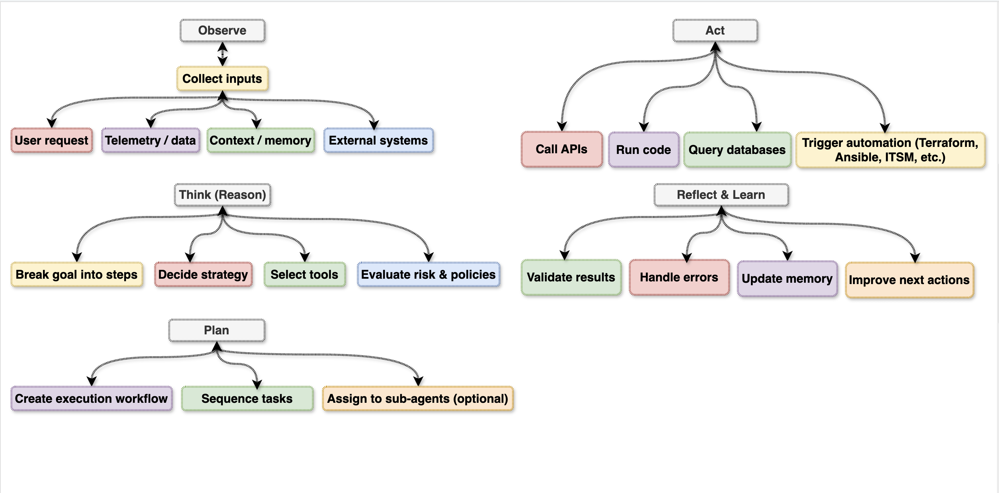

# What is Agentic AI?

Agentic AI refers to AI systems that can act autonomously to pursue goals, make decisions, and complete multi-step tasks with minimal human intervention — rather than simply responding to single prompts.

Agentic AI is an AI paradigm where the system behaves like an autonomous agent that can:

## Key characteristics:

- **Goal-directed behavior —** Given an objective, the AI breaks it down into subtasks and works toward completing them independently.
- **Tool use —** Agentic AI can use external tools like web search, code execution, APIs, file systems, or other software to accomplish tasks.
- **Multi-step reasoning —** It plans, executes, evaluates results, and adjusts its approach across multiple steps.
- **Memory —** It can retain context across a workflow to make coherent decisions over time.
- **Autonomy —** It can take actions in the world (send emails, browse the web, write and run code) rather than just generating text.

# 16 Layers of Agentic AI
Full-Stack Reference Architecture — From raw input to autonomous output

---

## Group 01 · Ingestion & Orchestration

### Layer 01 — Input Layer
**Tag:** Entry Point

Receives all incoming instructions — user prompts, API calls, scheduled triggers, webhooks, or messages from other agents. Parses and normalizes intent before passing it downstream.

**Components:** `User Prompt` · `API Trigger` · `Webhook` · `Scheduler` · `Agent Message`

---

### Layer 02 — Orchestration Layer
**Tag:** Coordination

The central manager. Interprets goals, decomposes them into sub-tasks, assigns work to specialized agents, and manages overall workflow state and lifecycle across all layers.

**Components:** `Task Routing` · `Sub-Agent Mgmt` · `Workflow DAG` · `Priority Queue`

---

## Group 02 · Cognition & Reasoning

### Layer 03 — Planning Layer
**Tag:** Strategy

Converts high-level goals into ordered, executable plans. Handles task dependencies, estimates effort, and generates step-by-step blueprints that the Reasoner works through.

**Components:** `Task Decomposition` · `Dependency Graph` · `ReAct / CoT` · `Plan Revision`

---

### Layer 04 — Reasoning Layer
**Tag:** Intelligence

The LLM core. Performs chain-of-thought reasoning, evaluates multiple options, reflects on intermediate outputs, and determines the single next best action to take at each step.

**Components:** `LLM Inference` · `Chain-of-Thought` · `Self-Reflection` · `Hypothesis Testing`

---

### Layer 05 — Action Selection Layer
**Tag:** Decision

Translates reasoning outputs into concrete, executable commands. Selects the right tool, binds the correct parameters, and dispatches the call with a confidence score attached.

**Components:** `Tool Selection` · `Parameter Binding` · `Action Ranking` · `Confidence Score`

---

## Group 03 · Memory & Knowledge

### Layer 06 — Short-Term Memory
**Tag:** Context

Holds the live session context — current task state, conversation history, recent tool outputs, and intermediate reasoning. Lives within the LLM's active context window.

**Components:** `Context Window` · `Session State` · `Scratchpad` · `Working Memory`

---

### Layer 07 — Long-Term Memory
**Tag:** Persistence

Persistent cross-session storage. Remembers user preferences, past decisions, historical outcomes, and behavioral patterns to improve future performance without re-learning from scratch.

**Components:** `User Preferences` · `Past Decisions` · `Episodic Memory` · `Cross-Session`

---

### Layer 08 — Knowledge & RAG Layer
**Tag:** Retrieval

Retrieval-Augmented Generation pipeline and knowledge graphs. Semantically searches vector databases to inject relevant, up-to-date domain knowledge directly into the reasoning context.

**Components:** `Vector DB` · `Semantic Search` · `Knowledge Graph` · `Embeddings` · `RAG Pipeline`

---

## Group 04 · Tool Execution

### Layer 09 — Tool & API Layer
**Tag:** Integration

Manages all external integrations. Routes tool calls to correct endpoints — web search, databases, file systems, communication platforms, cloud infrastructure, and ITSM systems.

**Components:** `Web Search` · `REST APIs` · `File System` · `Email / Slack` · `Cloud / K8s` · `ITSM`

---

### Layer 10 — Code Execution Layer
**Tag:** Runtime

A sandboxed environment for safely executing generated code. Runs Python, bash, SQL and other languages, capturing stdout, stderr, return values, and enforcing execution timeouts.

**Components:** `Sandbox` · `Python / Bash` · `SQL Execution` · `Error Capture` · `Timeout Guard`

---

## Group 05 · Observation & Feedback

### Layer 11 — Observation Layer
**Tag:** Perception

Collects and parses results from every tool execution. Normalizes varied output formats — JSON, HTML, plain text, error codes — into structured observations the Reasoning Layer can consume.

**Components:** `Result Parsing` · `Output Normalization` · `Error Detection` · `State Update`

---

### Layer 12 — Feedback & Reflection Layer
**Tag:** Adaptation

Closes the cognitive loop. Evaluates whether each action achieved its intent, identifies failure root causes, and feeds corrective signals back to the Planning and Reasoning layers.

**Components:** `Goal Evaluation` · `Self-Critique` · `Retry Logic` · `Loop Termination`

---

## Group 06 · Safety & Governance

### Layer 13 — Guardrails Layer
**Tag:** Safety

Enforces behavioral policies and hard boundaries. Intercepts and blocks actions that violate defined rules — preventing unauthorized, irreversible, destructive, or out-of-scope operations.

**Components:** `Policy Engine` · `Action Filtering` · `Scope Enforcement` · `Harm Prevention`

---

### Layer 14 — RBAC & Approvals Layer
**Tag:** Access Control

Role-based access control and human-in-the-loop checkpoints. Ensures the agent only accesses permitted resources and pauses for human approval before executing high-risk actions.

**Components:** `RBAC` · `Human Approval` · `Permission Scopes` · `Escalation Flow`

---

### Layer 15 — Audit & Logging Layer
**Tag:** Compliance

Immutable record of every agent action, tool call, decision, and outcome. Supports compliance audits, debugging, post-mortems, and full accountability tracing across the entire pipeline.

**Components:** `Immutable Logs` · `Trace IDs` · `Decision Records` · `Compliance Export`

---

## Group 07 · Learning & Output

### Layer 16a — Learning Layer
**Tag:** Improvement

Captures outcomes, user feedback, and failure signals to continuously improve agent behavior. Updates prompt heuristics, refines tool selection, and writes learnings to long-term memory.

**Components:** `RLHF Signals` · `Prompt Tuning` · `Outcome Tracking` · `Heuristic Update`

---

### Layer 16b — Output Layer
**Tag:** Delivery

Formats and delivers the final result to the user or downstream system — a report, code artifact, API response, Slack notification, or a trigger that kicks off another agent pipeline.

**Components:** `Response Formatting` · `File / Report` · `API Response` · `Downstream Trigger` · `Human Handoff`

---

## Summary Table

| Layer | Name | Group | Key Role |
|-------|------|-------|----------|
| 01 | Input Layer | Ingestion | Receives user/system instructions |
| 02 | Orchestration Layer | Ingestion | Routes tasks, manages workflow |
| 03 | Planning Layer | Cognition | Breaks goals into ordered steps |
| 04 | Reasoning Layer | Cognition | LLM-powered thinking & decisions |
| 05 | Action Selection | Cognition | Picks & dispatches tools |
| 06 | Short-Term Memory | Memory | Active session context |
| 07 | Long-Term Memory | Memory | Persistent cross-session storage |
| 08 | Knowledge & RAG | Memory | Vector search & knowledge graphs |
| 09 | Tool & API Layer | Execution | External integrations |
| 10 | Code Execution | Execution | Sandboxed code runtime |
| 11 | Observation Layer | Feedback | Parses tool results |
| 12 | Feedback & Reflection | Feedback | Closes the learning loop |
| 13 | Guardrails Layer | Safety | Enforces behavioral policies |
| 14 | RBAC & Approvals | Safety | Access control & human oversight |
| 15 | Audit & Logging | Safety | Immutable compliance records |
| 16a | Learning Layer | Output | Continuous improvement signals |
| 16b | Output Layer | Output | Delivers final results |

# 16 Layers of Agentic AI - Full-Stack Architecture Diagram

## Mapping Agentic AI Patterns to LangGraph vs CrewAI

## 🧩 Pattern → Framework Mapping Table

| Pattern              | LangGraph          | CrewAI       | Notes                           |
| -------------------- | ------------------ | ------------ | ------------------------------- |
| Reactive Agent       | ✅ Node             | ✅ Agent      | Simple Q&A                      |
| Tool-Using Agent     | ✅ Tool Node        | ✅ Tools      | MCP fits both                   |
| ReAct                | ✅ Native           | ⚠️ Partial   | LangGraph better control        |
| RAG Agent            | ✅ Native           | ✅ Native     | Both strong                     |
| Stateful Agent       | ✅ Native State     | ⚠️ Limited   | LangGraph excels                |
| Planner–Executor     | ✅ Best Fit         | ⚠️ Manual    | LangGraph designed for this     |
| Tree-of-Thought      | ✅ Supported        | ❌ Not native | Needs graph branching           |
| Graph-of-Thought     | ✅ Native           | ❌ No         | LangGraph exclusive             |
| Manager–Worker       | ✅ Supervisor Graph | ✅ Crew       | Both strong                     |
| Specialist Swarm     | ✅ Nodes            | ✅ Agents     | CrewAI very natural             |
| Debate / Consensus   | ✅ Graph            | ✅ Crew       | CrewAI simpler                  |
| Critic–Generator     | ✅ Graph            | ✅ Crew       | Both good                       |
| Event-Driven Agents  | ✅ Excellent        | ❌ Limited    | LangGraph preferred             |
| Policy-Driven Flow   | ✅ Native           | ⚠️ External  | LangGraph integrates governance |
| Human-in-the-Loop    | ✅ Native           | ⚠️ Manual    | LangGraph safer                 |
| Auto-Remediation     | ✅ Best             | ⚠️ Risky     | Needs guardrails                |
| Registry & Discovery | ✅ Native           | ⚠️ External  | LangGraph aligns with A2A       |
| Observability-First  | ✅ Built-in         | ❌ Limited    | LangGraph enterprise ready      |

## Anti-Patterns to Avoid (CRITICAL) 🚨

## ❌ Agentic AI Anti-Patterns

| Anti-Pattern               | Why It’s Dangerous      |
| -------------------------- | ----------------------- |
| Single mega-agent          | No control, no audit    |
| No governance              | Compliance failure      |
| Unbounded autonomy         | Production risk         |
| No observability           | Silent failures         |
| Tool access without policy | Security breach         |
| No fallback                | Infinite loops          |
| No versioning              | Irreproducible behavior |
| Prompt-only logic          | Fragile systems         |
| No cost controls           | Budget explosion        |
| Direct prod execution      | Catastrophic failures   |

## Agentic AI Patterns list

| #  | Pattern Name                | Category             | Purpose                          | When Used                 |
| -- | --------------------------- | -------------------- | -------------------------------- | ------------------------- |
| 1  | Chain-of-Thought (CoT)      | Planning & Reasoning | Step-by-step reasoning           | Complex analysis, RCA     |
| 2  | Tree-of-Thoughts (ToT)      | Planning & Reasoning | Explore multiple solution paths  | High-uncertainty problems |
| 3  | Graph-of-Thoughts (GoT)     | Planning & Reasoning | Reason over dependency graphs    | Service dependency RCA    |
| 4  | ReAct (Reason+Act)          | Planning & Reasoning | Alternate thinking and tool use  | Investigation workflows   |
| 5  | Plan–Act–Reflect            | Planning & Reasoning | Iterative improvement loop       | Autonomous remediation    |
| 6  | Reflexion                   | Planning & Reasoning | Self-critique and retry          | Low-confidence outputs    |
| 7  | Hypothesis Testing          | Planning & Reasoning | Validate multiple root causes    | Incident diagnosis        |
| 8  | Goal Decomposition          | Planning & Reasoning | Break into sub-tasks             | Multi-step automation     |
| 9  | Constraint-Aware Planning   | Planning & Reasoning | Respect policy/cost/risk limits  | Prod-safe automation      |
| 10 | Orchestrator–Worker         | Multi-Agent          | Central planner with specialists | Enterprise workflows      |
| 11 | Planner–Executor            | Multi-Agent          | Plan first, then execute         | Deterministic flows       |
| 12 | Critic–Generator            | Multi-Agent          | Validate generated outputs       | Change safety checks      |
| 13 | Debate Pattern              | Multi-Agent          | Competing solutions selection    | High-risk decisions       |
| 14 | Specialist Swarm            | Multi-Agent          | Domain agents collaborate        | Network/DB/Cloud RCA      |
| 15 | Hierarchical Agents         | Multi-Agent          | Manager → team → tools           | Large-scale systems       |
| 16 | Blackboard                  | Multi-Agent          | Shared working memory            | Cross-agent context       |
| 17 | Peer-to-Peer Agents         | Multi-Agent          | Direct negotiation               | Decentralized systems     |
| 18 | Workflow Graph              | Orchestration        | Stateful branching workflows     | LangGraph pipelines       |
| 19 | Event-Driven Agents         | Orchestration        | Trigger on alerts/events         | Monitoring, scaling       |
| 20 | Saga Pattern                | Orchestration        | Multi-step with rollback         | Patch, infra changes      |
| 21 | Checkpoint & Resume         | Orchestration        | Persist state across failures    | Long-running tasks        |
| 22 | Human Approval Gate         | Orchestration        | Pause for human review           | High-risk actions         |
| 23 | Policy-Based Routing        | Orchestration        | Route by risk/complexity         | Complexity router         |
| 24 | Circuit Breaker             | Orchestration        | Stop runaway loops               | Tool safety               |
| 25 | Guardrails                  | Safety               | Pre/post validation              | All prod actions          |
| 26 | Risk-Tiered Autonomy        | Safety               | Auto vs human control            | SRE automation            |
| 27 | Tool Permission Scoping     | Safety               | Limit tool access                | Security control          |
| 28 | Simulation/Dry Run          | Safety               | Test before execution            | Infra changes             |
| 29 | Confidence Thresholding     | Safety               | Execute above score              | Auto-remediation          |
| 30 | Kill Switch                 | Safety               | Emergency stop                   | Unsafe behavior           |
| 31 | RAG                         | Knowledge            | Retrieve docs/runbooks           | Known fixes               |
| 32 | Knowledge Graph Reasoning   | Knowledge            | Dependency + blast radius        | Impact analysis           |
| 33 | Semantic Memory             | Knowledge            | Store past learnings             | Repeated incidents        |
| 34 | Episodic Memory             | Knowledge            | Store execution history          | Auditing, learning        |
| 35 | Tool Discovery              | Knowledge            | Dynamic tool lookup              | Plugin ecosystems         |
| 36 | Context Optimization        | Knowledge            | Load relevant context only       | Token reduction           |
| 37 | Toolformer                  | Tool Usage           | LLM decides tool calls           | Flexible workflows        |
| 38 | Function Calling            | Tool Usage           | Structured API execution         | Deterministic actions     |
| 39 | Tool Chaining               | Tool Usage           | Multi-tool pipelines             | Diagnostics → fix         |
| 40 | Parallel Tool Execution     | Tool Usage           | Run tools concurrently           | Faster RCA                |
| 41 | Fallback Tool Strategy      | Tool Usage           | Alternate tool on failure        | Resilience                |
| 42 | Model Routing               | Cost & Performance   | Cheap vs powerful model          | Cost optimization         |
| 43 | Token Budgeting             | Cost & Performance   | Limit reasoning depth            | FinOps control            |
| 44 | Caching/Memoization         | Cost & Performance   | Reuse prior results              | Repeated tasks            |
| 45 | Batch Inference             | Cost & Performance   | Process tasks together           | High-volume alerts        |
| 46 | Early Exit                  | Cost & Performance   | Stop when confident              | Low-complexity cases      |
| 47 | Selective Reasoning         | Cost & Performance   | Use ToT only if needed           | Cost + latency            |
| 48 | Agent Telemetry             | Observability        | Track decisions/tools            | Performance monitoring    |
| 49 | Traceable Reasoning Logs    | Observability        | Full audit trail                 | Compliance                |
| 50 | Outcome-Based KPIs          | Observability        | Measure MTTR, success            | Value tracking            |
| 51 | Feedback Learning Loop      | Observability        | Improve from outcomes            | Continuous tuning         |
| 52 | Drift Detection             | Observability        | Detect performance decay         | Model health              |
| 53 | Multi-Tenant Isolation      | Enterprise           | Tenant-specific memory/policy    | SaaS platforms            |
| 54 | RBAC/ABAC Enforcement       | Enterprise           | Role-based access                | Governance                |
| 55 | Policy-as-Code              | Enterprise           | Centralized control              | Compliance                |
| 56 | Compliance Evidence Gen     | Enterprise           | Auto audit logs                  | Regulated env             |
| 57 | FinOps Cost Tracking        | Enterprise           | Cost per task/agent              | Budget control            |
| 58 | Registry & Discovery        | Enterprise           | Catalog agents/tools             | Platform scale            |
| 59 | Reinforcement Learning Loop | Learning             | Improve via feedback             | Optimization              |
| 60 | Runbook Mining              | Learning             | Convert manual → auto            | SRE automation            |
| 61 | Continuous Evaluation       | Learning             | Shadow → canary → prod           | Safe rollout              |
| 62 | Meta-Agent Optimization     | Learning             | Agents tuning agents             | Platform efficiency       |
| 63 | Working Memory              | Memory               | Session context                  | Active task state         |
| 64 | Long-Term Vector Memory     | Memory               | Semantic retrieval               | Knowledge reuse           |
| 65 | Structured State Store      | Memory               | Workflow state                   | LangGraph state           |
| 66 | Time-Weighted Memory        | Memory               | Recent > old context             | Incident timelines        |
| 67 | Complexity Router           | SRE-Specific         | Simple vs complex path           | Cost control              |
| 68 | Correlation Graph           | SRE-Specific         | Merge alerts                     | Noise reduction           |
| 69 | Blast Radius Estimation     | SRE-Specific         | Impact scoring                   | Change safety             |
| 70 | Autonomous Remediation Loop | SRE-Specific         | Diagnose → fix → validate        | Auto-healing              |
| 71 | Safe Rollback               | SRE-Specific         | Revert failed actions            | Change management         |
| 72 | Versioned Agents            | Lifecycle            | Track behavior per version       | Governance                |
| 73 | Canary Agents               | Lifecycle            | Test on subset                   | Safe deployment           |
| 74 | Blue-Green Agents           | Lifecycle            | Zero-downtime upgrades           | Platform ops              |
| 75 | Feature Flags for Autonomy  | Lifecycle            | Toggle automation level          | Gradual rollout           |

# 🧠 Agentic AI Enterprise Patterns — Single Master Table
| Pattern                        | 16-Layer Mapping          | LLM vs Non-LLM | Primary Agent Role        |
| ------------------------------ | ------------------------- | -------------- | ------------------------- |
| Chain-of-Thought (CoT)         | Agent Runtime             | LLM Mandatory  | Planner                   |
| Tree-of-Thought (ToT)          | Agent Runtime             | LLM Mandatory  | Planner                   |
| ReAct (Reason+Act)             | Runtime + Tools           | Hybrid         | Planner → Executor        |
| Plan-Act                       | Orchestration (LangGraph) | Non-LLM        | Orchestrator              |
| Plan-Act-Reflect               | Orchestrator + Reflection | Hybrid         | Orchestrator + Reflection |
| Reflection / Self-Critique     | Reflection Layer          | LLM Mandatory  | Reflection                |
| Critic-Planner (Maker-Checker) | Governance                | Hybrid         | Validator                 |
| Reasoner-Planner-Executor      | Control Plane             | Hybrid         | Orchestrator              |
| World-Model State Tracking     | State & Memory            | Non-LLM        | Orchestrator              |

# Multi-Agent Collaboration
| Pattern               | 16-Layer Mapping     | LLM vs Non-LLM | Primary Agent Role |
| --------------------- | -------------------- | -------------- | ------------------ |
| Hierarchical Agents   | Control Plane        | Non-LLM        | Orchestrator       |
| Peer-to-Peer Agents   | Agent Runtime        | Hybrid         | Planner            |
| Role-Based Agents     | Registry & Discovery | Non-LLM        | Orchestrator       |
| Debate / Consensus    | Governance           | LLM Mandatory  | Validator          |
| Swarm Parallel Agents | Runtime              | Non-LLM        | Executor           |
| Agent Mesh (A2A Bus)  | Integration Layer    | Non-LLM        | Orchestrator       |

# Orchestration & Control
| Pattern                        | 16-Layer Mapping | LLM vs Non-LLM | Primary Agent Role |
| ------------------------------ | ---------------- | -------------- | ------------------ |
| Sequential Orchestration (DAG) | Control Plane    | Non-LLM        | Orchestrator       |
| Parallel Orchestration         | Control Plane    | Non-LLM        | Orchestrator       |
| Dynamic Routing                | Control Plane    | Hybrid         | Orchestrator       |
| Handoff Pattern                | Control Plane    | Non-LLM        | Orchestrator       |
| Group Chat Orchestration       | Runtime          | LLM Mandatory  | Planner            |
| Event-Driven Agents            | Input Layer      | Non-LLM        | Orchestrator       |
| Workflow Graph (LangGraph)     | Control Plane    | Non-LLM        | Orchestrator       |
| Control-Plane-as-Tool          | Tools Layer      | Non-LLM        | Executor           |

# Tooling & Action
| Pattern             | 16-Layer Mapping    | LLM vs Non-LLM | Primary Agent Role |
| ------------------- | ------------------- | -------------- | ------------------ |
| Tool-Use Selection  | Tools & Integration | Hybrid         | Planner            |
| Function Calling    | LLM Abstraction     | Hybrid         | Planner            |
| Skill Library       | Registry            | Non-LLM        | Orchestrator       |
| Runbook Automation  | Execution Layer     | Non-LLM        | Executor           |
| Capability Routing  | Registry            | Non-LLM        | Orchestrator       |
| Sandboxed Execution | Security Layer      | Non-LLM        | Executor           |

# Memory & Knowledge
| Pattern                    | 16-Layer Mapping | LLM vs Non-LLM | Primary Agent Role |
| -------------------------- | ---------------- | -------------- | ------------------ |
| Short-Term Memory          | State Layer      | Non-LLM        | Orchestrator       |
| Long-Term Memory           | Memory DB        | Non-LLM        | Orchestrator       |
| RAG Retrieval              | Knowledge Layer  | Hybrid         | Planner            |
| Episodic Memory            | State Layer      | Non-LLM        | Reflection         |
| Semantic Cache             | FinOps Layer     | Non-LLM        | Orchestrator       |
| Stateful Agent Checkpoints | Orchestrator     | Non-LLM        | Orchestrator       |

# Governance, Safety, HITL
| Pattern                         | 16-Layer Mapping | LLM vs Non-LLM | Primary Agent Role |
| ------------------------------- | ---------------- | -------------- | ------------------ |
| Human-in-the-Loop (HITL)        | HITL Layer       | Non-LLM        | Validator          |
| Policy Guardrails (OPA/Cedar)   | Policy Layer     | Non-LLM        | Validator          |
| RBAC/ABAC for Agents            | Security Layer   | Non-LLM        | Validator          |
| Risk-Based Autonomy             | Governance       | Hybrid         | Validator          |
| Audit Trail                     | Audit Layer      | Non-LLM        | Orchestrator       |
| Explainability (Evidence-First) | Governance       | Hybrid         | Reflection         |

# Observability & Evaluation
| Pattern                        | 16-Layer Mapping | LLM vs Non-LLM | Primary Agent Role |
| ------------------------------ | ---------------- | -------------- | ------------------ |
| Telemetry-Driven Agents        | Input Layer      | Non-LLM        | Orchestrator       |
| Outcome-Based Evaluation (KPI) | Observability    | Non-LLM        | Reflection         |
| Confidence Scoring             | Reflection       | Hybrid         | Reflection         |
| Canary Execution               | Deployment       | Non-LLM        | Executor           |
| Feedback Loop Learning         | Learning Layer   | Hybrid         | Reflection         |
| Digital Twin Simulation        | Governance       | Non-LLM        | Validator          |

# Cost & Performance
| Pattern                   | 16-Layer Mapping | LLM vs Non-LLM | Primary Agent Role |
| ------------------------- | ---------------- | -------------- | ------------------ |
| Model Routing             | LLM Abstraction  | Non-LLM        | Orchestrator       |
| Adaptive Autonomy         | Control Plane    | Hybrid         | Orchestrator       |
| Batch Reasoning           | Runtime          | Non-LLM        | Executor           |
| Caching (Semantic/Output) | State Layer      | Non-LLM        | Orchestrator       |
| Elastic Agent Scaling     | Deployment       | Non-LLM        | Executor           |

# Lifecycle & Deployment
| Pattern                    | 16-Layer Mapping | LLM vs Non-LLM | Primary Agent Role |
| -------------------------- | ---------------- | -------------- | ------------------ |
| Agent Registry & Discovery | Registry Layer   | Non-LLM        | Orchestrator       |
| Versioned Agents           | Lifecycle Layer  | Non-LLM        | Orchestrator       |
| Blue-Green Deployment      | Deployment       | Non-LLM        | Executor           |
| Shadow Mode Agents         | Observability    | Non-LLM        | Reflection         |
| Policy-as-Code             | Governance       | Non-LLM        | Validator          |
| Continuous Evaluation (CE) | MLOps            | Hybrid         | Reflection         |

# Communication & Transactions
| Pattern                        | 16-Layer Mapping  | LLM vs Non-LLM | Primary Agent Role |
| ------------------------------ | ----------------- | -------------- | ------------------ |
| Message Bus (Kafka/Pulsar)     | Integration Layer | Non-LLM        | Orchestrator       |
| Contract-Based Messaging (A2A) | Integration       | Non-LLM        | Orchestrator       |
| Event Sourcing                 | State Layer       | Non-LLM        | Orchestrator       |
| Saga Pattern                   | Orchestrator      | Non-LLM        | Orchestrator       |

# ✅ Single Master Table (Enterprise)
| Pattern                         | When to Use (Use Case)                        | Example (How to use)                                                           | Planner Agent                         | Executor Agent                       | Validator Agent                              | Reflection Agent                         |
| ------------------------------- | --------------------------------------------- | ------------------------------------------------------------------------------ | ------------------------------------- | ------------------------------------ | -------------------------------------------- | ---------------------------------------- |
| Chain-of-Thought (CoT)          | RCA, risk reasoning, policy interpretation    | Planner reasons through evidence (metrics/logs) to propose safest remediation  | **LLM Required**                      | N/A                                  | N/A                                          | **LLM Optional** (quality review)        |
| Tree-of-Thought (ToT)           | Multiple remediation options                  | Generate 3–5 options (restart/scale/rollback), score and pick best             | **LLM Required**                      | N/A                                  | N/A                                          | **LLM Required** (branch outcome review) |
| ReAct (Reason+Act)              | Investigation requiring tools                 | Query Prometheus → logs → CMDB → decide action                                 | **LLM Required**                      | **Non-LLM** (tool calls)             | **Non-LLM** (policy gate)                    | **LLM Required** (did it work?)          |
| Plan-Act                        | Approved runbooks, patch workflows            | Orchestrator runs deterministic steps: drain→patch→verify                      | **LLM Optional** (plan draft)         | **Non-LLM Required**                 | **Non-LLM Required**                         | **Hybrid** (Non-LLM KPI + LLM summary)   |
| Plan-Act-Reflect                | Continuous improvement automation             | Execute fix → reflect → update future decision policy                          | **LLM Required**                      | **Non-LLM Required**                 | **Non-LLM Required**                         | **LLM Required**                         |
| Reflection / Self-Critique      | Reduce hallucination, validate outputs        | Reflection agent checks proposed action against evidence + constraints         | **LLM Optional**                      | N/A                                  | **LLM Optional** (critique) + Non-LLM policy | **LLM Required**                         |
| Critic-Planner (Maker-Checker)  | High-risk actions (DB restart, prod rollback) | Planner proposes → validator rejects if outside window → propose alternate     | **LLM Required**                      | **Non-LLM** (if approved)            | **Non-LLM Required** + **LLM Optional**      | **LLM Required**                         |
| Reasoner-Planner-Executor       | Enterprise separation of duties               | Planner decides “scale to 10” → executor calls K8s → orchestrator tracks state | **LLM Required**                      | **Non-LLM Required**                 | **Non-LLM Required**                         | **LLM Required**                         |
| World-Model / State Tracking    | Long-running incidents, resumable flows       | Maintain incident state + dependencies; resume after failure                   | **LLM Optional** (interpret)          | **Non-LLM Required** (state updates) | **Non-LLM**                                  | **LLM Optional** (drift insights)        |
| Hierarchical Multi-Agent        | SecOps/SRE/FinOps under one orchestrator      | Orchestrator routes work to domain agents                                      | **LLM Optional** (task decomposition) | **Non-LLM**                          | **Non-LLM**                                  | **LLM Optional**                         |
| Peer-to-Peer Agents             | Cross-domain collaboration                    | SRE shares latency findings with FinOps agent                                  | **LLM Required** (reasoning exchange) | **Non-LLM**                          | **Non-LLM**                                  | **LLM Optional**                         |
| Role-Based Agents               | Clear ownership boundaries                    | Patch agent only patches; Scaling agent only scales                            | **Non-LLM** (routing/registry)        | **Non-LLM**                          | **Non-LLM Required** (RBAC)                  | **LLM Optional**                         |
| Debate / Consensus              | Critical decisions requiring high confidence  | 2–3 planners debate; consensus agent chooses                                   | **LLM Required**                      | N/A                                  | **LLM Required** + Non-LLM policy            | **LLM Required**                         |
| Swarm Parallelization           | Fleet tasks at scale                          | Check 500 nodes patch status in parallel                                       | **Non-LLM**                           | **Non-LLM Required**                 | **Non-LLM**                                  | **LLM Optional**                         |
| Agent Mesh / A2A Messaging      | Decoupled agent communication                 | Agents communicate via contracts on message bus                                | **Non-LLM**                           | **Non-LLM Required**                 | **Non-LLM Required** (schema)                | **LLM Optional**                         |
| Sequential Orchestration (DAG)  | Runbooks, controlled flows                    | LangGraph executes step-by-step with retries/rollback                          | **Non-LLM**                           | **Non-LLM Required**                 | **Non-LLM Required**                         | **LLM Optional**                         |
| Parallel Orchestration          | Faster diagnosis/execution                    | Run checks for CPU/mem/disk/net concurrently                                   | **Non-LLM**                           | **Non-LLM Required**                 | **Non-LLM**                                  | **LLM Optional**                         |
| Dynamic Routing                 | Choose best agent/tool dynamically            | Classify incident → route to Network vs App agent                              | **Hybrid** (LLM classify)             | **Non-LLM Required**                 | **Non-LLM Required**                         | **LLM Optional**                         |
| Handoff / Escalation            | Risk threshold exceeded                       | Auto-heal fails → escalate to human approval                                   | **LLM Optional** (explain)            | **Non-LLM**                          | **Non-LLM Required** (HITL gate)             | **LLM Required**                         |
| Group Chat Orchestration        | Complex reasoning tasks                       | Planner+Risk+Cost agents collaborate                                           | **LLM Required**                      | N/A                                  | **LLM Optional** + policy                    | **LLM Required**                         |
| Event-Driven Agents             | Real-time ops automation                      | Kafka event “pod crash” triggers flow                                          | **Non-LLM**                           | **Non-LLM Required**                 | **Non-LLM Required**                         | **LLM Optional**                         |
| Tool-Use Selection              | Many possible tools/APIs                      | Choose between SSM / Terraform / K8s / ITSM                                    | **LLM Required**                      | **Non-LLM Required**                 | **Non-LLM Required**                         | **LLM Optional**                         |
| Function Calling (Structured)   | Deterministic tool invocation                 | LLM outputs JSON action contract for executor                                  | **LLM Required**                      | **Non-LLM Required**                 | **Non-LLM Required** (schema)                | **LLM Optional**                         |
| Skill Library                   | Standard reusable actions                     | “restart_service_v3”, “apply_patch_v2” skills                                  | **Non-LLM**                           | **Non-LLM Required**                 | **Non-LLM Required**                         | **LLM Optional**                         |
| Runbook Automation              | Approved self-heal actions                    | Restart service, clear queue, scale within blast radius                        | N/A                                   | **Non-LLM Required**                 | **Non-LLM Required**                         | **LLM Optional**                         |
| Short-Term Memory               | Maintain context per incident                 | Store current metrics/log pointers/session state                               | N/A                                   | **Non-LLM Required**                 | N/A                                          | **LLM Optional**                         |
| Long-Term Memory                | Learn from past incidents                     | Store successful fixes/outcomes; retrieve later                                | **Hybrid** (LLM uses)                 | **Non-LLM Required**                 | **Non-LLM**                                  | **LLM Required**                         |
| RAG Grounding                   | Need factual/policy grounding                 | Retrieve policy/runbook/CMDB docs → synthesize decision                        | **LLM Required**                      | **Non-LLM** (retrieval)              | **Non-LLM Required** (policy)                | **LLM Optional**                         |
| Episodic Memory                 | Outcome-based learning                        | “Restart fixed it” stored and ranked next time                                 | **Hybrid**                            | **Non-LLM Required**                 | N/A                                          | **LLM Required**                         |
| Semantic / Output Cache         | Reduce cost/latency                           | Cache repeated classifications and answers                                     | N/A                                   | **Non-LLM Required**                 | N/A                                          | **LLM Optional**                         |
| Human-in-the-Loop (HITL)        | High blast radius changes                     | Require approval for DB restart / prod rollback                                | **LLM Optional** (explain)            | N/A                                  | **Non-LLM Required** (approval)              | **LLM Required**                         |
| Policy Guardrails (OPA/Cedar)   | Enforce compliance and safety                 | Block action outside window/without ticket                                     | N/A                                   | N/A                                  | **Non-LLM Required**                         | **LLM Optional**                         |
| RBAC/ABAC                       | Least privilege                               | Patch agent cannot modify IAM; FinOps cannot restart prod                      | N/A                                   | N/A                                  | **Non-LLM Required**                         | N/A                                      |
| Risk-Based Autonomy             | Auto vs manual by risk score                  | Low risk auto-heal; high risk HITL                                             | **Hybrid** (LLM risk)                 | **Non-LLM Required**                 | **Non-LLM Required**                         | **LLM Required**                         |
| Audit Trail                     | SOC2/ISO evidence                             | Immutable log of decisions/actions/timestamps                                  | N/A                                   | **Non-LLM Required**                 | **Non-LLM Required**                         | **LLM Optional** (summaries)             |
| Explainability (Evidence-First) | Trust & governance                            | Output: evidence → policy → action → expected impact                           | **LLM Required**                      | N/A                                  | **Non-LLM** (check)                          | **LLM Required**                         |
| Outcome-Based Evaluation (KPI)  | Measure MTTR/availability value               | Compare before/after MTTR; autonomous resolution ratio                         | N/A                                   | **Non-LLM Required**                 | **Non-LLM**                                  | **LLM Required** (insights)              |
| Confidence Scoring              | Auto-escalation control                       | Low confidence → escalate to human                                             | **Hybrid**                            | N/A                                  | **Non-LLM Required** (threshold)             | **LLM Required** (calibrate)             |
| Canary Execution                | Safe changes                                  | Patch 5% nodes → validate → expand rollout                                     | N/A                                   | **Non-LLM Required**                 | **Non-LLM Required**                         | **LLM Optional**                         |
| Digital Twin / Simulation       | Predict impact before action                  | Simulate scale-in effect on latency before doing it                            | **LLM Optional**                      | **Non-LLM Required**                 | **Non-LLM Required**                         | **LLM Optional**                         |
| Model Routing                   | Reduce LLM cost                               | Small model classify; large model plan only when needed                        | **Non-LLM Required**                  | N/A                                  | **Non-LLM**                                  | **LLM Optional**                         |
| Adaptive Autonomy               | Save cost on simple cases                     | Simple alert → single-step plan; complex → ToT                                 | **Hybrid**                            | **Non-LLM Required**                 | **Non-LLM Required**                         | **LLM Required**                         |
| Batch Reasoning                 | High volume similar alerts                    | Group 100 similar alerts → one diagnosis plan                                  | **Hybrid**                            | **Non-LLM Required**                 | **Non-LLM**                                  | **LLM Optional**                         |
| Elastic Agent Scaling           | Scale platform runtime                        | Scale executor pods based on queue depth                                       | N/A                                   | **Non-LLM Required**                 | **Non-LLM**                                  | **LLM Optional**                         |
| Registry & Discovery            | Enterprise catalog                            | Find correct agent/skill/tool by metadata                                      | N/A                                   | **Non-LLM Required**                 | **Non-LLM Required**                         | **LLM Optional**                         |
| Versioned Agents                | Change control                                | Deploy v2 agent with rollback                                                  | N/A                                   | **Non-LLM Required**                 | **Non-LLM Required**                         | **LLM Optional**                         |
| Blue-Green Deployment           | Safe upgrades                                 | Switch traffic from v1 agent to v2                                             | N/A                                   | **Non-LLM Required**                 | **Non-LLM Required**                         | **LLM Optional**                         |
| Shadow Mode                     | Validate before autonomy                      | Run AI decisions in parallel; no execution                                     | **LLM Required**                      | N/A                                  | **Non-LLM Required**                         | **LLM Required**                         |
| Policy-as-Code                  | GitOps governance                             | PR to change autonomy thresholds                                               | N/A                                   | N/A                                  | **Non-LLM Required**                         | N/A                                      |
| Continuous Evaluation           | Regression tests for agents                   | Replay incident dataset; score accuracy                                        | **LLM Optional**                      | **Non-LLM Required**                 | **Non-LLM Required**                         | **LLM Required**                         |
| Message Bus                     | Event backbone                                | Alerts and agent messages through Kafka topics                                 | N/A                                   | **Non-LLM Required**                 | **Non-LLM Required**                         | **LLM Optional**                         |
| Contract Messaging              | Typed A2A communication                       | JSON schema enforced between agents                                            | N/A                                   | **Non-LLM Required**                 | **Non-LLM Required**                         | **LLM Optional**                         |
| Event Sourcing                  | Replayability                                 | Re-run incident flow for audits                                                | N/A                                   | **Non-LLM Required**                 | **Non-LLM**                                  | **LLM Optional**                         |
| Saga Pattern                    | Multi-step rollback safety                    | Patch fails → rollback → restore traffic                                       | **LLM Optional** (plan)               | **Non-LLM Required**                 | **Non-LLM Required**                         | **LLM Optional**                         |

## 📌 Usage Frequency Table

| Pattern             | Frequency | Primary Role        | Used For                       | When to Use                  | Production Priority |
| ------------------- | --------- | ------------------- | ------------------------------ | ---------------------------- | ------------------- |
| ReAct               | ⭐⭐⭐⭐⭐     | Executor loop       | Tool calling, step execution   | Any tool-using agent         | 🔥 Critical         |
| Tool Use            | ⭐⭐⭐⭐⭐     | Action layer        | APIs, DB, Cloud, K8s, ITSM     | Always when actions required | 🔥 Critical         |
| Memory Management   | ⭐⭐⭐⭐⭐     | Context layer       | Past runs, KB, personalization | Learning agents, RCA history | 🔥 Critical         |
| RAG                 | ⭐⭐⭐⭐⭐     | Knowledge layer     | Runbooks, policies, docs       | Grounded answers needed      | 🔥 Critical         |
| Planning            | ⭐⭐⭐⭐      | Planner agent       | Task decomposition, workflows  | Multi-step tasks, RCA        | High                |
| Reflection          | ⭐⭐⭐⭐      | Self-improvement    | Retry, error correction        | Quality improvement loops    | High                |
| Multi-Agent         | ⭐⭐⭐⭐      | System architecture | Role separation, parallelism   | Enterprise workflows         | High                |
| Router              | ⭐⭐⭐⭐      | Traffic controller  | Intent → tool/agent mapping    | Multi-domain systems         | High                |
| Evaluator–Optimizer | ⭐⭐⭐       | Quality control     | Scoring, grading, tuning       | Content quality, compliance  | Medium              |
| Guardrails          | ⭐⭐⭐⭐⭐     | Governance layer    | RBAC, budget, safety           | **Always in production**     | 🔥 Critical         |
