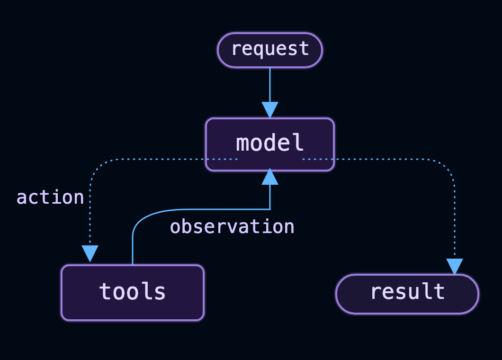
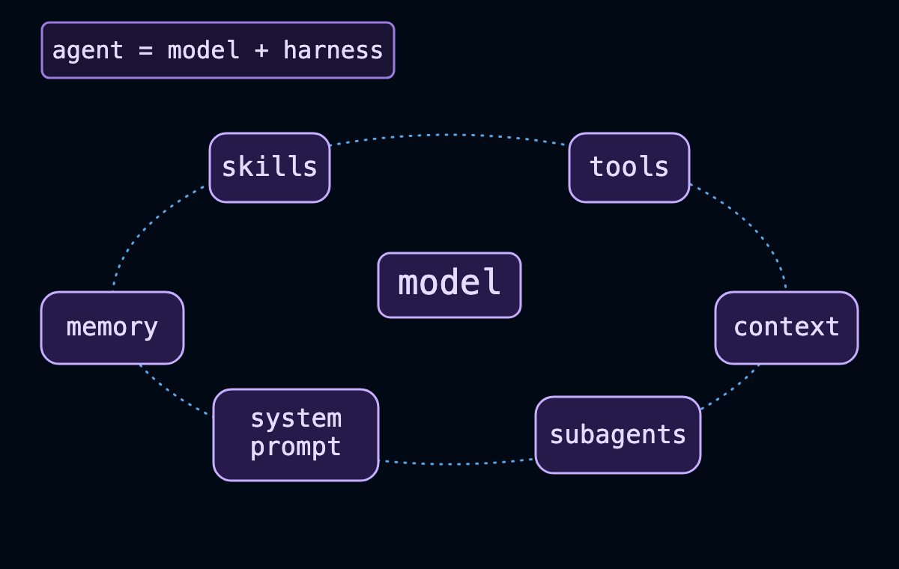
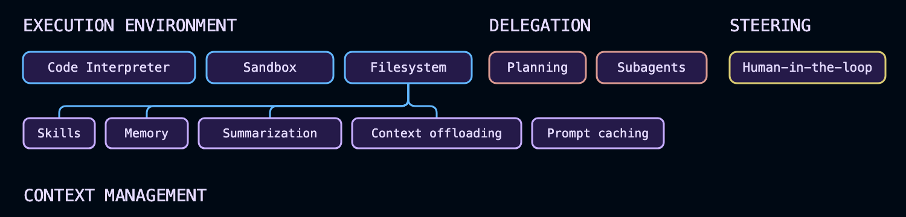

## LangChain overview

**Agent = `Model` + `Harness`**

LangChain provides `create_agent`. a minimal, highly configurable harness. The harness is everything around the `model loop`: `the prompt`, `the tools`, and any `middleware` that shapes behavior. Start with the primitives and compose exactly what your use case needs.

## What is a Harness?
A Harness is the software layer that surrounds the LLM and gives it the ability to perform useful tasks in the real world.

The model can only **think and generate text**. The harness enables it to:

- Use tools
- Maintain memory
- Plan tasks
- Execute code
- Call APIs
- Search databases
- Retrieve documents
- Interact with users
- Manage workflows
- Handle errors and retries
- Apply safety rules

Without a harness, an LLM is just a chatbot.

**Think of it like a Human:**

| Human       | AI Agent                          |
| ----------- | --------------------------------- |
| Brain       | Model (GPT, Claude, Gemini, etc.) |
| Hands       | Tools                             |
| Memory      | Conversation/Vector DB            |
| Notebook    | State Store                       |
| Eyes        | Search, OCR, Computer Vision      |
| Phone       | APIs                              |
| Manager     | Planner/Orchestrator              |
| Rules       | Guardrails                        |
| Entire body | Harness                           |

The **brain** is intelligent, but without a body it cannot accomplish much.

**Harness Architecture:**

```
                    USER
                      │
                      ▼
          +-----------------------+
          |       HARNESS         |
          |-----------------------|
          | Prompt Manager        |
          | Planner               |
          | Memory                |
          | Tool Executor         |
          | RAG                   |
          | State Management      |
          | Workflow Engine       |
          | Safety Guardrails     |
          | Retry Logic           |
          | Logging               |
          | Observability         |
          +----------+------------+
                     │
                     ▼
               +-----------+
               |   MODEL   |
               | GPT/Claude|
               | Gemini    |
               +-----------+
```

**What is inside a Harness?**

A production-quality harness often includes:

| Component       | Purpose                                              |
| --------------- | ---------------------------------------------------- |
| Prompt Manager  | Builds prompts and injects context                   |
| Memory          | Stores conversation history and long-term knowledge  |
| RAG             | Retrieves relevant documents before asking the model |
| Tool Calling    | Invokes APIs, databases, calculators, etc.           |
| Workflow Engine | Coordinates multi-step tasks                         |
| Planner         | Breaks complex goals into subtasks                   |
| State Manager   | Tracks progress across interactions                  |
| Guardrails      | Enforces safety and business rules                   |
| Retry Logic     | Handles failed API/tool calls                        |
| Authentication  | Manages user identity and permissions                |
| Logging         | Records requests and actions                         |
| Observability   | Tracks latency, token usage, costs, and errors       |


**Example:**

**Without Harness**

```Python
User:
What's the weather in Bangalore?

Model:
I don't know the current weather.
```

The model cannot access live information by itself.


**With Harness**

```Python
User
   │
   ▼
Harness
   │
   ├── Calls Weather API
   │
   ├── Gets response
   │
   └── Sends context to Model
               │
               ▼
Model

"The current temperature is 27°C with light rain."
```

**Example: `Invoice AI Agent`**

```Python
User uploads Invoice
          │
          ▼
      Harness
          │
 ┌────────┼──────────────┐
 │        │              │
 ▼        ▼              ▼
OCR   Layout Parser   Document Classifier
 │
 ▼
Structured Text
 │
 ▼
RAG (PO + Vendor + SAP Data)
 │
 ▼
LLM
 │
 ▼
Business Rule Engine
 │
 ▼
Validation Report
 │
 ▼
JSON Response
```

In this pipeline, the harness coordinates every component; the LLM is only one part.

**Popular Harness Frameworks**

| Framework         | What it Provides                           |
| ----------------- | ------------------------------------------ |
| LangChain         | Chains, tools, memory, agents              |
| LangGraph         | Stateful, graph-based agent workflows      |
| OpenAI Agents SDK | Agent orchestration, tool calling, tracing |
| CrewAI            | Multi-agent collaboration                  |
| LlamaIndex        | Data ingestion and retrieval (RAG)         |
| Semantic Kernel   | Planning, plugins, memory                  |
| AutoGen           | Multi-agent conversations                  |

These frameworks provide many harness capabilities so you don't have to build everything from scratch.

**Enterprise Harness (Typical Architecture)**

```Python
                 User
                   │
                   ▼
            API / UI Layer
                   │
                   ▼
         Agent Harness Layer
 ┌───────────────────────────────────────┐
 │ Prompt Manager                        │
 │ Planner                               │
 │ Memory                                │
 │ Tool Registry                         │
 │ RAG Retriever                         │
 │ Workflow Engine                       │
 │ State Store                           │
 │ Guardrails                            │
 │ Retry & Error Handling                │
 │ Authentication & Authorization        │
 │ Logging & Observability               │
 └───────────────────────────────────────┘
                   │
         ┌─────────┴─────────┐
         ▼                   ▼
      LLM Model         External Systems
                          • Databases
                          • APIs
                          • SAP
                          • Salesforce
                          • OCR
                          • Search
```                          

**In one sentence:**
A model provides reasoning and language generation, while the harness is the orchestration layer that gives the model memory, tools, workflows, state, and integration with external systems so it can function as a complete AI agent.


## LangChain vs. LangGraph vs. Deep Agents

| Feature                           | Deep Agents                               | LangChain (`create_agent`)                 | LangGraph                                                       | LangSmith                                      |
| --------------------------------- | ----------------------------------------- | ------------------------------------------ | --------------------------------------------------------------- | ---------------------------------------------- |
| **Purpose**                       | Ready-to-use production AI agent          | Build customizable AI agents               | Build complex, stateful multi-agent workflows                   | Observe, debug, evaluate, and monitor agents   |
| **Level**                         | High-level                                | High-level                                 | Low-level orchestration                                         | Development & Operations (Observability)       |
| **Primary Use Case**              | Fastest way to build an agent             | Custom single/multi-tool agents            | Enterprise workflows combining deterministic + agentic logic    | Debugging, tracing, evaluation, monitoring     |
| **Target Users**                  | Beginners & rapid development             | Application developers                     | Enterprise AI engineers                                         | AI developers, DevOps, MLOps                   |
| **Agent Harness Included**        | ✅ Yes (batteries included)                | ✅ Yes (customizable)                       | Partial (you build it)                                          | ❌ No                                           |
| **LLM Support**                   | ✅ Any supported LLM                       | ✅ Any supported LLM                        | ✅ Any supported LLM                                             | Works with all                                 |
| **Tool Calling**                  | ✅ Built in                                | ✅ Built in                                 | ✅ Built in                                                      | Trace only                                     |
| **Memory**                        | ✅ Automatic                               | ✅ Configurable                             | ✅ Stateful                                                      | View memory usage                              |
| **Automatic Context Compression** | ✅ Built in                                | ❌ Manual                                   | ❌ Manual                                                        | Monitor only                                   |
| **Virtual Filesystem**            | ✅ Built in                                | ❌                                          | ❌                                                               | ❌                                              |
| **Sub-Agent Creation**            | ✅ Automatic                               | Manual                                     | Manual                                                          | View traces                                    |
| **Multi-Agent Support**           | Limited                                   | Moderate                                   | ⭐ Excellent                                                     | Observe only                                   |
| **Workflow Orchestration**        | Basic                                     | Moderate                                   | ⭐ Advanced                                                      | No                                             |
| **State Management**              | Automatic                                 | Basic                                      | ⭐ Advanced persistent state                                     | View state                                     |
| **Conditional Routing**           | Limited                                   | Basic                                      | ⭐ Excellent                                                     | View routing                                   |
| **Loops & Cycles**                | Limited                                   | Limited                                    | ⭐ Native support                                                | Trace execution                                |
| **Human-in-the-loop**             | Basic                                     | Supported                                  | ⭐ Excellent                                                     | Monitor approvals                              |
| **Checkpointing / Resume**        | Automatic                                 | Limited                                    | ⭐ Built in                                                      | View checkpoints                               |
| **Deterministic Logic**           | Limited                                   | Moderate                                   | ⭐ Excellent                                                     | No                                             |
| **Scalability**                   | Medium                                    | High                                       | ⭐ Very High                                                     | Enterprise scale                               |
| **Customization**                 | Low                                       | High                                       | ⭐ Very High                                                     | N/A                                            |
| **Learning Curve**                | ⭐ Easy                                    | Medium                                     | Steep                                                           | Easy                                           |
| **Lines of Code**                 | Very Low                                  | Moderate                                   | High                                                            | Very Low                                       |
| **Production Ready**              | ✅ Yes                                     | ✅ Yes                                      | ✅ Enterprise grade                                              | ✅ Enterprise grade                             |
| **Best For**                      | Rapid prototyping & common agent patterns | Custom AI assistants and tool-using agents | Enterprise agent systems, orchestrators, long-running workflows | Monitoring, debugging, testing, and evaluation |


**When to Use Each**

| Scenario                          | Recommended     |
| --------------------------------- | --------------- |
| Build an AI agent in minutes      | **Deep Agents** |
| Build a custom chatbot with tools | **LangChain**   |
| RAG application with tool calling | **LangChain**   |
| Complex multi-agent orchestration | **LangGraph**   |
| Approval workflows                | **LangGraph**   |
| Long-running workflows            | **LangGraph**   |
| Persistent conversations          | **LangGraph**   |
| Human approval steps              | **LangGraph**   |
| Production monitoring             | **LangSmith**   |
| Prompt debugging                  | **LangSmith**   |
| Agent evaluation                  | **LangSmith**   |
| Cost and latency analysis         | **LangSmith**   |


**Relationship Between Them**

```Python
                     +----------------------+
                     |      LangSmith       |
                     |----------------------|
                     | Tracing              |
                     | Debugging            |
                     | Evaluation           |
                     | Monitoring           |
                     +----------▲-----------+
                                │
             -----------------------------------------
             │                                       │
             ▼                                       ▼
      +--------------+                    +----------------+
      | Deep Agents  |                    |   LangGraph    |
      |--------------|                    |----------------|
      | Ready-made   |                    | Orchestration  |
      | Agent Harness|                    | State Machine  |
      | Auto Memory  |                    | Multi-Agent    |
      | Subagents    |                    | Workflow       |
      +------+-------+                    +--------▲-------+
             │                                     │
             ▼                                     │
      +--------------------------------------------+
      |              LangChain                      |
      |--------------------------------------------|
      | create_agent()                             |
      | Models                                     |
      | Tools                                      |
      | Memory                                     |
      | Prompts                                    |
      | RAG                                        |
      +--------------------------------------------+
```

## Install LangChain

To install the LangChain package:

```Python
pip install -U langchain
# Requires Python 3.10+

uv add langchain
# Requires Python 3.10+
```

LangChain provides integrations to hundreds of LLMs and thousands of other integrations. These live in independent provider packages.

```Python
# Installing the OpenAI integration
pip install -U langchain-openai

# Installing the Anthropic integration
pip install -U langchain-anthropic

# Installing the OpenAI integration
uv add langchain-openai

# Installing the Anthropic integration
uv add langchain-anthropic
```

## Install dependencies

Install the following packages to follow along:(uv, pip, venv)

```Python
uv init
uv add langchain deepagents
uv sync

pip install -U langchain deepagents


python3 -m venv .venv
source .venv/bin/activate
# Windows: .venv\Scripts\activate
pip install -U langchain deepagents
```

## Set up API keys

Get an API key from any supported model provider (for example, Google Gemini or OpenAI).

Set the API keys, for example:

```Python
export OPENAI_API_KEY="your-api-key"
export GOOGLE_API_KEY="your-api-key"
export ANTHROPIC_API_KEY="your-api-key"
export OPENROUTER_API_KEY="your-api-key"
export FIREWORKS_API_KEY="your-api-key"
export BASETEN_API_KEY="your-api-key"

# Local: Ollama must be running (https://ollama.com)
# Cloud: Set your Ollama API key for hosted inference
export OLLAMA_API_KEY="your-api-key"

export AZURE_OPENAI_API_KEY="your-api-key"
export AZURE_OPENAI_ENDPOINT="https://your-resource.openai.azure.com"
export AZURE_OPENAI_DEPLOYMENT_NAME="your-deployment"

export AWS_ACCESS_KEY_ID="your-access-key"
export AWS_SECRET_ACCESS_KEY="your-secret-key"
export AWS_REGION="us-east-1"

export HUGGINGFACEHUB_API_TOKEN="hf_..."
```

## Agents
An agent is a model calling tools in a loop until a given task is complete.



**`Agent` = `Model` + `Harness`**

- The job of a harness: get the model the right context at the right time for the given task.

A harness is everything around that loop: `the model`, `its prompt`, `its tools`, and any `middleware` that shapes its behavior.

## create_agent

Creates an agent graph that calls tools in a loop until a stopping condition is met.

```Python
create_agent(
  model: str | BaseChatModel,
  tools: Sequence[BaseTool | Callable[..., Any] | dict[str, Any]] | None = None,
  *,
  system_prompt: str | SystemMessage | None = None,
  middleware: Sequence[AgentMiddleware[StateT_co, ContextT]] = (),
  response_format: ResponseFormat[ResponseT] | type[ResponseT] | dict[str, Any] | None = None,
  state_schema: type[AgentState[ResponseT]] | None = None,
  context_schema: type[ContextT] | None = None,
  checkpointer: Checkpointer | None = None,
  store: BaseStore | None = None,
  interrupt_before: list[str] | None = None,
  interrupt_after: list[str] | None = None,
  debug: bool = False,
  name: str | None = None,
  cache: BaseCache[Any] | None = None,
  transformers: Sequence[TransformerFactory] | None = None
) -> CompiledStateGraph[AgentState[ResponseT], ContextT, InputAgentState, OutputAgentState[ResponseT]]
```

The agent node calls the language model with the messages list (after applying the system prompt). If the resulting `AIMessage` contains `tool_calls`, the graph will then call the tools. The tools node executes the tools and adds the responses to the messages list as `ToolMessage` objects. The agent node then calls the language model again. The process repeats until no more `tool_calls` are present in the response. The agent then returns the full list of messages.

**Example:**

```Python
from langchain.agents import create_agent

def check_weather(location: str) -> str:
    '''Return the weather forecast for the specified location.'''
    return f"It's always sunny in {location}"

graph = create_agent(
    model="anthropic:claude-sonnet-4-5-20250929",
    tools=[check_weather],
    system_prompt="You are a helpful assistant",
)
inputs = {"messages": [{"role": "user", "content": "what is the weather in sf"}]}
for chunk in graph.stream(inputs, stream_mode="updates"):
    print(chunk)
```

## Agent Evals
Evaluations (“evals”) measure how well your agent performs by assessing its execution trajectory, the sequence of messages and tool calls it produces. Unlike integration tests that verify basic correctness, evals score agent behavior against a reference or rubric, making them useful for catching regressions when you change prompts, tools, or models.

An evaluator is a function that takes agent outputs (and optionally reference outputs) and returns a score:


```Python
def evaluator(*, outputs: dict, reference_outputs: dict):
    output_messages = outputs["messages"]
    reference_messages = reference_outputs["messages"]
    score = compare_messages(output_messages, reference_messages)
    return {"key": "evaluator_score", "score": score}
```

The agentevals package provides prebuilt evaluators for agent trajectories. You can evaluate by performing a **trajectory match** (deterministic comparison) or by using an **LLM judge** (qualitative assessment):

| Approach             | When to Use                                                                             | What It Evaluates                                                                        | Advantages                                              | Limitations                                                         | Example                                                                                              |
| -------------------- | --------------------------------------------------------------------------------------- | ---------------------------------------------------------------------------------------- | ------------------------------------------------------- | ------------------------------------------------------------------- | ---------------------------------------------------------------------------------------------------- |
| **Trajectory Match** | When you know the expected sequence of tool calls, intermediate steps, and final answer | Agent execution path (tool calls, order, arguments, intermediate messages, final output) | Fast, deterministic, no LLM cost, repeatable            | Brittle—fails if the agent takes a different but valid path         | Weather agent should call `check_weather("San Francisco")` exactly once before responding            |
| **LLM-as-Judge**     | When multiple valid reasoning paths or answers are acceptable                           | Overall answer quality, correctness, reasoning, completeness, relevance                  | Flexible, evaluates semantics rather than exact matches | Requires an LLM, incurs cost and latency, may have some variability | Judge whether the weather response correctly answers the user's question even if the wording differs |


**Comparison:**

| Feature                         | Trajectory Match                                  | LLM-as-Judge                                           |
| ------------------------------- | ------------------------------------------------- | ------------------------------------------------------ |
| Requires expected tool sequence | ✅ Yes                                             | ❌ No                                                   |
| Checks tool calls               | ✅ Yes                                             | Optional                                               |
| Checks reasoning quality        | Limited                                           | ✅ Excellent                                            |
| Checks final answer             | ✅ Exact                                           | ✅ Semantic                                             |
| Deterministic                   | ✅ Yes                                             | ❌ No (though often stable with fixed settings)         |
| LLM required                    | ❌ No                                              | ✅ Yes                                                  |
| Cost                            | Free                                              | Uses LLM tokens                                        |
| Speed                           | Very fast                                         | Slower                                                 |
| Best for                        | Unit tests, regression tests, tool-calling agents | End-to-end evaluation, RAG, customer-facing assistants |


## Install AgentEvals

```Python
pip install agentevals
```

**Trajectory match evaluator:**

AgentEvals offers the create_trajectory_match_evaluator function to match your agent’s trajectory against a reference. There are four modes:

| **Mode**      | **Description**                                                                                                                                           | **Tool Call Order**    | **Extra Tool Calls Allowed?** | **Missing Tool Calls Allowed?** | **Best Use Case**                                                                 | **Example**                                                                                                                             |
| ------------- | --------------------------------------------------------------------------------------------------------------------------------------------------------- | ---------------------- | ----------------------------- | ------------------------------- | --------------------------------------------------------------------------------- | --------------------------------------------------------------------------------------------------------------------------------------- |
| **strict**    | Requires an exact match of the message structure and tool calls in the same order. Message content may differ, but the execution path must match exactly. | ✅ Exact order required | ❌ No                          | ❌ No                            | Regression testing, deterministic workflows, compliance checks                    | Verify the agent always performs **Policy Lookup → Authorization → Response** in that order.                                            |
| **unordered** | Requires the same message structure and tool calls as the reference, but tool calls may occur in any order.                                               | ❌ Order ignored        | ❌ No                          | ❌ No                            | Information retrieval where execution order is not important                      | Verify the agent queries **Customer DB**, **Order DB**, and **Inventory DB**, regardless of which is called first.                      |
| **subset**    | The agent may call only tools that appear in the reference. It can use fewer tools, but it must not invoke unexpected tools.                              | Flexible               | ❌ No                          | ✅ Yes                           | Scope validation and security testing                                             | Ensure the agent only accesses **Weather API** and **Maps API**, and never calls **Payment API**.                                       |
| **superset**  | The agent must call at least all tools in the reference. Additional tool calls are permitted.                                                             | Flexible               | ✅ Yes                         | ❌ No                            | Ensuring required actions are completed while allowing optimization or enrichment | Verify the agent always performs **Authentication** and **Authorization**, while optionally calling **Audit Logging** or **Analytics**. |


| **Mode**      | **Order Matters** | **Allows Extra Tools** | **Allows Missing Tools** | **Typical Scenario**               |
| ------------- | ----------------- | ---------------------- | ------------------------ | ---------------------------------- |
| **strict**    | ✅ Yes             | ❌ No                   | ❌ No                     | Exact workflow validation          |
| **unordered** | ❌ No              | ❌ No                   | ❌ No                     | Same actions, any order            |
| **subset**    | ❌ No              | ❌ No                   | ✅ Yes                    | Restricting agent scope            |
| **superset**  | ❌ No              | ✅ Yes                  | ❌ No                     | Enforcing minimum required actions |


**Strict match:**
The `strict` mode ensures trajectories contain identical messages in the same order with the same tool calls, though it allows for differences in message content. This is useful when you need to enforce a specific sequence of operations, such as requiring a policy lookup before authorizing an action.


**Unordered match:**
The `unordered` mode allows the same tool calls in any order. This is helpful when you want to verify that specific information was retrieved but don’t care about the sequence. For example, an agent that checks both weather and events for a city with different tool calls.

**Subset and superset match:**
The `superset` and `subset` modes match partial trajectories. The superset mode verifies that the agent called at least the tools in the reference trajectory, allowing additional tool calls. The subset mode ensures the agent did not call any tools beyond those in the reference.

**Example:**

Assume the **reference trajectory** is:

```
1. Authenticate User
2. Retrieve Customer Record
3. Retrieve Orders
4. Generate Response
```

| **Mode**      | **Candidate Execution**                                 | **Result** | **Reason**                                               |
| ------------- | ------------------------------------------------------- | ---------- | -------------------------------------------------------- |
| **strict**    | Authenticate → Customer → Orders → Response             | ✅ Pass     | Exact match                                              |
| **strict**    | Authenticate → Orders → Customer → Response             | ❌ Fail     | Order differs                                            |
| **unordered** | Authenticate → Orders → Customer → Response             | ✅ Pass     | Same tool calls, different order                         |
| **subset**    | Authenticate → Customer → Response                      | ✅ Pass     | Uses only reference tools; `Retrieve Orders` is optional |
| **subset**    | Authenticate → Customer → Payment API → Response        | ❌ Fail     | Calls an unexpected tool                                 |
| **superset**  | Authenticate → Customer → Orders → Audit Log → Response | ✅ Pass     | Includes all required tools plus an extra                |
| **superset**  | Authenticate → Customer → Response                      | ❌ Fail     | Missing required `Retrieve Orders` tool                  |


## LLM-as-judge evaluator

You can use an LLM to evaluate the agent’s execution path with the `create_trajectory_llm_as_judge` function. Unlike trajectory match evaluators, it doesn’t require a reference trajectory, but one can be provided if available.


**Async support:**

All agentevals evaluators support Python asyncio. Async versions are available by adding async after create_ in the function name.

```Python
from agentevals.trajectory.llm import create_async_trajectory_llm_as_judge, TRAJECTORY_ACCURACY_PROMPT
from agentevals.trajectory.match import create_async_trajectory_match_evaluator

async_judge = create_async_trajectory_llm_as_judge(
    model="openai:o3-mini",
    prompt=TRAJECTORY_ACCURACY_PROMPT,
)

async_evaluator = create_async_trajectory_match_evaluator(
    trajectory_match_mode="strict",
)

async def test_async_evaluation():
    result = await agent.ainvoke({
        "messages": [HumanMessage(content="What's the weather?")]
    })

    evaluation = await async_judge(outputs=result["messages"])
    assert evaluation["score"] is True
```


## Core components




**Model:** Pass a model identifier string `("provider:model")` or an initialized model instance to select the model for your agent.

`Google:` 
```Python
from langchain.agents import create_agent

agent = create_agent(model="google_genai:gemini-3.5-flash", tools=tools)
```

`OpenAI:`
```Python
from langchain.agents import create_agent

agent = create_agent(model="openai:gpt-5.4", tools=tools)
```

`Anthropic:`
```Python
from langchain.agents import create_agent

agent = create_agent(model="anthropic:claude-sonnet-4-6", tools=tools)
```

`Ollama:`
```Python
from langchain.agents import create_agent

agent = create_agent(model="ollama:devstral-2", tools=tools)
```

**Tools:**
To provide the agent with tools, pass any Python callable, LangChain tool, or tool dict.
for tool definition, context access, and dynamic tool selection.

```Python
from langchain.agents import create_agent
from langchain.tools import tool


@tool
def search(query: str) -> str:
    """Search for information."""
    return f"Results for: {query}"


agent = create_agent(model="openai:gpt-5.4", tools=[search])
```

**System prompt:**
Shape how the agent approaches tasks. The system prompt parameter accepts a string or `SystemMessage`. For dynamic prompts at runtime, use `middleware`.

```Python
agent = create_agent(
    model="openai:gpt-5.4",
    tools=tools,
    system_prompt="You are a helpful assistant. Be concise and accurate.",
)
```

**Structured output:**
Return a validated schema from the agent using `response_format=`. 

```Python
from pydantic import BaseModel
from langchain.agents import create_agent


class Answer(BaseModel):
    summary: str
    confidence: float


agent = create_agent(model="openai:gpt-5.4", tools=tools, response_format=Answer)
result = agent.invoke({"messages": [{"role": "user", "content": "Summarize AI trends"}]})
result["structured_response"]  # Answer(summary=..., confidence=...)
```

**Invocation:**
You can invoke an agent with a message. Behind the scenes that passes an update to the agent’s `State`. All agents include a sequence of messages in their state; to invoke the agent, pass a new message along with a `thread_id` so the agent can persist and resume conversation history:

```Python
from langchain.agents import create_agent
from langchain_core.utils.uuid import uuid7
from langgraph.checkpoint.memory import InMemorySaver

agent = create_agent(
    model="openai:gpt-5.4",
    tools=[],
    checkpointer=InMemorySaver(),
)

config = {"configurable": {"thread_id": str(uuid7())}}

result = agent.invoke(
    {"messages": [{"role": "user", "content": "What's the weather in San Francisco?"}]},
    config=config,
)

# A follow-up turn on the same conversation: reuse the same thread_id to keep history
result = agent.invoke(
    {"messages": [{"role": "user", "content": "What about tomorrow?"}]},
    config=config,
)
```

**Persisting conversation history with thread_id requires the agent to be configured with a checkpointer.**

If you also need to pass per-run configuration (such as a user ID, API keys, or feature flags) to tools and middleware, pass it as `context` alongside `config`. Define the shape of that data with `context_schema` and access it through `runtime.context`:

```Python
from dataclasses import dataclass

from langchain.agents import create_agent
from langchain_core.utils.uuid import uuid7
from langgraph.checkpoint.memory import InMemorySaver


@dataclass
class Context:
    user_id: str


agent = create_agent(
    model="openai:gpt-5.4",
    tools=[],
    context_schema=Context,
    checkpointer=InMemorySaver(),
)

result = agent.invoke(
    {"messages": [{"role": "user", "content": "What's the weather in San Francisco?"}]},
    config={"configurable": {"thread_id": str(uuid7())}},
    context=Context(user_id="user-123"),
)
```

`thread_id` scopes the conversation (message history, checkpoints), while `context` carries per-run data your tools and middleware read at invocation time. Both are commonly passed together.


**Streaming:**
`invoke` returns the final response at the end of a run. If an agent executes multiple tool calls, users often need progress updates before completion. Use streaming to surface intermediate messages and tool activity as they happen.

```Python
from langchain.messages import AIMessage, HumanMessage


stream = agent.stream_events(
    {"messages": [{"role": "user", "content": "Search for AI news and summarize the findings"}]},
    version="v3",
)
for snapshot in stream.values:
    # Each snapshot contains the full state at that point
    latest_message = snapshot["messages"][-1]
    if latest_message.content:
        if isinstance(latest_message, HumanMessage):
            print(f"User: {latest_message.content}")
        elif isinstance(latest_message, AIMessage):
            print(f"Agent: {latest_message.content}")
    elif latest_message.tool_calls:
        print(f"Calling tools: {[tc['name'] for tc in latest_message.tool_calls]}")
```

**Configure the harness:**
`create_agent` is highly extensible. Middleware is the primitive for customization: each piece handles one concern, hooks into the agent loop at the right moment, and composes freely with any other. Take exactly what your use case needs and skip the rest.

Common patterns are prebuilt as first-class middleware. You can build anything else as custom middleware.



As agents take on complex work, they need support across a few key areas. The middleware ecosystem provides:

- **Execution environment**
- **Context management**
- **Planning and delegation**
- **Fault tolerance**
- **Guardrails**
- **Steering**


**Execution environment:**
Agents are especially useful when they can take action rather than just generate text.The execution environment gives the agent a workspace: tools it can call, a filesystem for reading and writing files across turns, and code execution for running scripts or shell commands.

```Python
from langchain.agents import create_agent
from deepagents.backends import StateBackend
from deepagents.middleware import FilesystemMiddleware

agent = create_agent(
    model="openai:gpt-5.4",
    tools=[search],
    middleware=[FilesystemMiddleware(backend=StateBackend())],
)
```

**Context management:**
Every model call has a fixed context window. As an agent runs, that window fills with accumulating history, tool results, and intermediate steps. Summarization compresses history before overflow hits; memory loads persistent instructions at startup so knowledge carries across sessions; skills surface domain knowledge on demand rather than loading everything upfront.

```Python
from deepagents.backends import StateBackend
from deepagents.middleware import FilesystemMiddleware, MemoryMiddleware, SkillsMiddleware, SummarizationMiddleware

backend = StateBackend()
model="openai:gpt-5.4"

agent = create_agent(
    model=model,
    tools=[search],
    middleware=[
        FilesystemMiddleware(backend=backend),
        SummarizationMiddleware(model=model, backend=backend),
        MemoryMiddleware(backend=backend, sources=["./AGENTS.md"]),
        SkillsMiddleware(backend=backend, sources=["./skills/"]),
    ],
)
```

**Planning and delegation:**
Complex tasks often exceed what one context window can handle. Delegation lets the main agent break work into pieces, hand them to subagents that each run in their own isolated context, and stay focused on coordination rather than execution. Work can run in parallel; the main agent’s context stays clean.

```Python
from deepagents.backends import StateBackend
from deepagents.middleware import FilesystemMiddleware
from deepagents.middleware.subagents import SubAgentMiddleware
from langchain.agents import create_agent
from langchain.agents.middleware import TodoListMiddleware
from langchain.tools import tool


@tool
def search(query: str) -> str:
    """Search for a query and return a short summary."""
    return f"Search results for: {query}"


backend = StateBackend()

agent = create_agent(
    model="openai:gpt-5.4",
    tools=[search],
    middleware=[
        FilesystemMiddleware(backend=backend),
        TodoListMiddleware(),
        SubAgentMiddleware(
            backend=backend,
            subagents=[
                {
                    "name": "researcher",
                    "description": "Searches and returns a structured summary.",
                    "system_prompt": "Use the search tool to research the question and summarize key points.",
                    "tools": [search],
                    "model": "anthropic:claude-sonnet-4-6",
                    "middleware": [],
                }
            ],
        ),
    ],
)
```

**Name your agent:**
Optionally use an identifier for the agent. This is especially useful when embedding the agent as a subgraph in multi-agent systems.

```Python
agent = create_agent(model="openai:gpt-5.4", tools=tools, name="research_assistant")
```

**Fault tolerance:**
Agents in production encounter failures that rarely appear in development: rate limits, model timeouts, transient API errors. Fault tolerance middleware handles these at the infrastructure level so your tools and business logic don’t need try/catch around every call.

```Python
from langchain.agents import create_agent
from langchain.agents.middleware import ModelRetryMiddleware, ToolRetryMiddleware
from langchain.tools import tool


@tool
def search(query: str) -> str:
    """Search for a query and return a short summary."""
    return f"Search results for: {query}"


agent = create_agent(
    model="openai:gpt-5.4",
    tools=[search],
    middleware=[
        ModelRetryMiddleware(max_retries=3),
        ToolRetryMiddleware(max_retries=2),
    ],
)
```

**Guardrails:**
Some policies can’t live in a prompt—they need to be enforced deterministically regardless of what the model does. Guardrails intercept data as it flows through the agent loop, applying compliance rules or content policies before tool results reach the model’s context.

```Python
from langchain.agents import create_agent
from langchain.agents.middleware import PIIMiddleware
from langchain.tools import tool


@tool
def search(query: str) -> str:
    """Search for a query and return a short summary."""
    return f"Search results for: {query}"


agent = create_agent(
    model="openai:gpt-5.4",
    tools=[search],
    middleware=[PIIMiddleware("email")],
)
```

**Steering:**
Full autonomy isn’t always appropriate. Steering lets you place humans at specific decision points—before destructive writes, expensive API calls, or anything requiring judgment—without restructuring your agent. The agent pauses and waits; a human approves, edits, or rejects; execution continues.

```Python
from langchain.agents import create_agent
from langchain.agents.middleware import HumanInTheLoopMiddleware
from langchain.tools import tool


@tool
def search(query: str) -> str:
    """Search for a query and return a short summary."""
    return f"Search results for: {query}"


agent = create_agent(
    model="openai:gpt-5.4",
    tools=[search],
    middleware=[HumanInTheLoopMiddleware(interrupt_on={"write_file": True})],
)
```


