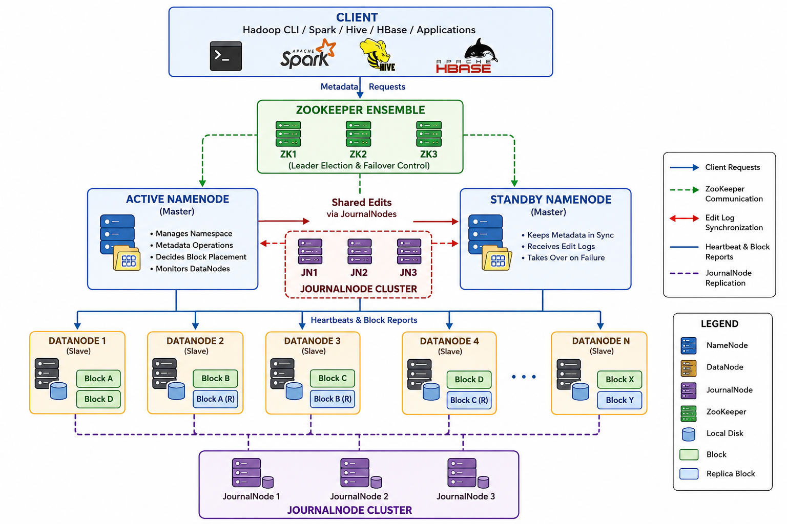

## What is Hadoop Distributed File System `(HDFS)`?
Hadoop Distributed File System is the **distributed storage layer of the Hadoop ecosystem**. It is designed to store **very large files (terabytes to petabytes)** across many commodity servers while providing **high throughput, fault tolerance, and scalability**.



## HDFS Components

**1. Client**

The client can be:

- Hadoop application
- Spark application
- Hive
- Pig
- Java application
- Python application

Responsibilities:

- Upload files
- Download files
- Request metadata
- Communicate with NameNode

**2. Active NameNode (Master)**
The Active NameNode is the `brain of HDFS`.

Responsibilities:

- Maintain filesystem namespace
- Store metadata
- Track file locations
- Decide block placement
- Monitor DataNodes
- Process client requests


**Note:** `It does not store the actual file data.`

Stores:

- File Name
- Block List
- DataNode Location
- Replication Count
- Permissions


**3. Standby NameNode (Master)**

The Standby NameNode continuously receives metadata updates from the Active NameNode.

Responsibilities:

- Keep metadata synchronized
- Stay ready to take over
- Monitor Active NameNode
- Become Active automatically during failure

Normally:

- Read metadata
- Replay edit logs
- Wait


**4. ZooKeeper Ensemble**

Usually:

- `3 Nodes` or `5 Nodes`

Responsibilities:

- Leader election
- Detect NameNode failure
- Coordinate failover
- Prevent split-brain scenarios

Example:

- `NN1 crashes` -> `ZooKeeper detects failure` -> `NN2 promoted` -> `Clients reconnect automatically`

**5. JournalNodes**

Typically:

- `3 JournalNodes` or `5 JournalNodes`

Responsibilities:

- Store edit logs
- Synchronize metadata changes
- Ensure the Standby NameNode has the latest namespace updates

Every metadata change is written to a majority of JournalNodes before it is considered committed.


**6. DataNodes (Slaves)**

The DataNodes store the actual file blocks.

Responsibilities:

- Store blocks
- Serve read requests
- Accept writes
- Replicate blocks
- Delete blocks when instructed
- Send heartbeats
- Send block reports

**Heartbeats**

Every few seconds, DataNodes send: `Heartbeat` -> `NameNode`

Purpose:`I'm alive.` 

If no heartbeat is received for a configured timeout: `DataNode` -> `Dead`

The NameNode starts re-replicating blocks to maintain the desired replication factor.


**Block Report**

DataNodes periodically send: `Block Report` -> `Complete list of blocks stored`

The NameNode updates its metadata accordingly.

**File Write Flow**

- `Client` -> `Request to create file` -> `Active NameNode` -> `Choose DataNodes` -> `Pipeline Created` -> `(DN1 → DN2 → DN3)` -> `Replication Completed` -> `Success`

**Example:**

Upload: `Employee.csv`, `512 MB`

With a 128 MB block size:

- `Block1 : 128 MB`, `Block2 : 128 MB`, `Block3 : 128 MB`, `Block4 : 128 MB`

Stored as:

- DN1 : `Block1, Block4`
- DN2 : `Block2, Block1 Replica`
- DN3 : `Block3, Block2 Replica`
- DN4 : `Block4 Replica, Block3 Replica`


**File Read Flow:** 

- `Client` -> `Ask Active NameNode` -> `Where is Block1?` -> `DN3` -> `Download Block1` -> `Where is Block2?` -> `DN2` -> `Download` -> `Assemble File`

**Replication:**

Default replication: `3`

Example:

- Block A : `DN1` , `DN4` , `DN7`

If one DataNode fails:

- `DN4` -> `Dead` -> `NameNode` -> `Create New Replica` -> `DN12`


Replication factor returns to the configured value.

**Metadata Stored in NameNode**

The NameNode keeps information such as:

- File names
- Directory hierarchy
- File ownership
- Permissions
- Block IDs
- Block locations
- Replication factor
- Namespace information

The actual block data remains on the DataNodes.


## Master-Slave Architecture

| Master Components  | Responsibilities                         |
| ------------------ | ---------------------------------------- |
| Active NameNode    | Manages metadata and client requests     |
| Standby NameNode   | Backup master for automatic failover     |
| ZooKeeper Ensemble | Coordinates failover and leader election |
| JournalNodes       | Share edit logs between NameNodes        |


| Slave Components | Responsibilities                                     |
| ---------------- | ---------------------------------------------------- |
| DataNodes        | Store data blocks, send heartbeats and block reports |


**Note:** `Partitioning is not an HDFS storage concept.`

There are `two different kinds of partitioning` in the big data ecosystem

**1. HDFS Level (Storage):** `HDFS only knows about files and blocks.`

HDFS does NOT know anything about:

- SQL partitions
- Spark partitions
- Hive partitions
- Year=2026
- Month=06


It only stores blocks.


**2. Processing Level (Spark / MapReduce)**

When Apache Spark reads an HDFS file:

- `HDFS File` -> `Blocks` -> `Spark` -> `Partitions` -> `Executors`

Spark creates partitions so multiple executors can process data in parallel.

These partitions are `processing partitions`, not HDFS storage blocks.

**3. Hive Partitioning (Logical)**

Suppose you have sales data.

Instead of: `sales.csv`

Hive stores it like:

```
sales/

    year=2024/

    year=2025/

    year=2026/
```

Inside:

```
year=2026/

    month=01/

    month=02/

    month=03/
```

This is called `table partitioning`.

HDFS simply sees these as directories and files.

```
HDFS

sales/

    year=2026/

        month=06/

            part-0001.parquet

            part-0002.parquet
```


HDFS has no idea that `year=2026` is a partition key—it is just a folder name.

## Difference Between Block and Partition

| HDFS Block                        | Spark Partition               |
| --------------------------------- | ----------------------------- |
| Storage concept                   | Processing concept            |
| Managed by HDFS                   | Managed by Spark              |
| Fixed size (128 MB, 256 MB, etc.) | Variable size                 |
| Stored on DataNodes               | Processed by executors        |
| Used for storage and replication  | Used for parallel computation |


**Relationship**


```
Large File
     │
     ▼
Split into Blocks (HDFS Block Size)
     │
     ▼
Store Blocks on Multiple DataNodes
     │
     ▼
Replicate Each Block (Replication Factor)
     │
     ▼
Spark/MapReduce Processes Blocks as Partitions
```

**1. What is Block Size?**

A `block` is the `smallest unit of storage` in HDFS.

When you upload a file, HDFS `splits it into fixed-size blocks`.

Example:

- `File size = 600 MB`
- `Block size = 128 MB`

```
600 MB File

↓

Block 1 = 128 MB

Block 2 = 128 MB

Block 3 = 128 MB

Block 4 = 128 MB

Block 5 = 88 MB
```

So `600 MB file becomes 5 blocks`.

**Common Block Sizes:**

| Hadoop Version |                                             Default Block Size |
| -------------- | -------------------------------------------------------------: |
| Hadoop 1.x     |                                                          64 MB |
| Hadoop 2.x     |                                                         128 MB |
| Hadoop 3.x     | 128 MB (256 MB is also commonly configured for large clusters) |


The block size is configurable.

**2. What is Replication?**

Each block is copied to multiple DataNodes.

Example:

Replication Factor = 3

```
Block 1

↓

DataNode1

DataNode3

DataNode5
```

This means:

- `Original block: 1 copy`
- `Replicas: 2 additional copies`
- `Total stored copies: 3`

The purpose is `fault tolerance`.


**Block Size vs Replication**

| Block Size                     | Replication                                         |
| ------------------------------ | --------------------------------------------------- |
| Determines how a file is split | Determines how many copies of each block are stored |
| Affects number of blocks       | Affects storage overhead and fault tolerance        |
| Example: 128 MB                | Example: 3 copies                                   |
| Improves parallelism           | Protects against node failures                      |


## Where Does Partitioning Fit?

Partitioning is `not the same as HDFS blocks`.

```
HDFS File

↓

Blocks

↓

Spark Reads Blocks

↓

Creates Partitions

↓

Executors Process Partitions
```

Although Spark often starts with one partition per HDFS block, it can create more or fewer partitions based on configuration (such as `repartition()` or `coalesce()`) and the data source.


**Complete Flow:**

```
                    600 MB File
                         │
                         ▼
        Split into HDFS Blocks (128 MB each)
                         │
                         ▼
     ┌──────────┬──────────┬──────────┬──────────┬──────────┐
     │ Block 1  │ Block 2  │ Block 3  │ Block 4  │ Block 5  │
     └──────────┴──────────┴──────────┴──────────┴──────────┘
                         │
          Replicate each block 3 times
                         │
                         ▼
      Store replicas across multiple DataNodes
                         │
                         ▼
    Spark/MapReduce reads the blocks in parallel
                         │
                         ▼
       Creates partitions for parallel processing
```


- **Block** = `How HDFS stores the file`.
- **Replication** = `How HDFS protects the file`.
- **Partition** = `How processing engines (Spark/MapReduce) divide the work for parallel execution`.
