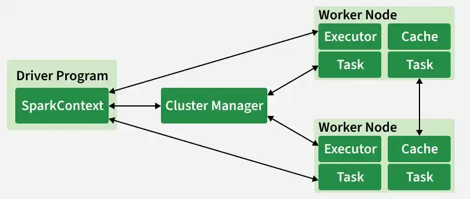
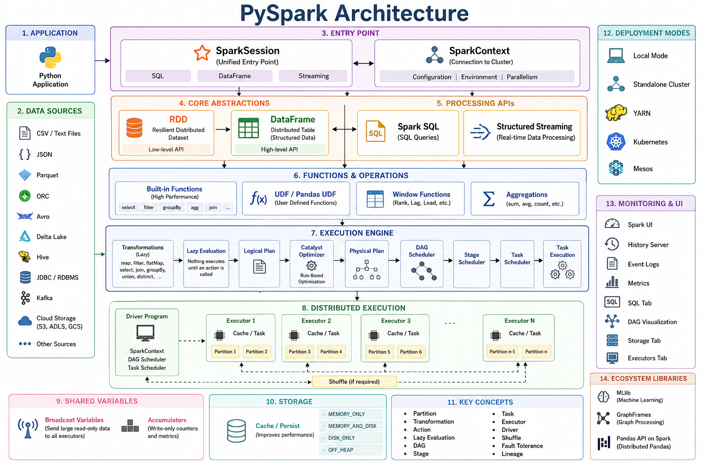

## What is PySpark?
PySpark is the Python API for Apache Spark.It enables you to perform real-time, large-scale data processing in a distributed environment using Python. It also provides a PySpark shell for interactively analyzing your data.

PySpark combines Python’s learnability and ease of use with the power of Apache Spark to enable processing and analysis of data at any size for everyone familiar with Python.

PySpark supports all of Spark’s features such as `**Spark SQL?**`, `**DataFrames**`, `**Structured Streaming**`, `**Machine Learning (MLlib)**`, `**Pipelines and Spark Core**`.

## Core Architecture

Spark uses a **master-worker** (driver-executor) model, with modern enhancements like Spark Connect.



- **Driver Program:** The "brain": Runs the main() function, creates SparkSession/SparkContext, translates code into a logical plan, optimizes it (via Catalyst), creates a physical plan, and coordinates execution.

- **Cluster Manager:** Allocates resources (YARN, Kubernetes, Mesos, standalone, or cloud-native like Databricks/EMR).

- **Executors:** Worker processes on cluster nodes. Each runs tasks, stores data in memory/disk, and reports back to the driver.

- **SparkSession:** Unified entry point (replaces older SparkContext + SQLContext).

- **Spark Connect** (major in 4.x) - Decouples client from cluster: Thin client (Python/Scala/Go/R) talks to server-side Spark via gRPC. Enables remote development, better security, and consistency between local and cluster execution.


## Key abstractions: 

- **Resilient Distributed Datasets (RDDs)** — Low-level, immutable, partitioned collections with lineage for fault recovery (still foundational but less used directly now).

- **DataFrames / Datasets** — Higher-level, structured (with schema), optimized via Catalyst optimizer and Tungsten execution engine (columnar, codegen).

- **Directed Acyclic Graph (DAG)** — Execution plan: Spark builds a DAG of stages (shuffle boundaries separate them).

## Built-in libraries (unified engine):

- **Spark SQL** — Structured data, ANSI SQL, DataFrames.
- **Spark Streaming / Structured Streaming** — Real-time (micro-batch or continuous/real-time mode in 4.x for ms latency).
- **MLlib** — Scalable machine learning.
- **GraphX** — Graph computation


## 1. Application Submission & Driver Initialization

A Spark application begins when the user submits code written in PySpark, Scala, Java, or SQL. This code creates a SparkSession, which internally initializes the SparkContext.

The Driver Program is the central coordinator of the application and runs the user’s main function. It is responsible for:

- Creating the SparkContext
- Converting user code into execution plans
- Coordinating execution across the cluster
- Collecting or persisting final results


The Driver contains critical internal components:

- DAG Scheduler
- Task Scheduler
- Backend Scheduler
- Block Manager


Together, the Driver and SparkContext oversee the entire job execution lifecycle.

## 2. Logical Plan Creation (Lazy Evaluation)

Spark follows a lazy evaluation model. When transformations such as filter, map, or groupBy are defined, Spark does not execute them immediately.


Instead:

- User code is converted into an unresolved logical plan.
- Spark records what needs to be done, not how to do it yet.

Execution only begins when an action (e.g., show(), count(), write()) is called.


## 3. Query Optimization Using Catalyst Optimizer

Once an action is triggered, Spark hands the logical plan to the Catalyst Optimizer, which performs multiple optimization steps:

- **Analysis** – Resolves column names, data types, and references.
- **Logical Optimization** – Applies rule-based optimizations (predicate pushdown, projection pruning).
- **Cost-Based Optimization (CBO)** – Chooses optimal join strategies using statistics.
- **Physical Planning** – Converts optimized logic into executable physical operators.

Spark may also apply whole-stage code generation and columnar execution to further improve performance.

## 4. DAG Creation and Stage Breakdown

The optimized physical plan is translated into a Directed Acyclic Graph (DAG) of operations.

The DAG Scheduler:

- Breaks the DAG into stages
- Identifies shuffle boundaries (e.g., joins, aggregations)
- Determines task dependencies


Each stage consists of multiple tasks that can be executed in parallel.

## 5. Cluster Manager & Resource Allocation

The Cluster Manager (Standalone, YARN, Kubernetes, or Mesos) is responsible for:

- Allocating CPU cores and memory
- Launching executor processes on worker nodes

The Spark Driver communicates with the Cluster Manager to request resources and schedule work.

## 6. Task Scheduling & Execution

The Task Scheduler assigns tasks to executors, which are long-lived processes running on worker nodes.

Executors:

- Execute tasks in parallel
- Cache data in memory or disk
- Perform shuffles when required
- Communicate with other executors during data exchange


## 7. Data Storage, Caching, and Memory Management

Spark supports in-memory computation, which is key to its performance advantage.

- Data can be cached using cache() or persist().
- Memory is divided into execution memory and storage memory.
- Cached data accelerates iterative workloads such as machine learning and graph processing.


## 8. Fault Tolerance & Reliability

Spark ensures fault tolerance through:

- **Lineage based recomputation** – lost partitions are recomputed automatically.
- **Speculative execution** – slow running tasks are re executed on other executors.
- **Task retries** – failed tasks are retried without restarting the job.


This approach avoids costly data replication while maintaining reliability.


## 9. Result Handling & Output

After task execution:

- Results may be returned to the Driver (for actions like collect)
- Or written to external storage (HDFS, S3, databases, data warehouses)


## End-to-End Production Workflow Example

A typical production ETL + ML pipeline (e.g., customer churn prediction or daily reporting):

**1. Ingestion (Extract)**

- **Sources:** Kafka (streaming), S3/ADLS (batch files), databases (JDBC).
- Use Spark Structured Streaming for continuous or Spark batch jobs scheduled via Airflow Workflows.

**2. Processing (Transform)**

- Read → clean (handle nulls/duplicates) → enrich (joins with reference data) → aggregate/window functions → feature engineering.
- Use Delta Lake for ACID transactions, time travel, schema evolution.
- Optimize: Partitioning, Z-ordering, caching, broadcast joins.
- Example: PySpark code with Spark Connect enabled for remote cluster.

**3. Storage (Load)**

- Write to Delta Lake.
- Formats: Parquet/Delta for efficiency.

**4. Orchestration & Scheduling**

- Airflow/Databricks Jobs → trigger daily/hourly.
- Use dynamic allocation, spot instances for cost savings.

**5. Monitoring & Governance**

- Spark UI or Prometheus for metrics.
- Delta Lake for auditing.
- Unity Catalog (Databricks) or open equivalents for governance.


**6. Consumption**

Serve gold tables to BI (Power BI/Tableau), ML models (MLflow), or downstream apps via APIs.


## Complete PySpark Architecture and Component Map

```Python
                                            PYSPARK
                                               │
        ┌──────────────────────────────────────┼──────────────────────────────────────┐
        │                                      │                                      │
        │                               Application Layer                      Cluster Layer
        │                                      │                                      │
        │                                      │                                      │
  Python Application                      SparkSession                         Cluster Manager
        │                                      │                        (Standalone / YARN /
        │                                      │                         Kubernetes / Mesos)
        │                                      │
        │                                      ▼
        │                              SparkContext
        │                                      │
        │          ┌───────────────────────────┼────────────────────────────┐
        │          │                           │                            │
        │          │                           │                            │
        ▼          ▼                           ▼                            ▼
      RDD      DataFrame                 Spark SQL                    Structured Streaming
        │          │                           │                            │
        │          │                           │                            │
        │          │                           ▼                            ▼
        │          │                     SQL Queries                 Streaming DataFrame
        │          │
        │          ├────────────────────────────────────────────────────────────┐
        │          │                                                            │
        │          ▼                                                            ▼
        │     Built-in Functions                                           UDF / Pandas UDF
        │          │                                                            │
        │          ▼                                                            ▼
        │     Window Functions                                           Aggregations
        │
        ▼
 Shared Variables
        │
  ┌─────┴───────────┐
  │                 │
Broadcast      Accumulator

────────────────────────────────────────────────────────────────────────────────────────────

                         Execution Engine (Internal Spark)

                             Transformations (Lazy)
                                     │
                map() filter() flatMap() select() join()
                groupBy() union() distinct() orderBy()
                                     │
                                     ▼
                              Lazy Evaluation
                                     │
                                     ▼
                              Logical Plan
                                     │
                                     ▼
                          Catalyst Optimizer
                                     │
                                     ▼
                           Physical Execution Plan
                                     │
                                     ▼
                            DAG Scheduler
                                     │
                                     ▼
                            Stage Scheduler
                                     │
                                     ▼
                           Task Scheduler
                                     │
                                     ▼
                              Task Execution

────────────────────────────────────────────────────────────────────────────────────────────

                            Memory & Storage

                         Cache / Persist
                                │
      MEMORY_ONLY
      MEMORY_AND_DISK
      DISK_ONLY
      OFF_HEAP

────────────────────────────────────────────────────────────────────────────────────────────

                          Distributed Execution

                         Driver Program
                               │
         ┌─────────────────────┼─────────────────────┐
         │                     │                     │
         ▼                     ▼                     ▼
     Executor 1           Executor 2           Executor 3
         │                     │                     │
   Partition 1           Partition 3           Partition 5
   Partition 2           Partition 4           Partition 6
         │                     │                     │
         └────────────── Shuffle (if required) ─────┘

────────────────────────────────────────────────────────────────────────────────────────────

                              Data Sources

             CSV
             JSON
             Parquet
             ORC
             Avro
             Delta Lake
             Hive
             JDBC
             Kafka
             Iceberg
             Hudi
             XML
             Text Files
             Cloud Storage (S3, ADLS, GCS)

────────────────────────────────────────────────────────────────────────────────────────────

                             Machine Learning

                           MLlib
                              │
      Classification
      Regression
      Clustering
      Recommendation
      Feature Engineering
      Pipelines
      Model Evaluation

────────────────────────────────────────────────────────────────────────────────────────────

                           Graph Processing

                    GraphFrames (PySpark)
                    GraphX (Scala/Java)

────────────────────────────────────────────────────────────────────────────────────────────

                          Monitoring & Debugging

Spark UI
History Server
Event Logs
Metrics
Explain Plan
Job DAG
Storage Tab
Executor Tab
SQL Tab

────────────────────────────────────────────────────────────────────────────────────────────

                             Deployment Modes

Local Mode
Standalone Cluster
YARN
Kubernetes
Mesos

────────────────────────────────────────────────────────────────────────────────────────────

                              Core Concepts

RDD
DataFrame
SparkSession
SparkContext
Partition
Transformation
Action
Lazy Evaluation
Shuffle
DAG
Stage
Task
Executor
Driver
Broadcast Variable
Accumulator
Cache
Persist
Checkpoint
Serialization
Catalyst Optimizer
Tungsten Engine
Adaptive Query Execution (AQE)
```

## Component Hierarchy

| Layer                      | Components                                                                  |
| -------------------------- | --------------------------------------------------------------------------- |
| **Entry Point**            | SparkSession, SparkContext                                                  |
| **Data Abstractions**      | RDD, DataFrame                                                              |
| **Processing APIs**        | Spark SQL, Structured Streaming                                             |
| **Functions**              | Built-in Functions, UDF, Pandas UDF, Window Functions                       |
| **Execution**              | Transformations, Actions, DAG, Catalyst Optimizer, AQE                      |
| **Distributed Processing** | Driver, Executors, Tasks, Stages, Partitions, Shuffle                       |
| **Shared Variables**       | Broadcast Variables, Accumulators                                           |
| **Storage**                | Cache, Persist, Checkpoint                                                  |
| **Data Sources**           | CSV, JSON, Parquet, ORC, Avro, Hive, JDBC, Kafka, Delta Lake, Iceberg, Hudi |
| **Analytics**              | MLlib, GraphFrames (PySpark)                                                |
| **Monitoring**             | Spark UI, History Server, Event Logs                                        |
| **Deployment**             | Local, Standalone, YARN, Kubernetes, Mesos                                  |





## Question & Answar

**Q1. What is Apache Spark, and how does it differ from Hadoop MapReduce?**
Apache Spark is an open-source, distributed data processing framework designed for **fast, large-scale data processing**. It performs computations **primarily in memory**, making it significantly faster than traditional disk-based processing systems.

**Q2. Explain the components of the Spark Ecosystem**
The Apache Spark Ecosystem is a collection of integrated libraries and components built around the Spark core engine. Together, they enable processing of batch data, streaming data, SQL queries, machine learning, graph analytics, and integration with various storage systems.

- Spark Core: Basic functionality — task scheduling, memory management, fault recovery.
- Spark SQL: Query structured data using SQL or the DataFrame API.
- Structured Streaming: Scalable, fault-tolerant processing of live data streams.
- MLlib: Built-in machine learning library (classification, regression, clustering).
- GraphX: Library for graph manipulation and graph-parallel computation.

**Q3. What is an RDD (Resilient Distributed Dataset)?**
RDD is the fundamental data structure of Spark — an immutable, partitioned collection of objects processed in parallel across a cluster. 'Resilient' because it tracks lineage and can recompute lost data on failure. 'Distributed' because data is split into partitions across multiple nodes.

**Q4. What is a Spark Driver?**
The Driver is the central 'brain' of a Spark application. It runs the main() method, creates the SparkSession, converts code into a logical DAG, splits the DAG into stages and tasks, schedules tasks on Executors, and collects results of actions.

**Q5. What is an Executor?**
Executors are worker processes running on individual cluster nodes. They execute tasks assigned by the Driver and store resulting data in-memory or on disk. Each application has its own set of executors that persist for the entire application lifetime.

**Q6. Explain the concept of a DAG (Directed Acyclic Graph).**
A DAG represents the series of transformations applied to data. Every transformation adds a node to the DAG. 'Directed' — operations move in a specific order. 'Acyclic' — no loops. When an action is called, the DAG Scheduler optimizes the plan by collapsing transformations into stages.

**Q7. What are Transformations in Spark?**
Transformations take an existing RDD or DataFrame and produce a new one. They are lazy — not executed immediately; Spark records the operation. Examples: map(), filter(), flatMap(), groupByKey(). Categorized as 'narrow' (no data movement) or 'wide' (requires a shuffle).

**Q8. What are Actions in Spark?**
Actions trigger actual computation of the transformations in the DAG. When an action is called, Spark processes data and returns a result to the Driver or writes to external storage. Common actions: collect(), count(), take(n), first(), saveAsTextFile().

**Q9. What is Lazy Evaluation?**
Spark delays execution of transformations until an action is invoked. Instead of executing each line immediately, Spark builds a lineage of transformations. This allows the Catalyst Optimizer to look at the entire chain and optimize physical execution before any processing begins.

**Q10. What is a SparkSession?**
Introduced in Spark 2.0, SparkSession is a unified entry point for interacting with Spark. Prior to 2.0, developers managed separate contexts (SparkContext, SQLContext, HiveContext). SparkSession encapsulates all these into a single object, making the API cleaner while maintaining backward compatibility.

## Data Structures & APIs

**Q11. What is the difference between RDD, DataFrame, and Dataset?**

- RDD: Most control, no built-in schema, harder for Spark to optimize.
- DataFrame: Distributed collection organized into named columns. Faster via Catalyst Optimizer and Tungsten.
- Dataset: Extension of DataFrames with type-safety (Scala/Java). Strongly typed objects with DataFrame performance.

**Q12. How do you create a DataFrame in PySpark?**

- From a file: spark.read.csv(), spark.read.json(), spark.read.parquet().
- From an existing RDD: rdd.toDF() if the RDD contains Row objects or tuples.
-  Programmatically: spark.createDataFrame(data, schema) with a list of tuples and a StructType schema.


**Q13. What is the difference between map and flatMap?**
map() transforms each element into exactly one output element (list stays same length). flatMap() can return zero, one, or many elements per input and flattens the result. Common use case for flatMap: word count — one line becomes multiple words.

**Q14. What are Narrow and Wide Transformations?**

- Narrow: Each parent partition used by at most one child partition (filter, map). No network shuffle required.
- Wide: Data from multiple parent partitions needed for a single child partition (groupByKey, join). Triggers a Shuffle — data moves across the network.

**Q15. What is a Shuffle operation?**

A shuffle redistributes data across executors so it's grouped differently across partitions. Triggered by join or groupBy. Shuffles are the most expensive operations in Spark — they involve disk I/O, data serialization, and network transmission. Minimizing shuffles is key to performance tuning.

**Q16. How does Spark handle missing or null data?**

Spark provides the DataFrame.na functions: df.na.drop() removes rows with null values, df.na.fill(value) replaces nulls with a constant, df.na.replace() swaps specific values. All functions can target specific columns to preserve valuable data elsewhere.

**Q17. What is a Schema, and why should you define it explicitly?**

A schema defines column names and data types of a DataFrame. While Spark can infer schema by reading a portion of data, this is slow and error-prone (e.g., integers read as strings). Defining schema explicitly using StructType and StructField makes loading faster and ensures data integrity.