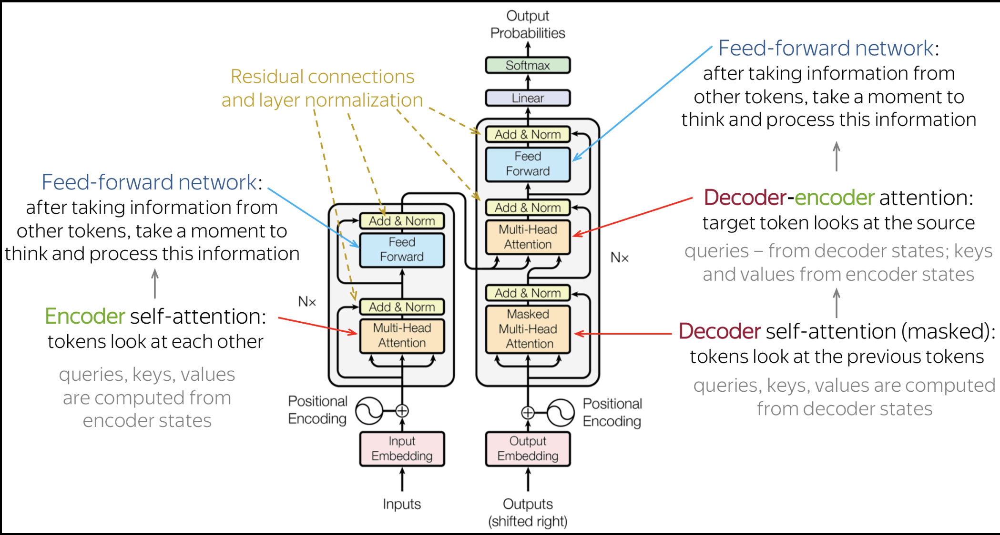

# Encoder–Decoder Transformer (Seq2Seq Transformer)

An Encoder–Decoder Transformer is a deep learning architecture used for sequence-to-sequence (Seq2Seq) tasks — where input and output are both sequences but may differ in length.



👉 Example tasks:

- Language translation (English → French)
- Text summarization
- Question answering

It has two main parts:

## Encoder (Understand Input)

- Reads the input sequence
- Converts it into context-rich embeddings

👉 Example:

```
Input: "The cat sat"
↓
Encoder → Meaning vectors
```

## Decoder (Generate Output)

- Takes encoder output
- Generates output sequence one token at a time

👉 Example:

```
Output: "Le chat s'est assis"
```

## Full Architecture Flow

## Step 1: Input Embedding + Positional Encoding

- Convert words → vectors
- Add position info

## Step 2: Encoder Stack (Repeated N times)

Each encoder layer has:

**✔️ Multi-Head Self-Attention**

- Each word attends to every other word

**✔️ Feed Forward Network (FFN)**

- Adds non-linearity

**✔️ Add & Normalize**

- Residual + LayerNorm

## Step 3: Encoder Output

- Final representation of input sequence

## Step 4: Decoder Input

- Starts with <START> token
- Uses previously generated tokens

## Step 5: Decoder Stack (Repeated N times)

Each decoder layer has:

**✔️ 1. Masked Multi-Head Self-Attention**

- Cannot see future tokens

**✔️ 2. Encoder–Decoder Attention**

- Decoder attends to encoder output

👉 This is what connects input ↔ output

**✔️ 3. Feed Forward Network**

## Step 6: Output Generation

- Linear + Softmax
- Predict next word


## Key Difference vs Other Transformers

| Type                | Description                    |
| ------------------- | ------------------------------ |
| Encoder-Only        | Understands input (e.g., BERT) |
| Decoder-Only        | Generates text (e.g., GPT)     |
| **Encoder–Decoder** | Understands + Generates        |


## Intuition (Simple)

Think of it like:

👂 Encoder = Listener
🧠 Internal Representation = Understanding
🗣️ Decoder = Speaker


## Real Example (Translation)

**Input:**

`"I love AI"`

**Encoder Output:**

`[vector1, vector2, vector3]`

**Decoder Process:**

`<START> → "Je" → "aime" → "l'IA"`

Each step:

- Looks at previous output
- Looks at encoder context
- Predicts next word

## Popular Models Using This

- T5
- BART
- MarianMT


👉 Encoder = Understand input
👉 Decoder = Generate output
👉 Attention = Connect both


## 🆚 BERT vs GPT (CRITICAL DIFFERENCE)

| Feature    | BERT (Encoder)     | GPT (Decoder)         |
| ---------- | ------------------ | --------------------- |
| Attention  | Bidirectional      | Causal (masked)       |
| Head       | Task-specific head | LM Head               |
| Output     | Label / span       | Next token            |
| Generation | ❌ No               | ✅ Yes                 |
| Training   | Masked tokens      | Next-token prediction |


## ✅ Encoder-only:

- Needs external head
- Not generative

## ✅ Decoder-only:

- Has LM head built-in
- Generates text step-by-step


👉 BERT = Understand → Head → Output

👉 GPT = Understand (past) → LM Head → Next Token → Repeat

