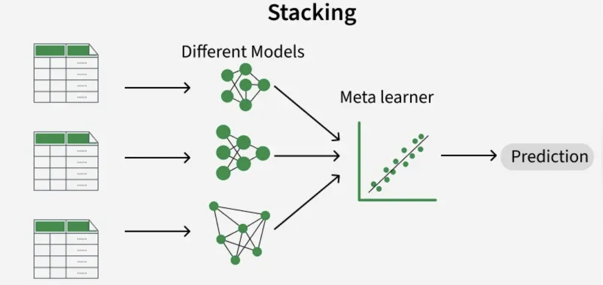
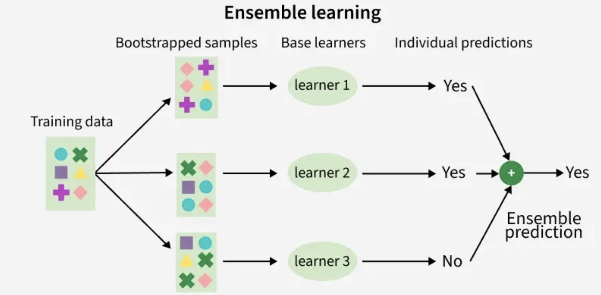
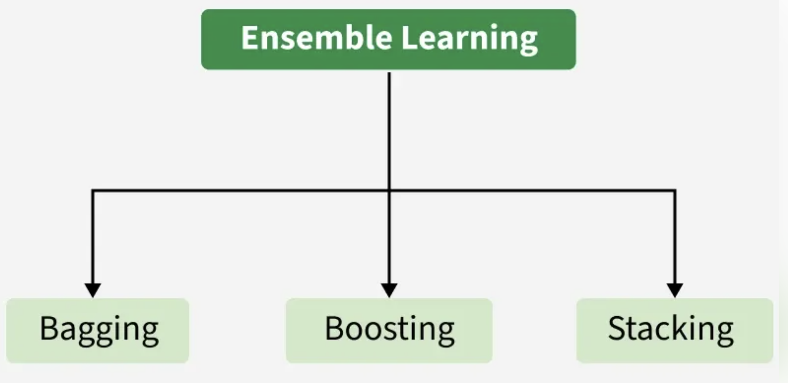
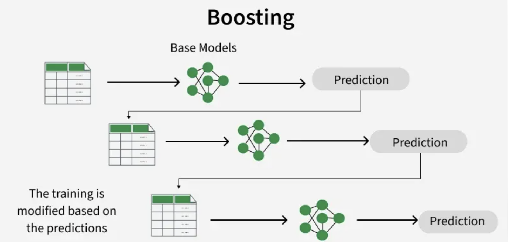
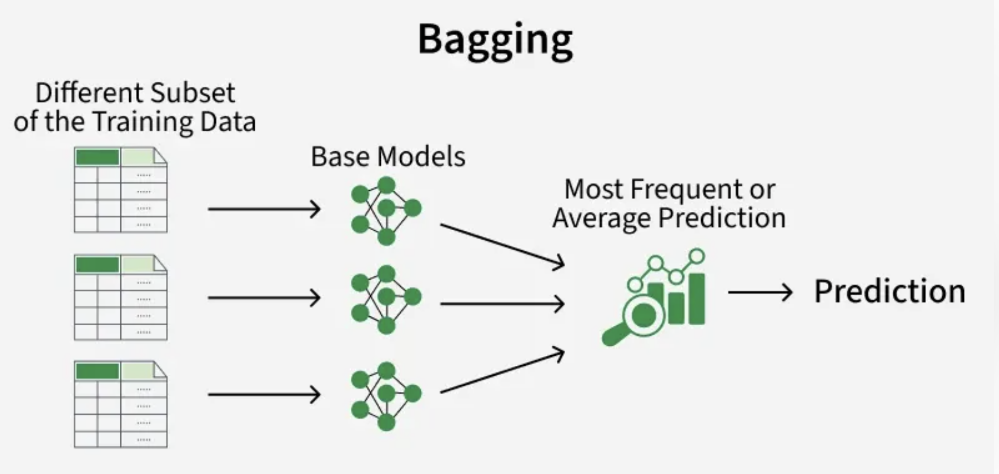
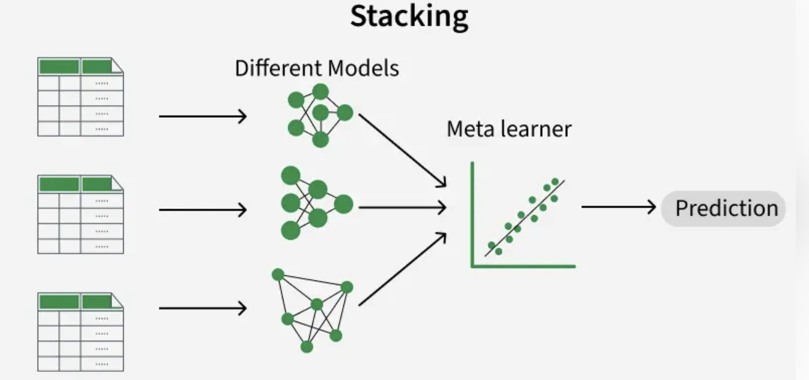

# What is Ensemble Learning?
Ensemble learning is a method where multiple models are combined instead of using just one.Even if individual models are weak, combining their results gives more accurate and reliable predictions.

- Uses multiple models together to improve overall accuracy.
- Reduces errors by balancing mistakes across models.
- Works on a simple idea similar to combining opinions from a group.













# Types of Ensemble Models?

## 1. Bagging (Bootstrap Aggregating)

## 2. Boosting

## 3. Stacking (Stacked Generalization)

## 4. Voting / Averaging

## 5. Blending (Variant of Stacking)

## 6. Ensemble of Deep Learning Models

## When to Use What?

- Use **Bagging** → if overfitting problem
- Use **Boosting** → if model underfits
- Use **Stacking** → for best performance (complex systems)
- Use **Voting** → for quick and simple improvement


| Type     | Training Style | Goal             | Example           |
| -------- | -------------- | ---------------- | ----------------- |
| Bagging  | Parallel       | Reduce variance  | Random Forest     |
| Boosting | Sequential     | Reduce bias      | XGBoost           |
| Stacking | Multi-level    | Improve accuracy | Meta-learning     |
| Voting   | Parallel       | Simplicity       | Voting Classifier |
| Blending | Holdout-based  | Faster stacking  | Hybrid models     |


Neuro Digital Twin uses a **hybrid ensemble architecture**. It is not a single ensemble method like Random Forest or XGBoost. Instead, it combines multiple ensemble strategies, each optimized for a specific clinical objective.


| #     | Ensemble Method Used                     | Classical Ensemble Category                   | Purpose in Neuro Digital Twin                                     | Weight Mechanism                                            | Output                                         |
| ----- | ---------------------------------------- | --------------------------------------------- | ----------------------------------------------------------------- | ----------------------------------------------------------- | ---------------------------------------------- |
| **1** | **Quality-Adjusted Weighted Average**    | **Weighted Averaging Ensemble**               | Combine disease risk predictions from multiple forecasting models | Fixed base weights × runtime data quality scores            | **Fused Risk Score (0–1)**                     |
| **2** | **Weighted Soft Voting + Severity Bias** | **Soft Voting Ensemble (Modified)**           | Determine consensus disease stage (CN → MCI → AD)                 | Base weights × quality + severity adjustment (+0.15)        | **Consensus Stage**                            |
| **3** | **Variance-Based BCI**                   | **Ensemble Diversity Analysis**               | Measure disagreement among biomarker predictions                  | No weights; uses prediction variance                        | **BCI Score**                                  |
| **4** | **Pairwise JS Divergence Confidence**    | **Ensemble Agreement/Uncertainty Estimation** | Quantify confidence in ensemble predictions                       | Jensen–Shannon divergence between probability distributions | **Confidence Score (0–1)**                     |
| **5** | **Neural Attention Fusion**              | **Learned Stacking / Deep Ensemble**          | Fuse multimodal clinical representations                          | Attention weights learned during training                   | **256-D Embedding + Diagnostic Probabilities** |

## 1. Quality-Adjusted Weighted Average
 
Type: `Weighted Averaging Ensemble`
Formula: 

$$
\text{Risk}_{\text{fused}}
=
\frac{\sum_{i=1}^{N}\left(w_i \times q_i \times r_i\right)}
{\sum_{i=1}^{N}\left(w_i \times q_i\right)}
$$

Where:

- `rᵢ` = model risk prediction
- `wᵢ` = predefined model importance
- `qᵢ` = runtime quality score


Example:

| Model    | Risk | Base Weight | Quality |
| -------- | ---- | ----------- | ------- |
| BiLSTM   | 0.78 | 0.35        | 0.90    |
| Bayesian | 0.72 | 0.25        | 0.95    |
| HMM      | 0.70 | 0.20        | 0.85    |
| ABM      | 0.82 | 0.20        | 0.70    |


`**Fused Risk = 0.755**`

## 2. Weighted Soft Voting + Severity Bias

Type: `Modified Soft Voting Ensemble`


## Variance-Based BCI

Type: `Ensemble Diversity Metric`

## JS Divergence Confidence

Type: `Consensus / Uncertainty Ensemble`

## Neural Attention Fusion

Type: `Deep Learned Stacking Ensemble`


## Overall Neuro Digital Twin Ensemble Architecture

```
                 ┌──────────────────────┐
                 │ Disease Models (8)   │
                 │ BiLSTM               │
                 │ HMM                  │
                 │ Bayesian             │
                 │ Monte Carlo          │
                 │ ABM                  │
                 │ Trajectory           │
                 │ Survival             │
                 │ CDSS                 │
                 └──────────┬───────────┘
                            │
          ┌─────────────────┼──────────────────┐
          │                 │                  │
          ▼                 ▼                  ▼
 Weighted Averaging   Soft Voting       Diversity Analysis
 (Risk Fusion)       (Stage Fusion)        (BCI)
          │                 │                  │
          └─────────┬───────┴─────────┬────────┘
                    │                 │
                    ▼                 ▼
          JS Confidence      Attention Fusion
             Estimator       (Multimodal Net)
                    │                 │
                    └─────────┬───────┘
                              ▼
                   Neuro Digital Twin
                  Clinical Decision Layer
```

**system contains five different ensemble paradigms:**

1. **Weighted Averaging Ensemble** → Risk fusion.
2. **Modified Soft Voting Ensemble** → Disease stage consensus.
3. **Ensemble Diversity Analysis** → Biomarker Consistency Index.
4. **Agreement-Based Uncertainty Ensemble** → Confidence estimation.
5. **Deep Attention Stacking Ensemble** → Multimodal representation learning.

