## What is Generative AI?
**Generative AI (GenAI)** is a type of artificial intelligence that can **create new content**—such as text, images, code, audio, conversations, stories, music or video by learning patterns from existing data.

It can learn human language, programming languages, art, chemistry, biology, or any complex subject matter. It reuses what it knows to solve new problems. For example, it can learn English vocabulary and create a poem from the words it processes. 

**Simple Definition:**

Generative AI = AI that **learns from data and generates new content similar to that data**

## How It Works (High-Level)

1. **Training Phase**

    - AI is trained on massive datasets (text, images, code, etc.)
    - Learns patterns, structure, relationships

2. **Model Types**

    - **Transformers (LLMs)** → Text (ChatGPT, Gemini)
    - **Diffusion Models** → Images (DALL·E, Midjourney)
    - **GANs** → Images, videos

3. **Generation Phase**

    - You give a **prompt**
    - Model predicts and generates output based on learned patterns

## What is the difference between AI and Generative AI?

**Simple Difference**

| AI (Artificial Intelligence)                         | Generative AI                                             |
| ---------------------------------------------------- | --------------------------------------------------------- |
| AI is the broad field of making machines intelligent | Generative AI is a subset of AI that creates new content  |
| Focuses on prediction, classification, automation    | Focuses on generation of text, images, code, audio, video |
| Answers: “What is this?”                             | Answers: “Create something new”                           |
| Usually gives fixed outputs                          | Produces dynamic/generated outputs                        |


**Easy Analogy**

**Traditional AI**

Like a **bank fraud detection system:**

  - Input → transaction data
  - Output → fraud or not fraud

It mainly:

  - Detects
  - Predicts
  - Classifies

**Generative AI**

Like ChatGPT or image generators:

  - Input → prompt
  - Output → newly generated text/image/code

It mainly:

  - Creates
  - Writes
  - Designs
  - Generates

## Generative AI Flow

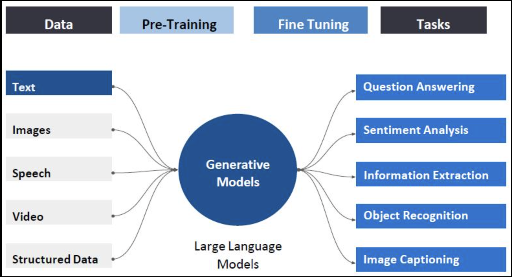

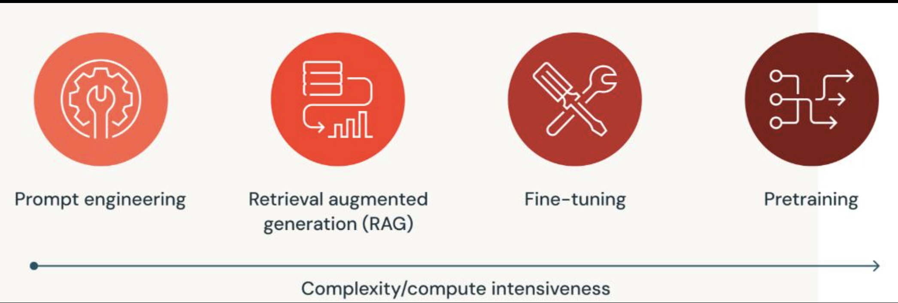

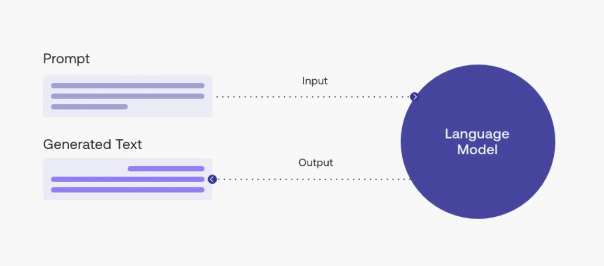

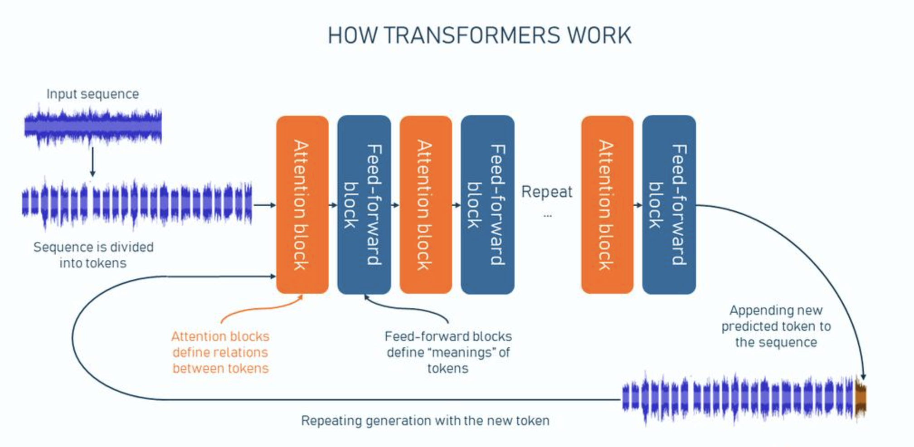

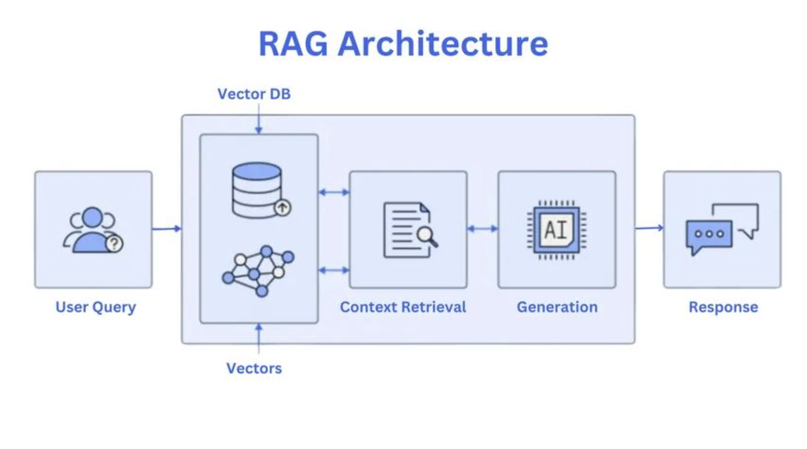

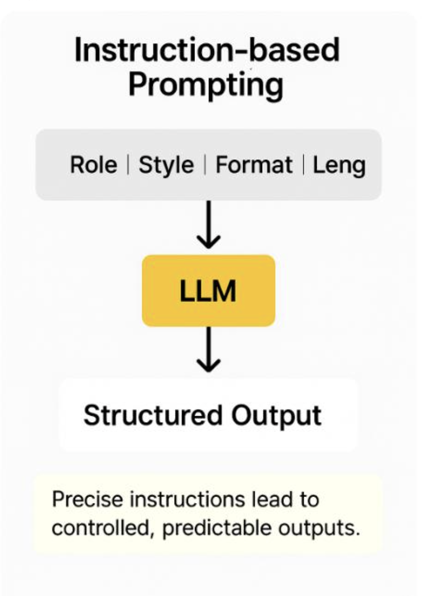

1. `Massive Data Training`
2. `Foundation Model / LLM`
3. `Prompt Input`
4. `Content Generation`

**Core Technical Difference**

| Area           | Traditional AI                          | Generative AI                        |
| -------------- | --------------------------------------- | ------------------------------------ |
| Main Objective | Predict outcomes                        | Generate content                     |
| Models         | Decision Trees, SVM, Random Forest, CNN | Transformers, Diffusion Models, GANs |
| Training Data  | Structured datasets                     | Huge unstructured datasets           |
| Output Type    | Categories, scores                      | Human-like content                   |
| Creativity     | Limited                                 | High                                 |


**Examples**

| Scenario   | AI                    | Generative AI                    |
| ---------- | --------------------- | -------------------------------- |
| Email      | Spam detection        | Drafting email reply             |
| Healthcare | Disease prediction    | Medical report generation        |
| Banking    | Fraud detection       | Financial summary creation       |
| DevOps     | Failure prediction    | Auto-generating pipeline scripts |
| ITSM       | Ticket classification | RCA summary generation           |


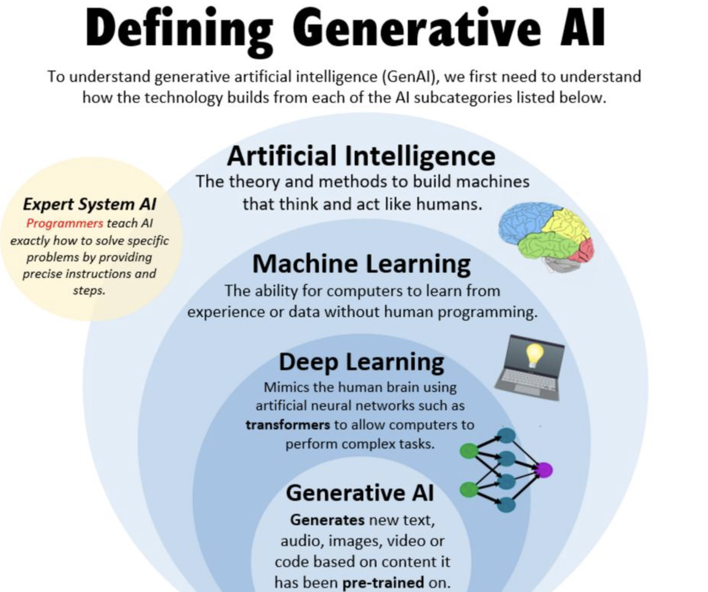

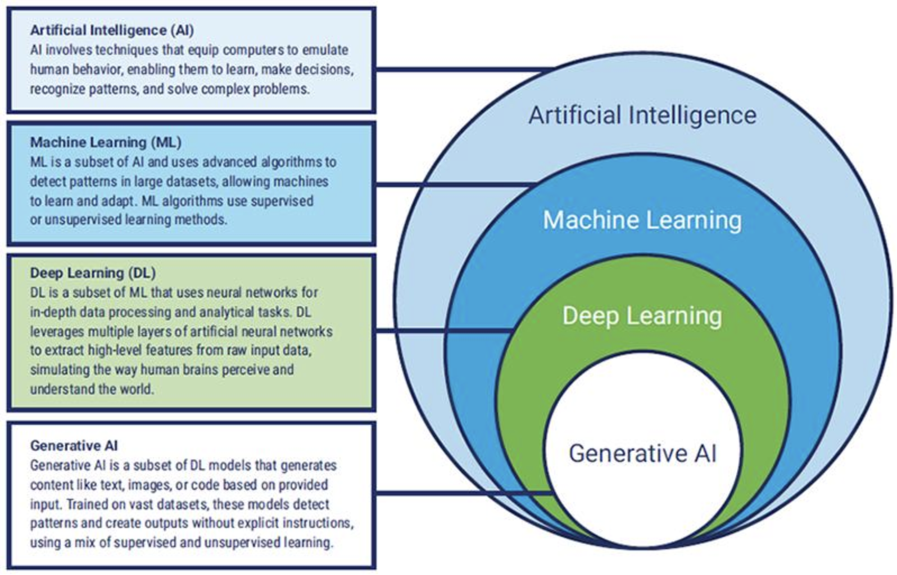

**Important Limitation Difference**

| Traditional AI        | Generative AI                |
| --------------------- | ---------------------------- |
| Usually deterministic | Probabilistic                |
| More explainable      | Can hallucinate              |
| Easier to validate    | Harder to verify correctness |


## When was generative AI created?

Generative AI was not created in a single year. It evolved over decades through advances in artificial intelligence, machine learning, and deep learning.

**Key Milestones in Generative AI**

| Year  | Milestone                                                           | Importance                                       |
| ----- | ------------------------------------------------------------------- | ------------------------------------------------ |
| 1950s | Early AI research                                                   | Foundation of artificial intelligence            |
| 1980s | Neural networks gained popularity                                   | Machines started learning patterns               |
| 2014  | GANs (Generative Adversarial Networks) introduced by Ian Goodfellow | Major breakthrough for image generation          |
| 2017  | Transformer architecture introduced by Google                       | Foundation of modern LLMs                        |
| 2018  | GPT-1 released by OpenAI                                            | Beginning of modern text generation              |
| 2020  | GPT-3                                                               | Large-scale human-like text generation           |
| 2022  | ChatGPT launched                                                    | Generative AI became mainstream                  |
| 2023+ | Multimodal AI explosion                                             | AI generating text, image, audio, video together |


## Important Breakthroughs

**1. GANs (2014)**

Ian Goodfellow introduced:

  - **Generator**
  - **Discriminator**

These two neural networks compete to generate realistic outputs.

This became the foundation for:

  - `AI art`
  - `Deepfakes`
  - `Synthetic images`

**2. Transformers (2017)**

Google published the famous paper:

`Attention Is All You Need`

This introduced the **Transformer architecture**.

It enabled:

   - `LLMs`
   - `ChatGPT`
   - `Gemini`
   - `Claude`
   - `Modern GenAI systems`

**3. ChatGPT Era (2022)**

When ChatGPT launched in 2022:

  - Generative AI became widely adopted
  - Enterprises started using GenAI
  - Massive investment began worldwide

This triggered:

  - `RAG systems`
  - `AI copilots`
  - `Agentic AI`
  - `AI automation platforms`

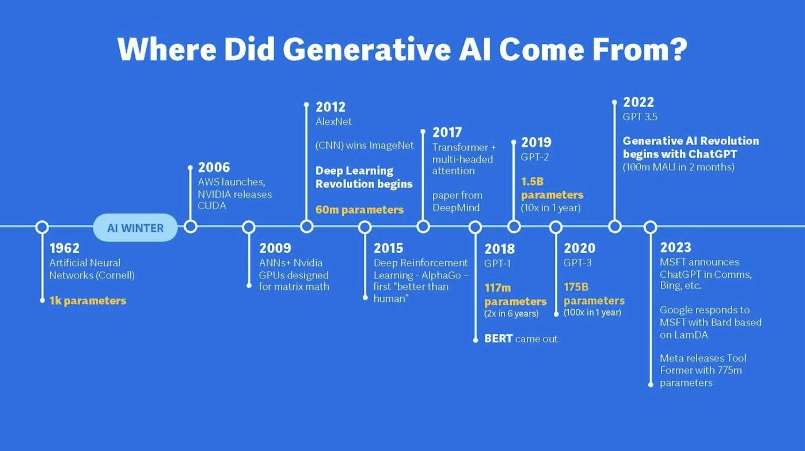

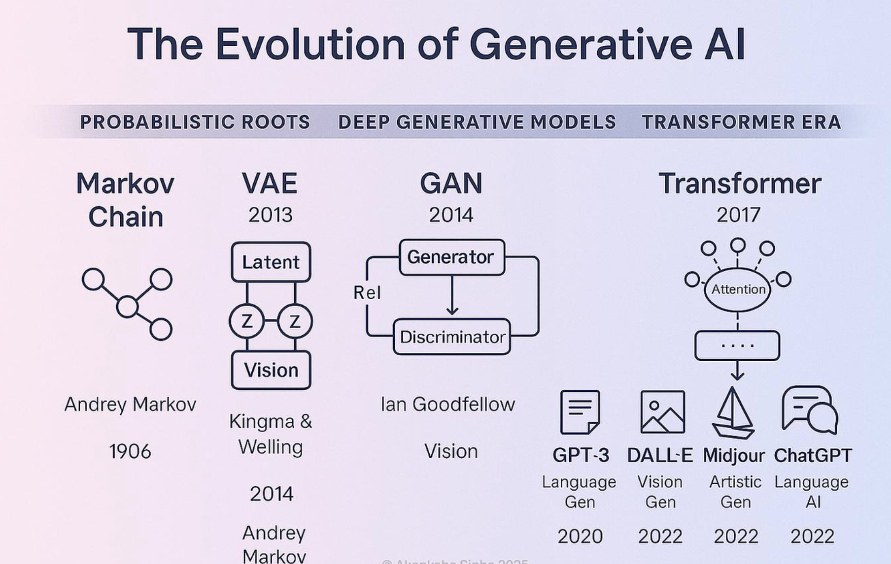

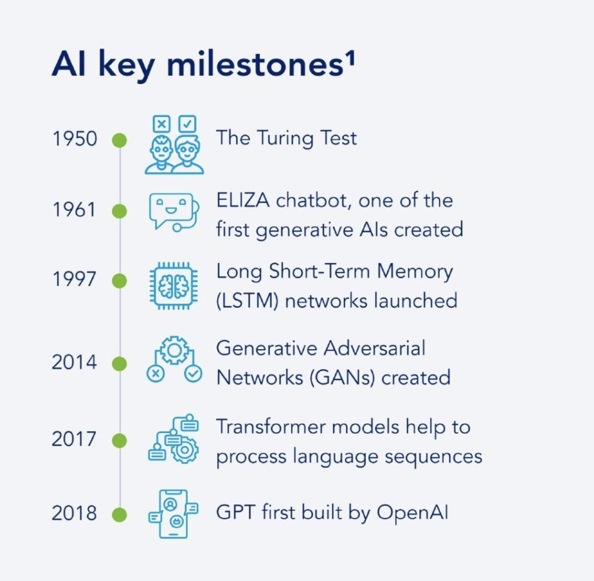

## What are foundation models in generative AI?

A **Foundation Model** is a **large pre-trained AI model** trained on massive amounts of data that can be adapted to many different tasks.

It acts as the **base (“foundation”)** for building AI applications.

**Simple Definition**

A foundation model is a large AI model trained on broad data that can be reused for multiple downstream tasks.

**Why Called “Foundation”?**

Because it becomes the foundation for:

  - Chatbots
  - AI assistants
  - Summarization systems
  - Code generators
  - RAG systems
  - Agentic AI systems

Instead of training AI from scratch every time, organizations build on top of these models.


**How Foundation Models Work**

**Step 1 — Pretraining**

The model is trained on:

  - `Internet text`
  - `Books`
  - `Articles`
  - `Code`
  - `Images`
  - `Documents`

It learns:

  - Language
  - Logic
  - Patterns
  - Context

**Step 2 — Adaptation**

The same model can later be:

  - `Fine-tuned`
  - `Prompt-engineered`
  - `Connected with RAG`
  - `Used by agents/tools`


**Characteristics of Foundation Models**

| Feature              | Description                    |
| -------------------- | ------------------------------ |
| Large-scale training | Trained on huge datasets       |
| General-purpose      | Supports many tasks            |
| Transfer learning    | Reused across domains          |
| Multimodal           | Can support text, image, audio |
| Context-aware        | Understands prompts            |


**Foundation Model vs Traditional ML Model**

| Traditional ML         | Foundation Model        |
| ---------------------- | ----------------------- |
| Task-specific          | General-purpose         |
| Small datasets         | Massive datasets        |
| Limited capability     | Multi-capability        |
| Needs retraining often | Adaptable via prompting |


## What are generative AI examples?

Generative AI can create many types of content:

  - Text
  - Images
  - Code
  - Audio
  - Video
  - 3D designs
  - Synthetic data

**1. Text Generation AI**

Examples:

  - Chatbots
  - Email drafting
  - Document summarization
  - Content writing
  - Translation

**Real Use Cases**

 - IT support assistants
 - Banking document summarization
 - Healthcare report generation
 - RAG-based enterprise chatbots


**2. Image Generation AI**

Examples

  - AI artwork
  - Product design
  - Marketing creatives
  - Medical image enhancement


**Popular Tools**

  - `DALL·E`
  - `Midjourney`
  - `Stable Diffusion`


**3. Code Generation AI**

Examples

  - Auto-generated code
  - Test case generation
  - Pipeline generation
  - Documentation generation

**Popular Tools**

  - `GitHub Copilot`
  - `Cursor`
  - `Codex`
  - `claude code`
  - `Codeium`
  - `windsurf`

**4. Audio & Voice Generation**

Examples

  - AI voice assistants
  - Text-to-speech
  - AI-generated music
  - Voice cloning

**Popular Tools**

  - `ElevenLabs`
  - `Suno`

**5. Video Generation AI**

Examples

  - Text-to-video
  - AI avatars
  - Training videos
  - Marketing videos

**Popular Tools**

  - `Runway`
  - `Synthesia`
  - `OpenAI Sora`

**6. Generative AI in Healthcare**

Examples

  - Medical report summarization
  - Clinical assistant chatbots
  - Synthetic patient data generation
  - MRI image enhancement

**7. Generative AI in Enterprise & DevOps**

Examples

  - AI ticket summarization
  - Auto RCA generation
  - SOP/runbook generation
  - AI-based incident response
  - Agentic AI workflows


## What are the benefits of generative AI?


1. **Increased Productivity**
2. **Faster Decision Making**
3. **Automation of Complex Tasks**
4. **Improved Customer Experience**
5. **Content Creation at Scale**
6. **Software Development Acceleration**
7. **Knowledge Management & RAG**
8. **Personalization**
9. **Innovation & Creativity**


| Benefit            | Impact                        |
| ------------------ | ----------------------------- |
| Productivity       | Faster work completion        |
| Cost Reduction     | Less manual effort            |
| Automation         | Reduced operational workload  |
| Scalability        | Handle more users/tasks       |
| Faster Development | Accelerated software delivery |
| Better Support     | 24/7 intelligent assistance   |


**Important Limitation**

Generative AI also has challenges:

  - `Hallucinations`
  - `Bias`
  - `Data privacy concerns`
  - `Incorrect outputs`
  - `Security risks`

That is why evaluation metrics are important:

  - `Faithfulness`
  - `Groundedness`
  - `Correctness`
  - `Relevance`


## What are the best practices in generative AI adoption?

Successful Generative AI adoption is not only about choosing an LLM.

It requires:

   - `Strategy`
   - `Governance`
   - `Security`
   - `Data quality`
   - `Evaluation`
   - `MLOps/LLMOps`
   - `Responsible AI practices`

**1. Start with High-Value Business Use Cases**

Focus on use cases with:

  - High manual effort
  - Repetitive knowledge work
  - Large document processing
  - Customer interaction
  - Automation potential

Good Enterprise Examples

  - AI chatbots
  - Document summarization
  - ITSM copilots
  - DevOps automation
  - Knowledge assistants
  - Healthcare report summarization

**2. Use RAG Instead of Training From Scratch**

For enterprise adoption:

  - Prefer `RAG (Retrieval-Augmented Generation)`
  - Avoid full model training unless necessary

Benefits:
  
   - Lower cost
   - Faster deployment
   - Better grounding
   - Reduced hallucination risk
   - Easier updates

**3. Build Strong Data Governance**

Important Areas

  - Data classification
  - PII protection
  - Access control
  - Encryption
  - Audit logging
  - Data lineage

Best Practice

Never expose:
  
  - `Sensitive healthcare data`
  - `Banking credentials`
  - `Confidential enterprise documents`


**4. Implement AI Evaluation Metrics**

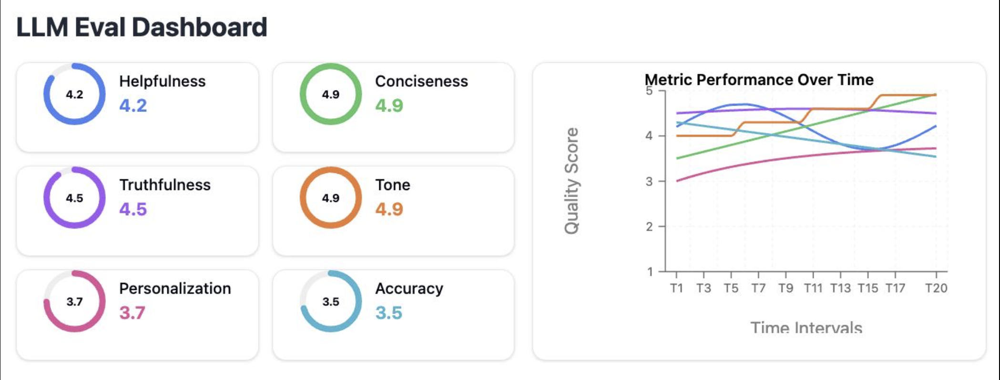

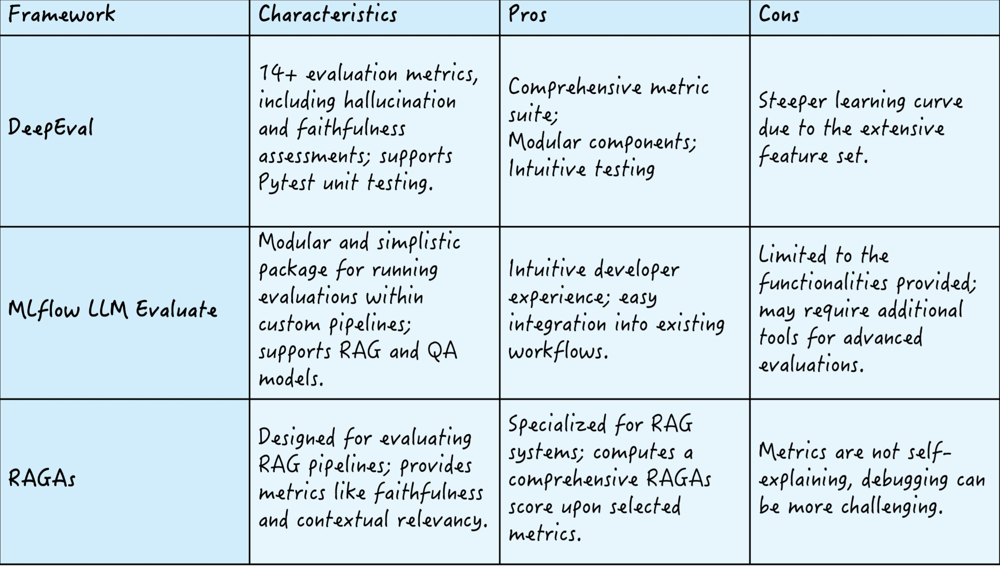

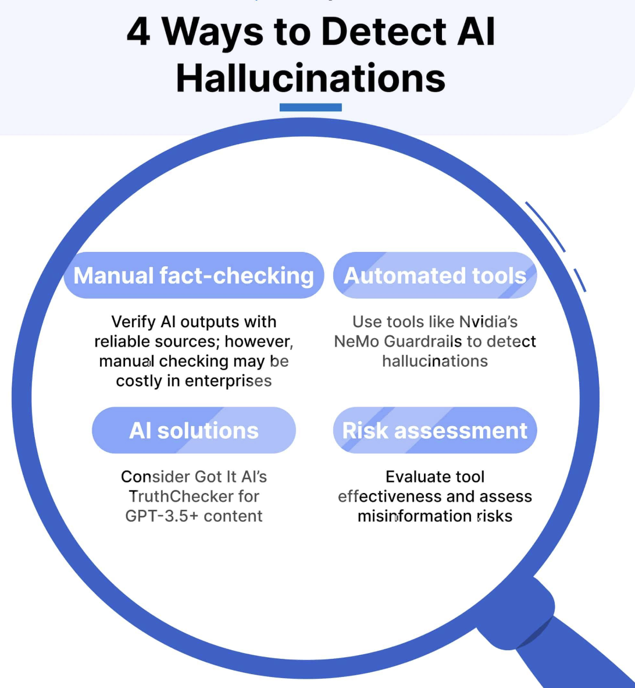

This is one of the most critical best practices.

**Metrics to Track**

| Metric             | Purpose                           |
| ------------------ | --------------------------------- |
| Faithfulness       | Is answer grounded in source?     |
| Correctness        | Is answer factually correct?      |
| Relevance          | Does answer match query?          |
| Groundedness       | Does response use retrieved data? |
| Recall@K           | Retrieval quality                 |
| Precision@K        | Retrieval accuracy                |
| Hallucination Rate | Incorrect generated content       |
| Latency            | Response speed                    |


**5. Establish AI Governance**

Governance Should Include

  - Responsible AI policies
  - Human approval workflows
  - Ethical AI guidelines
  - Risk management
  - Compliance controls


**6. Keep Humans in the Loop**

Critical for:

  - Healthcare
  - Banking
  - Legal
  - Security operations

 AI should:

  - Assist humans
  - Not blindly replace decisions


**7. Use Secure Enterprise Architecture**

Recommended Architecture Layers

```
Users
  ↓
Application Layer
  ↓
Guardrails & Security
  ↓
RAG / Vector Database
  ↓
Foundation Model
  ↓
Monitoring & Evaluation
```

**8. Implement Guardrails**

Guardrails help prevent:

  - `Hallucinations`
  - `Toxic outputs`
  - `Data leakage`
  - `Unsafe responses`

Examples

  - `Prompt filtering`
  - `Output moderation`
  - `Role-based access`
  - `Citation enforcement`

**9. Monitor Cost & Performance**

Track:

  - `Token usage`
  - `GPU cost`
  - `Latency`
  - `Throughput`
  - `Failure rate`
  - `User feedback`


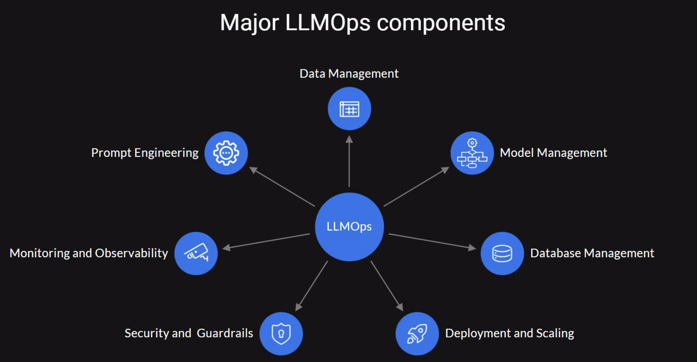

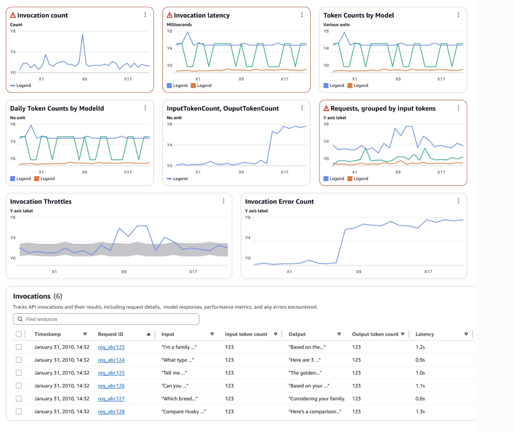

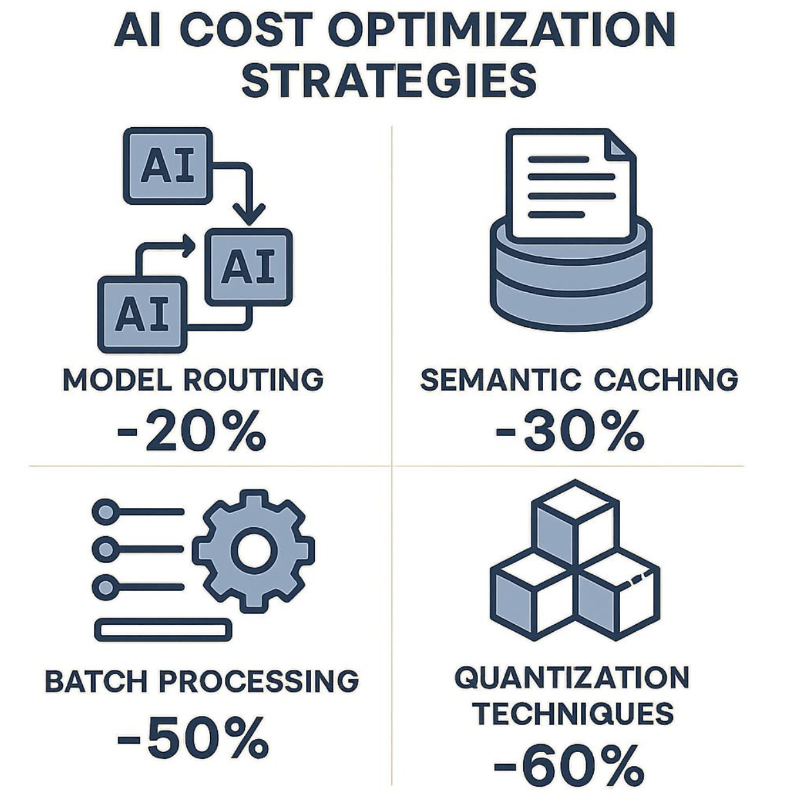

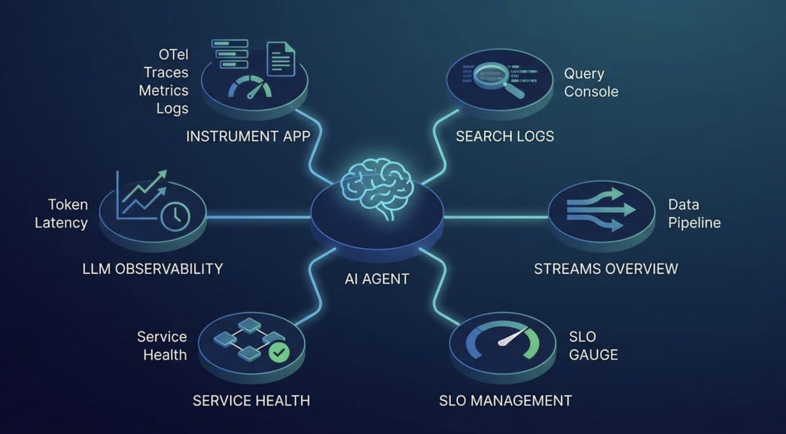

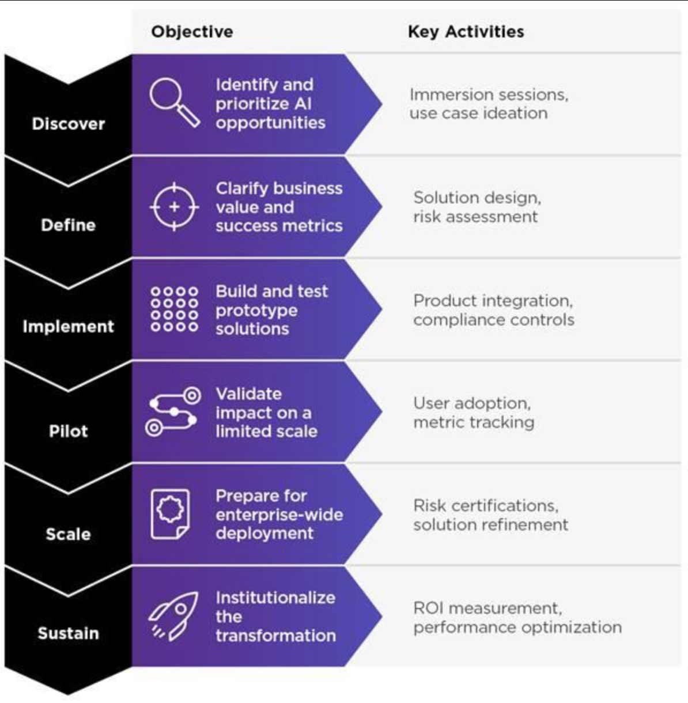

**10. Adopt LLMOps / MLOps**

For production AI systems use:

  - Version control
  - CI/CD for prompts/models
  - Experiment tracking
  - Monitoring
  - Observability
  - Model registry


**11. Choose the Right Model Strategy**

| Approach        | Best For                     |
| --------------- | ---------------------------- |
| API-based LLM   | Fast implementation          |
| Open-source LLM | Customization & privacy      |
| Fine-tuning     | Domain specialization        |
| RAG             | Enterprise knowledge systems |

**12. Design for Scalability**

Plan for:

  - Concurrent users
  - Large documents
  - Multi-agent orchestration
  - GPU scaling
  - Vector DB optimization


**13. Ensure Explainability & Transparency**

Users should know:

  - AI-generated vs human-generated
  - Source references
  - Confidence level
  - Retrieval sources

**14. Start Small, Then Scale**

Recommended adoption path:

  `POC → Pilot → Controlled Production → Enterprise Rollout`

**15. Train Teams on AI Literacy**

Teams should understand:

  - Prompt engineering
  - AI limitations
  - Hallucinations
  - Security risks
  - Responsible AI usage


## Enterprise Adoption Checklist

| Area         | Best Practice              |
| ------------ | -------------------------- |
| Data         | Secure & governed          |
| Architecture | Use RAG                    |
| Security     | Add guardrails             |
| Evaluation   | Track metrics              |
| Operations   | Use LLMOps                 |
| Governance   | Human approvals            |
| Scaling      | Design for enterprise load |


