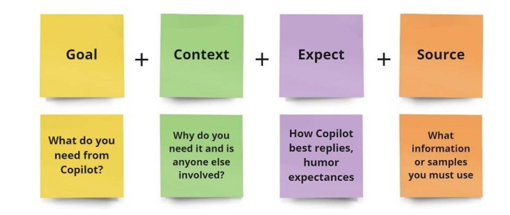

## What is Microsoft Copilot?
Microsoft Copilot is an AI assistant like ChatGPT, but not exactly like ChatGPT! It's far better at handling complex queries, but only a few people know how to use it efficiently.

Microsoft Copilot is not just another helper or simple AI assistant. It holds the power to give you real-time strategies and productivity, unlike any other AI assistant. The Copilot System operates with Microsoft 365 and it uses Large Language Models (LLMs) and other Machine Learning models to process data.

Microsoft Copilot leverages Generative AI to provide real-time automation. A user is highly important for any AI assistant because it requires some input from the user at a time. The best thing is that Copilot learns constantly and adapts to your unique workflow, your particular patterns or behaviors, daily work schedule, task management, preferences, and personalization, making it your personal assistant and increasingly more useful over time.


Microsoft Copilot Considered as one of the biggest game-changing productivity tools, which is specially made to be integrated with Microsoft 365 apps like Word, Docs, PowerPoint, Excel, and Microsoft Teams.

## Key Features of Microsoft Copilot
Microsoft Copilot gives you ample features that boost your productivity and level up your content generation. Some of the main features of Microsoft Copilot are mentioned below −

**1. AI-Powered Writing**

Microsoft Copilot helps to write your content, not any simple content but AI-powered generative content that looks more fascinating and interesting to read. This assistant is specially used in Microsoft Word and generates content based on your summary or prompt given. Whether you want to draft a report, email, proposal, grammar check or even story writing, etc. anything can be done at ease.

**2. Data Analysis and Visualization**

Data analysis is a highly professional task for the people dealing with data in this field. Microsoft Copilot helps them to structure and arrange data in Microsoft Excel, increasing overall capacity by generating charts, calculations, data patterns, insights based on data, etc. Providing whole automation throughout your data handling, monitoring, and analyzing task.


**3. Improved Presentation**

The presentation assistance of Copilot in PowerPoint helps you to get access to direct templates which are both stunning and easy to use in your next presentation. It suggests side layouts, designs, and visual elements and offers various ideas to make your presentation highly professional.

**4. Improved Collaboration in Microsoft Teams**

Copilot helps to summarise conversations in the meetings, generating action points and flagging important topics to be discussed on. And also allows more effective communication by suggesting responses to live chats.

**5. Natural Language Interaction**

Copilot has the ability to understand the local language so that it can be highly user-friendly and always accessible to non-tech people.

**Benefits of Using Microsoft Copilot**

- Increased Productivity
- Streamlined Workflows
- Customisable Assistance
- Better Collaboration
- Real-time Learning
- Real-Time Data Analysis
- Time-Saving Formula Generation
- Email Management
- Cross-APplication Functionality
- Learning and Adapting Over Time
- Microsoft Graph API
- Increased Productivity
- Improved Security

## Prerequisites for Using Microsoft Copilot

Before starting with Microsoft Copilot on your Windows system, you need to ensure some of the prerequisites required for seamless usage throughout your workflow. Following are the things you need to run Copilot:

**1. Microsoft Office or Microsoft 365 Subscription**

Microsoft Copilot comes for free with a Microsoft 365 subscription, which any user can get generally after newly purchasing Windows. Copilot comes with some renowned subscriptions like Microsoft 365 or some business enterprise versions like E3, E5 and Business Premium. If you can access Microsoft Apps then Copilot's basic subscription will work for you.

**2. Applications Usage**

Copilot works with newly released versions of Microsoft 365 apps, including Word, Excel, PowerPoint, Outlook and Teams. Therefore it is important you have the latest version of these apps installed in order to access Copilot integration.


**3. System Requirements**

Make sure you have the proper internet connection in order to run scripts and generate output as text or images. Copilot works best on devices with stable internet connections for more complex AI tasks.

## How to Access Microsoft Copilot?

Once you are ready with all the prerequisites and setup, we can look at how to access Microsoft Copilot in the Microsoft 365 suite. The steps for activating Copilot within supported apps are mentioned below.

**1. Launch a Microsoft 365 App**

Open any of the Microsoft 365 apps where Copilot is available. Such apps are Microsoft Word, Excel, PowerPoint, or Teams. Once the app is launched, you'll find the Copilot feature readily accessible.

**2. Locate the Copilot Feature**

You can find the Copilot icon is generally located on the ribbon or toolbar of the app, It depends on which program you're using. You can look for the Copilot symbol in the toolbar.

**3. Enable Copilot**

If the Copilot isn't enabled or does not provide any prompt answer to you then you may have to manually activate it. This is done by just clicking on the Copilot icon. Make sure you are signed in to your Microsoft 365 account and you agree to the terms and services.


## Getting Started with Microsoft Copilot

**Step 1: Communicate with the Copilot using Natural Language**

Microsoft Copilot's most important advantage is its ability to understand natural language commands. Hence it allows you to interact with Copilot by simply typing or through speech recognition. This will eliminate the barrier of technicality as every user must not have to be familiar with technology in order to properly use Copilot. Following are the key steps you can follow −

- **Direct Commands** − You can start using Copilot by typing your command in the input field. This usually appears on the taskbar or in a dedicated Copilot section within the application.

- **Native Language** − Here, with the powerful LLMs, you can use any native language you want, and Copilot will provide output in the same language.

- **Voice Commands (if available)** − In some versions, Copilot may include voice command functionality. All you have to do is click the microphone icon and start speaking. The speech recognition system is highly smart and it automatically ignores any internal sound playing on the device and directly listens to your speech input with great accuracy. This makes it easy to use when handling multiple tasks.

- **Contextual Understanding** − Copilot's unique strength is its contextual awareness. Whether you're writing a document or reviewing data, Copilot takes your context into account. For example, if you type "optimize this paragraph" while editing in Word, Copilot automatically updates the last paragraph you were working on.


**Step 2: Using Prompts for Automation**

Copilot comes with a variety of built-in prompts to help automate your routine tasks. These tasks might include creating a presentation, drafting emails, summarizing reports, and setting reminders and tasks within Microsoft 365 apps.


Here's how you can make the most out of Copilot's features −

- **Default Prompt** − Microsoft Copilot provides a default prompt in many apps. For example, in Word, you'll often see prompts such as "Write summary," "Improve grammar," or "Generate ideas for this paragraph." You can click a word or make these recommendations and let Copilot do the rest.

- **Custom Prompts** − You also have the flexibility to create your own prompts based on the specific task you're working on. For example, in Excel, you can type Analyze data and find trends and Copilot will process the data accordingly.

Example prompts in the app −

- **Word** − Rewrite this article to make it more concise.
- **Excel** − Create a bar chart from this data.
- **PowerPoint** − Design slides based on the content of this document.
- **Teams** − Set a new meeting for this weekend.


## Microsoft Copilot Studio

Copilot Studio is aimed at developers and large enterprises. It offers more advanced AI capabilities. It is built to support complex workflows in software development, CI/CD pipelines, and automation across large organisations, developers, and IT professionals. Enterprise teams use Copilot Studio to improve coding, debugging, and team collaboration. With a deeper integration of AI, Microsoft is revolutionising the field of personalised AI with many customisations available.

**The Real Power of Microsoft Copilot**

Microsoft Copilot offers robust AI-powered features focused primarily on enhancing personal productivity within Microsoft Office Suite applications. Below are the core capabilities of Microsoft Copilot that you need to know:

**1. Optimisation**

Microsoft Copilot offers basic customization options. It allows users to automate repetitive tasks and adjust workflows in Office applications. However, customization is limited compared to Copilot Studio and is mostly related to templates, for example, email automation and document formatting.


**2. AI Functions**

Copilot primarily uses AI to help with various tasks in daily life, such as drafting documents Spreadsheet analysis, email summaries, meeting scheduling, etc. The Natural Language Processing (NLP) capabilities allow users to interact with tools in conversations which has improved accessibility for non-technical users.

Copilot Studio offers more advanced AI features than Copilot. It can help with code generation, debugging, and testing, making it essential for developers working on complex software projects. Here, the models can also be trained on custom datasets. This leads to finely tuned AI models that meet the specific needs of the project. Some of the highly advanced AI features are −


- **Generative AI** − A magical tool for creating new images, text, videos, raw data and much more. Copilot Studio combines all the generative capabilities with a rules-based engine. It means it will allow us to create end-to-end conversational experiences without writing everything manually in coding.

- **Large Language Models** − Copilot Studio leverages the transformer-based Natural Language Understanding (NLU) models so that it can understand every type of figure of speech in any particular language which is highly important to understanding the user's context.

- **Trigger Phrases of Unified Authoring Canvas** − When it comes to crafting topics for your Copilot, you can manually provide a handful of trigger phrases. They are short, hardly 2-10 words per phrase, changing nouns and verbs to expand the coverage. All these creative playground phrases are really helpful for anyone making custom Copilots, overall making your Copilot smarter.

- **Backward Compatibility** − In case you have older versions of Copilot (created before May 23, 2023), you can still use them in the current version of Copilot Studio. The AI features will enhance the capabilities and ensure they keep up to date.

- **Power to Publish** − You can publish your custom-made Copilots to any channel within a few clicks. Whether it's a chatbot, a virtual assistant or any interactive website, your Copilot is ready to engage all the users.


**3. Safety and Compliance Features**

Copilot ensures that all data shared between applications is protected using Microsoft's default security protocols, including data encryption. Secure file storage and user authentication are done via Azure Active Directory. Ultimately, the whole security framework is primarily geared towards small and medium-sized organisations rather than large and complex enterprise environments.


## Microsoft Copilot - Prompt Engineering

What are prompts? Prompts are those building sentences that define the output generated by any AI model. Prompts can be really tricky when it comes to writing efficient prompts. When can you say this would be the most efficient prompt? Well, it depends upon a lot of factors. A long prompt may look complex but every long prompt is not that effective. On the other hand, some short but precise prompts can do the job perfectly.


Hence prompt engineering is the art of crafting clear, concise, and specific instructions that enable AI systems, like Microsoft Copilot, to perform tasks efficiently. 

**Building Your First Prompt: A Step-by-Step Approach**

To illustrate how you can progressively refine a prompt to generate a more accurate and useful result, lets start with a basic task: writing an email.


**1. Basic Prompt Structure**

A basic prompt is direct but lacks the detail needed for a refined output. Heres how a simple prompt might look −


**Basic Prompt**

`Write an email to my team about a project update.`

With this prompt, Copilot will likely create a generic email informing the team about an update. However, it may not specify which project or what kind of update is needed.


**2. Refining the Basic Prompt**

Now, lets add more detail to make the prompt clearer. By specifying the project name and the nature of the update, you can guide Copilot to generate a more focused result −


**Refined Prompt**

```
Write an email to my team about a project update for the new website redesign 
project. Mention the completion of the first design draft.
```

This refined prompt now points Copilot to a specific project and mentions the key progress updatethe completion of the first design draft.

**Advanced Refinement: Adding Expectations and Tone**

At this stage, you can enhance the email further by specifying the tone and expectations. Perhaps you want the email to be formal and include the next steps −

**Advanced Prompt**

```
Write a formal email to my team about a project update for the 
new website redesign project. Mention the completion of the 
first design draft and ask the team to review it before the next meeting.
```


Now, the email is not only providing the update but also clearly requesting an action from the team, while maintaining a formal tone.


**Ultimate Refinement: Adding Creativity, Humour, Acknowledgement, and References**

Finally, we can take the prompt to the next level by adding elements like acknowledgement of team efforts and a link to the document, making the email more engaging and informative −

**Final Prompt**

```
Write a formal and appreciative email to my team about a project update for the new website redesign project. Mention the completion of the first design draft, add some humour, acknowledge the teams hard work, and include a link to the draft for review before the next meeting. End the email by motivating the team to continue with the same dedication.
```

This final version produces a highly personalised, engaging email that not only conveys the necessary information but also motivates the team and encourages their input, resulting in well-rounded communication.

**Prompt Architecture You Need To Follow**



## Prompt Engineering in Different Microsoft 365 Apps

**Prompt Engineering in Word**

- **Basic Prompt:** `Create a business letter.`
- **Intermediate Prompt:** `Create a formal business letter requesting a meeting.`
- **Advanced Prompt:** `Create a formal business letter requesting a meeting, and include a reference to the recent project report.`
- **Final Prompt:** ```Create a formal business letter requesting a meeting, include a polite reference to 
the recent project report, and end with a witty remark about improving collaboration efficiency.```

**Prompt Engineering in Excel**

- **Basic Prompt:** `Create a pie chart of sales data.`
- **Intermediate Prompt:** `Create a pie chart of sales data for Q1, highlighting the top-performing products.`
- **Advanced Prompt:** ```Create a pie chart of sales data for Q1, highlighting top-performing products, 
and compare it with the previous quarters sales.```
- **Final Prompt:** ```Create a pie chart of Q1 sales data, highlight top-performing products, 
compare with the previous quarter, and add a footnote on projected trends for Q2.```

**Prompt Engineering in PowerPoint**

- **Basic Prompt:** `Create a presentation.`
- **Intermediate Prompt:** `Create a 5-slide presentation on the new marketing strategy.`
- **Advanced Prompt:** ```Create a 5-slide presentation on the new marketing strategy, and include 
an engaging chart on customer demographics.```
- **Final Prompt:** ```Create a 5-slide presentation on the new marketing strategy, include a chart on customer
 demographics, and add humour to the slide transitions.```


## Advanced Techniques for Writing Prompts

**Multi-Step Prompts**

Instead of asking Copilot to perform one large task, break it down into smaller, manageable steps.

- **Basic Prompt** `Generate a report.`

This can be unclear, so lets refine it −

- **Intermediate Prompt:** `Generate a monthly sales report, and include data on new customers.`

You can now add comparisons and insights −

- **Advanced Prompt:** `Generate a monthly sales report, include data on new customers and compare with the last quarter.`

For a more comprehensive result −

- **Final Prompt:** ```Generate a monthly sales report, include data on new customers, compare with 
the last quarter, and add a footnote on customer retention strategies.```

**Conditional Prompts and Follow-Ups**

Copilot can also handle conditional instructions −

- **Basic Prompt:** `If sales increase, show a graph, otherwise display a table.`

Refining this −

- **Intermediate Prompt:** ```If sales increase, show a graph with a product-wise breakdown, 
otherwise display a table with region-wise sales.```

- **Dynamic Data and Referencing**

Prompts can also reference dynamic data, such as pulling information from external sources or updating in real time.

**Example**

```
Fetch data from the last quarterly report and generate a sales summary comparing 
regional performance, adding predictions for the next quarter based on current trends.
```

## Common Mistakes in Prompt Writing

**Overloading Prompts**

Overloading prompts with too many tasks can confuse Copilot.

- **Overloaded Prompt** − `Create a document summarising this data, then create a chart, and email it to all team members." Break it down for clarity.`

- **Refined Prompt** − `Summarise this data first, then create a chart, and finally, draft an email to all team members.`

**Avoiding Ambiguity**

When writing prompts, it's crucial to avoid ambiguity. Vague instructions can lead to unclear results. For example −

- **Ambiguous Prompt** − "Analyse the data."

Without context or detail, Copilot may not know whether you want a simple overview or an in-depth analysis.

- **Refined Prompt** − `Analyse the data and highlight the sales growth by region over the last quarter.`

Now, Copilot can get more clear on what matters, avoiding unnecessary information or confusion.

**Conclusion:**

Effective prompt engineering is about starting with clear, simple instructions and refining them to include context, expectations, and creativity. By following this step-by-step approach, you can maximise Microsoft Copilots potential and generate accurate, high-quality results. Practice with different prompts in various Microsoft apps to become proficient in crafting the best instructions for your needs.


