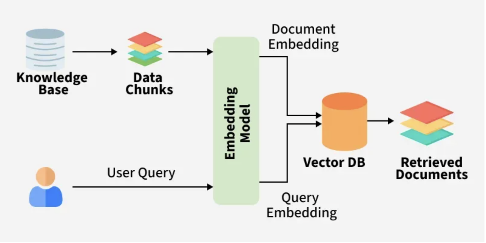

## What Is Retrieval-Augmented Generation (RAG)?
Retrieval-Augmented Generation (RAG) is an advanced paradigm in natural language processing that combines the strengths of retrieval-based methods and large generative language models (LLMs). By grounding the generation process in external knowledge sources, RAG significantly improves response accuracy, reduces model hallucinations and enables domain-adaptive, knowledge-intensive applications.

Retrieval-Augmented Generation (RAG) is a way to make AI answers more reliable by combining searching for relevant information and then generating a response. Instead of guessing based only on old training data, it first finds useful data from external sources (like documents or databases) and then uses it to give a better answer.


1. **Retrieval** → finding relevant information from external sources
2. **Generation** → using a large language model (LLM) to produce an answer based on that information

It helps AI systems answer questions using up-to-date or domain-specific knowledge instead of relying only on what was learned during training.


**Simple analogy**

Think of RAG like an “open-book exam”:

- A normal LLM answers from memory.
- A RAG system first **looks up relevant documents**, then answers using those documents.


## How RAG works

Typical pipeline:

1. **User asks a question**
    - `What’s our company refund policy?`

2. **Retriever searches knowledge sources**
    - `PDFs`
    - `databases`
    - `websites`
    - `internal docs`
    - `vector databases`

3. **Relevant chunks are returned**
    - `Example: policy paragraphs about refunds`

4. **LLM generates the response**
    - `It uses the retrieved content as context`


## Components of RAG

The main components of RAG are:

1. **External Knowledge Source:** Stores domain specific or general information like documents, APIs or databases.

2. **Text Chunking and Preprocessing:** Breaks large text into smaller, manageable chunks and cleans it for consistency.

3. **Embedding Model:** Converts text into numerical vectors that capture semantic meaning.

4. **Vector Database:** Stores embeddings and enables similarity search for fast information retrieval.

5. **Query Encoder:** Transforms the user’s query into a vector for comparison with stored embeddings.

6. **Retriever:** Finds and returns the most relevant chunks from the database based on query similarity.

7. **Prompt Augmentation Layer:** Combines retrieved chunks with the user’s query to provide context to the LLM.

8. **LLM (Generator):** Generates a grounded response using both the query and retrieved knowledge.

## Working of RAG




| #  | Chunking Type                   | Description                                           | Chunk Unit            | Best File/Data Types         | Enterprise Use Cases     | LangChain Support | External Tools/Common Integrations |
| -- | ------------------------------- | ----------------------------------------------------- | --------------------- | ---------------------------- | ------------------------ | ----------------- | ---------------------------------- |
| 1  | Character Chunking              | Fixed-size splitting by character count               | Characters            | TXT, logs, raw text          | Simple RAG, log analysis | Native            | None                               |
| 2  | Word Chunking                   | Splits by number of words                             | Words                 | TXT, chat data               | NLP preprocessing        | Custom            | NLTK, SpaCy                        |
| 3  | Line Chunking                   | Splits line by line                                   | Lines                 | Logs, CSV-like text          | Monitoring systems       | Custom            | None                               |
| 4  | Token Chunking                  | Splits by LLM token count                             | Tokens                | LLM-ready text               | GPT/Claude/Llama systems | Native            | tiktoken                           |
| 5  | Recursive Chunking              | Recursive separator-based splitting                   | Paragraph/sentence    | PDFs, DOCX                   | Enterprise RAG           | Native            | None                               |
| 6  | Sentence Chunking               | Splits using sentence boundaries                      | Sentences             | Legal, medical docs          | Research AI              | Partial           | NLTK, SpaCy                        |
| 7  | Paragraph Chunking              | Splits by paragraph structure                         | Paragraphs            | Articles, books              | Knowledge bases          | Custom            | None                               |
| 8  | Semantic Chunking               | Embedding similarity-based splitting                  | Semantic blocks       | Long enterprise docs         | High-accuracy RAG        | Experimental      | LlamaIndex, Haystack               |
| 9  | Topic-Based Chunking            | Topic modeling driven chunking                        | Topics                | Research papers              | Analytics AI             | Custom            | BERTopic, LDA                      |
| 10 | Adaptive Chunking               | Dynamic chunk sizes based on content                  | Variable              | Mixed enterprise data        | Agentic RAG              | Custom            | LangGraph                          |
| 11 | Agentic Chunking                | LLM determines chunk boundaries                       | Variable              | Complex data                 | Autonomous AI agents     | Custom            | LangGraph, CrewAI                  |
| 12 | Sliding Window Chunking         | Overlapping chunk windows                             | Overlapping text      | Long context docs            | Continuity preservation  | Native            | None                               |
| 13 | Parent-Child Chunking           | Small retrieval chunks linked to larger parent chunks | Parent/child docs     | Manuals, KBs                 | Enterprise retrieval     | Native            | None                               |
| 14 | Hierarchical Chunking           | Multi-level chunk tree structure                      | Sections/subsections  | Books, large docs            | Multi-hop retrieval      | Partial           | LlamaIndex                         |
| 15 | Metadata-Aware Chunking         | Chunking influenced by metadata                       | Metadata groups       | Enterprise docs              | Governance/compliance    | Custom            | Vector DB metadata                 |
| 16 | Query-Aware Chunking            | Optimized for expected user queries                   | Query-focused blocks  | FAQ, support docs            | Customer support AI      | Custom            | RAG evaluators                     |
| 17 | Retrieval-Optimized Chunking    | Designed for vector DB performance                    | Optimized chunks      | Any enterprise data          | Recall@K optimization    | Custom            | Pinecone, Weaviate                 |
| 18 | Compression Chunking            | Summarized hierarchical chunks                        | Compressed summaries  | Large corpora                | Long-context AI          | Custom            | LangGraph                          |
| 19 | Structure-Aware Chunking        | Uses document structure                               | Sections/headers      | DOCX, PDFs                   | Documentation AI         | Partial           | Unstructured                       |
| 20 | Layout-Aware Chunking           | Uses visual layout coordinates                        | Layout blocks         | Scanned PDFs                 | Invoice/report AI        | External          | LayoutParser, Docling              |
| 21 | Markdown Chunking               | Uses markdown hierarchy                               | Markdown headers      | README, docs                 | Technical documentation  | Native            | None                               |
| 22 | HTML/DOM Chunking               | Uses webpage DOM structure                            | HTML sections         | Websites                     | Web chatbots             | Partial           | BeautifulSoup                      |
| 23 | XML Chunking                    | XML tree-aware splitting                              | XML nodes             | XML configs                  | Enterprise integrations  | Custom            | lxml                               |
| 24 | JSON Chunking                   | Schema/path-aware splitting                           | JSON objects          | APIs, FHIR                   | Structured RAG           | Custom            | jq, pydantic                       |
| 25 | YAML Chunking                   | YAML structure-aware chunking                         | YAML blocks           | DevOps configs               | CI/CD AI                 | Custom            | PyYAML                             |
| 26 | Table-Aware Chunking            | Specialized handling for tables                       | Rows/cells            | Excel, CSV                   | BI/financial AI          | External          | Camelot, Tabula                    |
| 27 | Spreadsheet Chunking            | Workbook/sheet-aware splitting                        | Sheets/tables         | XLSX, ODS                    | Reporting AI             | External          | openpyxl, pandas                   |
| 28 | Code Chunking                   | AST/function-aware splitting                          | Functions/classes     | Source code                  | Copilot/code AI          | Native            | tree-sitter                        |
| 29 | AST-Based Chunking              | Abstract syntax tree parsing                          | AST nodes             | Codebases                    | Static analysis AI       | External          | tree-sitter                        |
| 30 | API Schema Chunking             | OpenAPI/Swagger-aware chunking                        | Endpoints/schemas     | API specs                    | API copilots             | Custom            | Swagger parsers                    |
| 31 | Graph Chunking                  | Graph neighborhood splitting                          | Nodes/edges           | Knowledge graphs             | GraphRAG                 | External          | Neo4j                              |
| 32 | Knowledge Unit Chunking         | Fact/entity-level chunking                            | Facts/entities        | Enterprise KBs               | Fact-grounded AI         | Custom            | RDF/SPARQL                         |
| 33 | Entity-Centric Chunking         | Entity relationship-based chunks                      | Entities              | CRM/EHR data                 | Relationship AI          | Custom            | spaCy, Neo4j                       |
| 34 | OCR Chunking                    | OCR text block segmentation                           | OCR blocks            | Scanned images               | Digitization AI          | External          | Tesseract                          |
| 35 | Image-Aware Chunking            | Region/object-aware chunking                          | Image regions         | Medical images               | Vision RAG               | External          | MONAI, OpenCV                      |
| 36 | Multi-Modal Chunking            | Combines text/image/audio/video                       | Multi-modal units     | Mixed media                  | Enterprise multimodal AI | Partial           | LlamaIndex                         |
| 37 | Audio Chunking                  | Audio semantic segmentation                           | Audio segments        | Calls, podcasts              | Voice AI                 | External          | Whisper                            |
| 38 | Speaker-Aware Chunking          | Splits by speaker changes                             | Speaker turns         | Meetings, calls              | Contact center AI        | External          | Pyannote                           |
| 39 | Video Chunking                  | Scene/frame-aware splitting                           | Scenes                | Videos                       | Surveillance/search AI   | External          | PySceneDetect                      |
| 40 | Time-Series Chunking            | Temporal window segmentation                          | Time windows          | IoT, ECG                     | Monitoring AI            | Custom            | pandas                             |
| 41 | Event-Based Chunking            | Splits around events                                  | Events                | Logs, SIEM                   | Incident AI              | Custom            | ELK, Splunk                        |
| 42 | Log Chunking                    | Structured log segmentation                           | Log groups            | DevOps logs                  | Observability AI         | Custom            | Fluentd                            |
| 43 | Conversation Chunking           | Dialogue/session-aware splitting                      | Conversations         | Chat/email                   | Conversational AI        | Custom            | LangGraph                          |
| 44 | Email Thread Chunking           | Email chain grouping                                  | Threads               | Emails                       | Enterprise support AI    | Custom            | Outlook/Gmail APIs                 |
| 45 | Session-Based Chunking          | User-session-aware chunking                           | Sessions              | User activity streams        | Behavioral AI            | Custom            | Kafka                              |
| 46 | Stream Chunking                 | Incremental real-time chunking                        | Streaming windows     | Kafka streams                | Real-time AI             | Custom            | Kafka, Flink                       |
| 47 | Incremental Chunking            | Updates chunks incrementally                          | Delta chunks          | Continuously changing docs   | Live KB systems          | Custom            | Delta Lake                         |
| 48 | Hybrid Chunking                 | Combination of multiple chunkers                      | Hybrid units          | Enterprise mixed data        | Advanced RAG             | Custom            | LangGraph                          |
| 49 | Security-Aware Chunking         | Splits based on security classification               | Security domains      | Regulated data               | Compliance AI            | Custom            | DLP systems                        |
| 50 | Domain-Specific Chunking        | Customized for industry schemas                       | Domain objects        | Healthcare, banking          | Industry AI              | Custom            | FHIR, HL7                          |
| 51 | Medical Imaging Chunking        | MRI/CT region segmentation                            | Anatomical regions    | DICOM images                 | Neuro digital twin       | External          | MONAI                              |
| 52 | CAD/Engineering Chunking        | Engineering drawing segmentation                      | Diagram regions       | CAD files                    | Manufacturing AI         | External          | OpenCascade                        |
| 53 | GIS/Spatial Chunking            | Geo-spatial partitioning                              | Spatial tiles         | Maps/GIS                     | Location intelligence    | External          | GeoPandas                          |
| 54 | Slide-Aware Chunking            | PPT slide-level chunking                              | Slides                | PPT/PPTX                     | Presentation AI          | External          | python-pptx                        |
| 55 | Document Section Chunking       | Chapter/section splitting                             | Sections              | Books/manuals                | Long-form retrieval      | Partial           | Unstructured                       |
| 56 | Citation-Aware Chunking         | Keeps references linked to content                    | Citation groups       | Research papers              | Academic AI              | Custom            | Semantic Scholar APIs              |
| 57 | Regulatory Chunking             | Policy/control-aware chunking                         | Clauses/controls      | Compliance docs              | GRC AI                   | Custom            | Policy parsers                     |
| 58 | Financial Statement Chunking    | Statement-aware segmentation                          | Financial sections    | Annual reports               | Finance AI               | External          | SEC parsers                        |
| 59 | EHR/FHIR Chunking               | Healthcare schema-aware chunking                      | Clinical records      | EHR/FHIR JSON/XML            | Healthcare RAG           | Custom            | HL7/FHIR tools                     |
| 60 | Knowledge Graph Hybrid Chunking | Combines semantic + graph retrieval                   | Entity-context groups | Enterprise knowledge systems | GraphRAG enterprise AI   | External          | Neo4j + LangChain                  |


## Advanced / Niche Chunking Types

| #  | Chunking Type                        | Description                                                    | Typical Usage             |
| -- | ------------------------------------ | -------------------------------------------------------------- | ------------------------- |
| 61 | Attention-Aware Chunking             | Uses transformer attention patterns to decide chunk boundaries | Advanced LLM optimization |
| 62 | Perplexity-Based Chunking            | Splits where language-model perplexity changes significantly   | Research NLP systems      |
| 63 | Reinforcement-Learned Chunking       | RL model learns optimal chunk strategy                         | Experimental agentic AI   |
| 64 | Cognitive Chunking                   | Mimics human reading/comprehension patterns                    | Cognitive AI research     |
| 65 | Memory-Augmented Chunking            | Chunking linked with AI memory systems                         | Long-term AI agents       |
| 66 | Retrieval Feedback Chunking          | Chunk strategy optimized using retrieval evaluation feedback   | Self-improving RAG        |
| 67 | Embedding Drift-Aware Chunking       | Detects semantic drift across embeddings                       | Continually evolving KBs  |
| 68 | Delta / Diff Chunking                | Only changed content is chunked/indexed                        | Versioned documents       |
| 69 | Version-Aware Chunking               | Tracks chunk lineage across versions                           | Git/document history      |
| 70 | Temporal Knowledge Chunking          | Preserves time-validity of facts                               | Financial/legal AI        |
| 71 | Causal Chunking                      | Preserves causal relationships                                 | Scientific AI             |
| 72 | Workflow-Aware Chunking              | Chunks according to business workflows                         | BPM/ERP systems           |
| 73 | Ontology-Aware Chunking              | Uses enterprise ontology hierarchy                             | Semantic enterprise AI    |
| 74 | Taxonomy-Aware Chunking              | Uses taxonomy classifications                                  | Product catalogs          |
| 75 | Policy-Aware Chunking                | Segments based on governance boundaries                        | Compliance AI             |
| 76 | Federated Chunking                   | Distributed chunking across systems/data centers               | Large-scale enterprise AI |
| 77 | Privacy-Preserving Chunking          | Sensitive-data isolation during chunking                       | HIPAA/GDPR systems        |
| 78 | Encryption-Aware Chunking            | Chunking compatible with encrypted retrieval                   | Secure RAG                |
| 79 | Vector Density Chunking              | Optimized based on embedding-space density                     | Vector DB optimization    |
| 80 | Multi-Hop Retrieval Chunking         | Designed for graph/multi-hop reasoning                         | Agentic GraphRAG          |
| 81 | Reasoning-Step Chunking              | Preserves chain-of-thought structure                           | Reasoning agents          |
| 82 | Tool-Aware Chunking                  | Optimized for agent tool selection                             | Agentic systems           |
| 83 | Simulation-State Chunking            | State-based chunking for simulations/digital twins             | Neuro/industrial twins    |
| 84 | Sensor Fusion Chunking               | Combines multimodal sensor streams                             | Autonomous systems        |
| 85 | Edge-Aware Chunking                  | Lightweight chunking for edge devices                          | IoT AI                    |
| 86 | GPU-Optimized Chunking               | Chunk sizing optimized for GPU inference                       | High-performance AI       |
| 87 | Batch Retrieval Chunking             | Optimized for large concurrent retrieval                       | Enterprise-scale RAG      |
| 88 | Cache-Aware Chunking                 | Improves semantic cache hit rates                              | Low-latency AI            |
| 89 | Hierarchical Semantic Graph Chunking | Combines semantic + hierarchical + graph chunking              | Advanced GraphRAG         |
| 90 | Autonomous Self-Rechunking           | System dynamically re-chunks based on usage patterns           | Self-evolving AI systems  |


| Rank | Chunking Type Used in Production  | Approx Enterprise Adoption % | Typical Data/File Types                         | Common Industries            | Why It’s Used                          |
| ---- | --------------------------------- | ---------------------------- | ----------------------------------------------- | ---------------------------- | -------------------------------------- |
| 1    | Recursive Character Chunking      | 85–90%                       | PDF, DOCX, TXT, Confluence, SharePoint, KB docs | All industries               | Simple, stable, good retrieval quality |
| 2    | Token-Based Chunking              | 80–85%                       | LLM text, chat history, PDFs                    | GenAI platforms              | Prevents token overflow                |
| 3    | Sliding Window / Overlap Chunking | 75–80%                       | Long documents, manuals                         | Enterprise RAG               | Preserves context continuity           |
| 4    | Semantic Chunking                 | 55–70%                       | Research docs, healthcare, banking              | Advanced AI enterprises      | Better semantic retrieval              |
| 5    | Metadata-Aware Chunking           | 50–65%                       | Enterprise documents, tickets, KBs              | Banking, ITSM, healthcare    | Improves filtering/governance          |
| 6    | Parent-Child Chunking             | 45–60%                       | Large manuals, policies, SOPs                   | Banking, ERP, insurance      | Better retrieval + context             |
| 7    | Structure/Header-Aware Chunking   | 45–55%                       | DOCX, Markdown, PDFs                            | Documentation platforms      | Keeps hierarchy intact                 |
| 8    | Table-Aware Chunking              | 35–50%                       | Excel, CSV, reports                             | Finance, ERP, analytics      | Critical for structured data           |
| 9    | Layout-Aware Chunking             | 30–45%                       | Complex/scanned PDFs                            | Insurance, legal, healthcare | Needed for OCR/layout docs             |
| 10   | HTML/DOM Chunking                 | 30–40%                       | Websites, portals, HTML docs                    | ERP/helpdesk/chatbots        | Maintains webpage structure            |
| 11   | Code-Aware Chunking               | 25–40%                       | Source code repositories                        | DevOps/software companies    | Preserves functions/classes            |
| 12   | Markdown Chunking                 | 20–35%                       | README, GitHub docs                             | Developer platforms          | Technical documentation                |
| 13   | JSON/XML Schema-Aware Chunking    | 20–30%                       | APIs, configs, FHIR                             | Healthcare, SaaS             | Structured retrieval                   |
| 14   | Event-Based Chunking              | 15–25%                       | Logs, SIEM events                               | DevOps/SRE/SOC               | Incident correlation                   |
| 15   | Conversation/Thread Chunking      | 15–25%                       | Emails, chats, call transcripts                 | Support/contact centers      | Preserves conversational flow          |
| 16   | Multi-Modal Chunking              | 10–20%                       | Image + text + audio                            | Healthcare, media            | Modern multimodal AI                   |
| 17   | Graph-Based Chunking              | 8–15%                        | Knowledge graphs                                | Large enterprises            | Multi-hop reasoning                    |
| 18   | Time-Series Chunking              | 8–15%                        | IoT, telemetry, ECG                             | Manufacturing, healthcare    | Temporal analytics                     |
| 19   | OCR-Based Chunking                | 8–12%                        | Scanned docs/images                             | BFSI, government             | Legacy document processing             |
| 20   | Adaptive/Dynamic Chunking         | 5–10%                        | Mixed enterprise datasets                       | AI-first enterprises         | Better optimization                    |
| 21   | Audio Chunking                    | 5–10%                        | Calls, meetings                                 | Contact center AI            | Voice intelligence                     |
| 22   | Video Chunking                    | 3–8%                         | CCTV, training videos                           | Security/media               | Scene retrieval                        |
| 23   | GraphRAG Hybrid Chunking          | 3–7%                         | Enterprise knowledge systems                    | Advanced AI orgs             | Complex reasoning                      |
| 24   | Agentic Chunking                  | 2–5%                         | Autonomous AI systems                           | Research/advanced AI         | Dynamic AI orchestration               |
| 25   | Attention/RL-Based Chunking       | <1%                          | Experimental AI workloads                       | Research labs                | Experimental optimization              |


## Most Common File Types in Production RAG

| File Type           | Enterprise Usage % | Typical Chunking Used               |
| ------------------- | ------------------ | ----------------------------------- |
| PDF                 | 90%+               | Recursive + semantic + layout-aware |
| DOCX                | 75%+               | Structure-aware + recursive         |
| TXT                 | 70%+               | Character/token                     |
| HTML/Web Pages      | 60%+               | DOM-aware                           |
| Markdown            | 50%+               | Header-aware                        |
| Excel/CSV           | 45%+               | Table-aware                         |
| JSON/XML            | 40%+               | Schema-aware                        |
| Emails              | 35%+               | Thread-aware                        |
| Source Code         | 30%+               | Code-aware                          |
| PPT/PPTX            | 25%+               | Slide-aware                         |
| Images/Scanned PDFs | 20%+               | OCR/layout-aware                    |
| Audio               | 10%+               | Speaker/topic-aware                 |
| Video               | 5%+                | Scene-aware                         |
| IoT/Telemetry       | 5%+                | Time-series/event                   |


## Real Production Architecture (Most Common)

Document Loader
      ↓
OCR/Layout Parsing (if needed)
      ↓
Recursive Chunking
      ↓
Metadata Enrichment
      ↓
Optional Semantic Chunking
      ↓
Embedding
      ↓
Vector DB
      ↓
Hybrid Retrieval
      ↓
Re-ranking
      ↓
LLM

## Actual Top Production Combination

| Enterprise Maturity     | Common Chunking Stack                         |
| ----------------------- | --------------------------------------------- |
| Beginner RAG            | Recursive + overlap                           |
| Intermediate RAG        | Recursive + metadata                          |
| Advanced Enterprise RAG | Semantic + parent-child + metadata            |
| FAANG/Hyperscale        | Layout-aware + semantic + GraphRAG + adaptive |

## Retrieval Metrics (Most Important)

| Metric                       | Description                                  | Ideal Direction |
| ---------------------------- | -------------------------------------------- | --------------- |
| Recall@K                     | Relevant documents retrieved in top K        | Higher          |
| Precision@K                  | Relevant docs among retrieved docs           | Higher          |
| Hit Rate                     | At least one relevant chunk retrieved        | Higher          |
| MRR (Mean Reciprocal Rank)   | Rank quality of first correct result         | Higher          |
| MAP (Mean Average Precision) | Overall ranking quality                      | Higher          |
| NDCG                         | Ranking quality considering relevance scores | Higher          |
| Top-K Accuracy               | Correct chunk appears in top K               | Higher          |
| Retrieval Accuracy           | Correct retrieval percentage                 | Higher          |
| Context Recall               | Relevant context retrieved                   | Higher          |
| Context Precision            | Retrieved context relevance                  | Higher          |
| Semantic Similarity Score    | Query ↔ chunk similarity                     | Higher          |
| Retriever Latency            | Retrieval response time                      | Lower           |
| Failed Retrieval Rate        | Queries with no useful retrieval             | Lower           |
| Empty Retrieval Rate         | No chunks returned                           | Lower           |
| Duplicate Chunk Rate         | Duplicate retrieved chunks                   | Lower           |
| Retrieval Coverage           | KB coverage during retrieval                 | Higher          |
| Noise Ratio                  | Irrelevant retrieval percentage              | Lower           |
| Retrieval Diversity          | Diversity of retrieved chunks                | Balanced        |
| Hybrid Search Accuracy       | BM25 + vector quality                        | Higher          |
| Re-ranking Gain              | Improvement after reranking                  | Higher          |


## Generation Metrics

| Metric                | Description                      | Ideal    |
| --------------------- | -------------------------------- | -------- |
| Answer Correctness    | Accuracy of generated answer     | Higher   |
| Answer Relevance      | Relevance to user query          | Higher   |
| Answer Completeness   | Missing information measure      | Higher   |
| Coherence             | Logical readability              | Higher   |
| Fluency               | Grammar/natural language quality | Higher   |
| Consistency           | No contradictions                | Higher   |
| Conciseness           | Avoid unnecessary verbosity      | Balanced |
| Toxicity Score        | Harmful content probability      | Lower    |
| Safety Score          | Safe response quality            | Higher   |
| Instruction Adherence | Follows prompt instructions      | Higher   |
| Helpfulness           | User usefulness rating           | Higher   |
| Factual Accuracy      | Fact correctness                 | Higher   |
| Readability Score     | Human readability                | Higher   |
| Response Diversity    | Variation across outputs         | Balanced |
| Response Stability    | Consistency across runs          | Higher   |


## Grounding / Hallucination Metrics

| Metric                 | Description                       | Ideal  |
| ---------------------- | --------------------------------- | ------ |
| Faithfulness           | Answer grounded in retrieved docs | Higher |
| Groundedness           | Supported by source context       | Higher |
| Hallucination Rate     | Unsupported/generated facts       | Lower  |
| Citation Accuracy      | Correct source attribution        | Higher |
| Attribution Score      | Traceability to sources           | Higher |
| Unsupported Claim Rate | Claims not in retrieval           | Lower  |
| Context Utilization    | How much retrieved context used   | Higher |
| Source Consistency     | Agreement with source docs        | Higher |
| Evidence Match Score   | Evidence-answer alignment         | Higher |
| Fabrication Rate       | Invented entities/facts           | Lower  |


## Chunking Metrics

| Metric                       | Description                   | Ideal     |
| ---------------------------- | ----------------------------- | --------- |
| Chunk Relevance              | Chunk usefulness              | Higher    |
| Chunk Coherence              | Semantic continuity           | Higher    |
| Chunk Density                | Information per chunk         | Balanced  |
| Chunk Overlap Efficiency     | Useful overlap percentage     | Balanced  |
| Chunk Redundancy             | Duplicate info across chunks  | Lower     |
| Chunk Coverage               | Document coverage quality     | Higher    |
| Average Chunk Size           | Tokens/chars per chunk        | Optimized |
| Context Fragmentation        | Broken semantic continuity    | Lower     |
| Semantic Boundary Accuracy   | Correct semantic splitting    | Higher    |
| Retrieval-to-Chunk Alignment | Retrieval precision per chunk | Higher    |


## Embedding Metrics

| Metric                              | Description                     | Ideal     |
| ----------------------------------- | ------------------------------- | --------- |
| Embedding Similarity                | Semantic closeness              | Higher    |
| Vector Drift                        | Embedding consistency over time | Lower     |
| Embedding Latency                   | Time to generate embeddings     | Lower     |
| Embedding Dimensionality Efficiency | Performance vs vector size      | Optimized |
| Cluster Separation                  | Distinct semantic groups        | Higher    |
| Intra-cluster Similarity            | Similarity within group         | Higher    |
| Inter-cluster Distance              | Difference between groups       | Higher    |
| ANN Recall                          | Approx nearest neighbor quality | Higher    |
| Vector Compression Loss             | Loss after quantization         | Lower     |


## Re-ranking Metrics

| Metric                    | Description                 | Ideal  |
| ------------------------- | --------------------------- | ------ |
| Cross-Encoder Accuracy    | Re-ranker precision         | Higher |
| Re-ranking Latency        | Re-rank speed               | Lower  |
| Ranking Improvement Score | Improvement after reranking | Higher |
| NDCG Improvement          | Ranking enhancement         | Higher |
| Pairwise Ranking Accuracy | Correct pair ordering       | Higher |


## Agentic AI Metrics

| Metric                         | Description                  | Ideal  |
| ------------------------------ | ---------------------------- | ------ |
| Tool Selection Accuracy        | Correct tool chosen          | Higher |
| Task Completion Rate           | Successfully completed tasks | Higher |
| Planning Accuracy              | Quality of agent plan        | Higher |
| Multi-Agent Coordination Score | Collaboration quality        | Higher |
| Autonomous Success Rate        | Independent task success     | Higher |
| Recovery Success Rate          | Recovery after failure       | Higher |
| Memory Recall Accuracy         | Correct memory retrieval     | Higher |
| Reflection Quality             | Self-correction quality      | Higher |
| Agent Latency                  | Agent response speed         | Lower  |


## LLM Performance Metrics

| Metric                     | Description            | Ideal  |
| -------------------------- | ---------------------- | ------ |
| Tokens/sec                 | Inference throughput   | Higher |
| TTFT (Time to First Token) | Initial response delay | Lower  |
| Completion Latency         | Full response time     | Lower  |
| Context Window Utilization | Efficient context use  | Higher |
| Prompt Efficiency          | Quality vs prompt size | Higher |
| Token Efficiency           | Useful output/token    | Higher |
| GPU Utilization            | Hardware efficiency    | Higher |
| Inference Cost             | Cost per request       | Lower  |


## Infrastructure & System Metrics

| Metric                   | Description              | Ideal     |
| ------------------------ | ------------------------ | --------- |
| API Latency              | End-to-end response time | Lower     |
| Throughput               | Requests/sec             | Higher    |
| Availability             | Uptime percentage        | Higher    |
| Error Rate               | Failed requests          | Lower     |
| Cache Hit Rate           | Cache efficiency         | Higher    |
| Vector DB Query Time     | Search speed             | Lower     |
| CPU Utilization          | Resource efficiency      | Balanced  |
| GPU Memory Usage         | Memory efficiency        | Optimized |
| Concurrent User Capacity | Scalability              | Higher    |
| Queue Wait Time          | Processing delay         | Lower     |


## Cost Metrics

| Metric          | Description             | Ideal |
| --------------- | ----------------------- | ----- |
| Cost per Query  | Total query cost        | Lower |
| Embedding Cost  | Vector generation cost  | Lower |
| Storage Cost    | Vector DB storage       | Lower |
| GPU Cost        | Inference hardware cost | Lower |
| Token Cost      | LLM token spending      | Lower |
| Re-ranking Cost | Cross-encoder cost      | Lower |


## User Experience Metrics

| Metric             | Description             | Ideal      |
| ------------------ | ----------------------- | ---------- |
| CSAT               | Customer satisfaction   | Higher     |
| User Retention     | Continued usage         | Higher     |
| Query Success Rate | User got desired answer | Higher     |
| Feedback Score     | User ratings            | Higher     |
| Escalation Rate    | Human handoff frequency | Lower      |
| Session Duration   | Engagement              | Contextual |
| Click-through Rate | Interaction engagement  | Higher     |


## Security & Governance Metrics

| Metric                        | Description             | Ideal  |
| ----------------------------- | ----------------------- | ------ |
| PII Leakage Rate              | Sensitive data exposure | Lower  |
| Prompt Injection Success Rate | Jailbreak success       | Lower  |
| Access Control Violations     | Unauthorized access     | Lower  |
| Compliance Adherence          | GDPR/HIPAA alignment    | Higher |
| Audit Traceability            | Traceable operations    | Higher |
| Data Lineage Accuracy         | Source tracking         | Higher |


## Multi-Modal Metrics

| Metric                         | Description                 | Ideal  |
| ------------------------------ | --------------------------- | ------ |
| OCR Accuracy                   | Correct text extraction     | Higher |
| Image Caption Accuracy         | Visual understanding        | Higher |
| Audio Transcription Accuracy   | Speech-to-text quality      | Higher |
| Video Scene Retrieval Accuracy | Relevant scene retrieval    | Higher |
| Multi-modal Alignment Score    | Alignment across modalities | Higher |


## Benchmark Metrics

| Benchmark  | Purpose                     |
| ---------- | --------------------------- |
| MTEB       | Embedding benchmark         |
| BEIR       | Retrieval benchmark         |
| HELM       | Holistic LLM evaluation     |
| RAGAS      | RAG evaluation              |
| DeepEval   | LLM evaluation              |
| TruthfulQA | Hallucination benchmark     |
| HumanEval  | Code generation             |
| GSM8K      | Reasoning/math              |
| SWE-Bench  | Software engineering agents |

## Business KPIs

| KPI                        | Description              |
| -------------------------- | ------------------------ |
| SLA Compliance             | Meets support SLA        |
| Ticket Deflection Rate     | Reduced support tickets  |
| Productivity Gain          | Time saved               |
| Resolution Time Reduction  | Faster issue solving     |
| Knowledge Reuse Rate       | KB usage                 |
| Revenue Impact             | Financial value          |
| Operational Cost Reduction | Reduced enterprise cost  |
| Employee Efficiency        | Productivity improvement |


## Most Important Metrics Used in Real Enterprise RAG

| Priority | Metric             |
| -------- | ------------------ |
| 1        | Recall@K           |
| 2        | Precision@K        |
| 3        | Faithfulness       |
| 4        | Groundedness       |
| 5        | Hallucination Rate |
| 6        | Answer Correctness |
| 7        | Context Relevance  |
| 8        | Latency            |
| 9        | Cost per Query     |
| 10       | Retrieval Accuracy |


## Common Enterprise Evaluation Stack

```
Retrieval Metrics
       +
Grounding Metrics
       +
Generation Metrics
       +
Latency Metrics
       +
Cost Metrics
       +
Human Evaluation
```

## Groundedness

**Groundedness**

- **Focuses on:** `Did the answer come from retrieved documents?`

- `LLM Judge = evaluator`
- `Groundedness Score = evaluation result`

**What Generates the Score?**

The judge model generates it using:

- reasoning
- semantic understanding
- context comparison
- hallucination detection


## Common Enterprise Groundedness Prompt

```
You are an AI evaluator.

Question:
{question}

Retrieved Context:
{context}

Generated Answer:
{answer}

Evaluate whether the answer is fully supported by the retrieved context.

Return:
1. Groundedness score (0-1)
2. Unsupported claims
3. Explanation
```

## Faithfulness

- **Focuses on:** `Did the answer stay true to the retrieved documents?`

**Example**

**Retrieved Context:** `The refund period is 30 days.`

**Answer:** `Refund period is 30 days.`

| Metric       | Result |
| ------------ | ------ |
| Groundedness | High   |
| Faithfulness | High   |


**Hallucinated Example**

**Retrieved Context:** `Refund period is 30 days.`

**Answer:** `Refund period is 60 days.`

| Metric       | Result |
| ------------ | ------ |
| Groundedness | Low    |
| Faithfulness | Low    |


**Difference**

**Groundedness** 

**Checks:** `Was answer grounded in retrieved evidence?`

**Main concern:**
  
  - retrieval support


**Faithfulness**

**Checks:** `Did answer preserve factual truth from context?`

**Main concern:**

  - factual consistency


**Analysis**

| Metric       | Interpretation                     |
| ------------ | ---------------------------------- |
| Groundedness | High (based on context)            |
| Faithfulness | Medium-high (less precise wording) |


## Hallucination

What is Hallucination Rate?

Hallucination Rate measures: `How often the LLM generates information NOT supported by evidence or reality.`

In RAG systems, hallucination usually means:

- unsupported claims
- invented facts
- wrong numbers
- fake citations
- fabricated entities

**Basic Formula**

$$
\text{Hallucination Rate} = \frac{\text{Hallucinated Outputs}}{\text{Total Outputs}}
$$

**Percentage Formula**

$$
\text{Hallucination Rate (%)} =
\left(
\frac{\text{Hallucinated Outputs}}
{\text{Total Outputs}}
\right) \times 100
$$

**Example**

| Answer   | Hallucinated? |
| -------- | ------------- |
| Answer 1 | Yes           |
| Answer 2 | No            |
| Answer 3 | Yes           |
| Answer 4 | No            |


**Hallucination Rate:**

$$
\frac{2}{4} = 0.5*100 = 50%
$$

The hallucination rate is 50%.


**Example Judge Prompt**

```
You are an evaluator.

Question:
{question}

Retrieved Context:
{context}

Generated Answer:
{answer}

Identify unsupported claims.
Return:
- hallucination detected (true/false)
- hallucination score (0-1)
- explanation
```

## 1. Faithfulness Metric (Cosine Similarity)

```
from sentence_transformers import SentenceTransformer
from sklearn.metrics.pairwise import cosine_similarity

# Load embedding model
model = SentenceTransformer('all-MiniLM-L6-v2')

# Retrieved context
context = """
France is a country in Europe.
Paris is the capital of France.
"""

# Generated answer
answer = "Paris is the capital city of France."

# Generate embeddings
context_embedding = model.encode([context])
answer_embedding = model.encode([answer])

# Calculate cosine similarity
faithfulness_score = cosine_similarity(
    context_embedding,
    answer_embedding
)[0][0]

print("Faithfulness Score:", round(faithfulness_score, 4))
```

## 2. Correctness Metric

```
from sentence_transformers import SentenceTransformer
from sklearn.metrics.pairwise import cosine_similarity

model = SentenceTransformer('all-MiniLM-L6-v2')

# Ground truth answer
ground_truth = "Paris is the capital of France."

# Generated answer
generated_answer = "Paris is France's capital city."

# Embeddings
gt_embedding = model.encode([ground_truth])
gen_embedding = model.encode([generated_answer])

# Similarity
correctness_score = cosine_similarity(
    gt_embedding,
    gen_embedding
)[0][0]

print("Correctness Score:", round(correctness_score, 4))
```

## 3. Groundedness Metric

```
from sentence_transformers import SentenceTransformer
from sklearn.metrics.pairwise import cosine_similarity
import nltk

nltk.download('punkt')

model = SentenceTransformer('all-MiniLM-L6-v2')

# Retrieved context
context = """
Python is a programming language created by Guido van Rossum in 1991.
"""

# Generated answer
answer = """
Python was created by Guido van Rossum in 1991.
"""

# Split answer into sentences
sentences = nltk.sent_tokenize(answer)

supported = 0

# Context embedding
context_embedding = model.encode([context])

for sentence in sentences:
    sentence_embedding = model.encode([sentence])

    similarity = cosine_similarity(
        sentence_embedding,
        context_embedding
    )[0][0]

    print(f"Sentence: {sentence}")
    print(f"Similarity: {similarity:.4f}")

    if similarity > 0.80:
        supported += 1

# Groundedness score
groundedness_score = supported / len(sentences)

print("\nGroundedness Score:", round(groundedness_score, 4))
```

## 4. Hallucination Rate Metric

```
from sentence_transformers import SentenceTransformer
from sklearn.metrics.pairwise import cosine_similarity
import nltk

nltk.download('punkt')

model = SentenceTransformer('all-MiniLM-L6-v2')

# Retrieved context
context = """
Python was created by Guido van Rossum.
"""

# Generated answer
answer = """
Python was created by Guido van Rossum in California in 1991.
"""

# Sentence split
sentences = nltk.sent_tokenize(answer)

unsupported = 0

context_embedding = model.encode([context])

for sentence in sentences:
    sentence_embedding = model.encode([sentence])

    similarity = cosine_similarity(
        sentence_embedding,
        context_embedding
    )[0][0]

    print(f"Sentence: {sentence}")
    print(f"Similarity: {similarity:.4f}")

    if similarity < 0.80:
        unsupported += 1

# Hallucination rate
hallucination_rate = (
    unsupported / len(sentences)
) * 100

print("\nHallucination Rate:", round(hallucination_rate, 2), "%")
```

## 5. Answer Relevancy Metric

```
from sentence_transformers import SentenceTransformer
from sklearn.metrics.pairwise import cosine_similarity

model = SentenceTransformer('all-MiniLM-L6-v2')

# User query
query = "What is Kubernetes?"

# Generated answer
answer = """
Kubernetes is an open-source container orchestration platform.
"""

# Embeddings
query_embedding = model.encode([query])
answer_embedding = model.encode([answer])

# Similarity
relevancy_score = cosine_similarity(
    query_embedding,
    answer_embedding
)[0][0]

print("Answer Relevancy Score:", round(relevancy_score, 4))
```

## 6. Combined RAG Evaluation Script

```
from sentence_transformers import SentenceTransformer
from sklearn.metrics.pairwise import cosine_similarity

model = SentenceTransformer('all-MiniLM-L6-v2')

# Inputs
query = "Who invented Python?"

retrieved_context = """
Python was invented by Guido van Rossum.
"""

generated_answer = """
Python was invented by Guido van Rossum in 1991.
"""

ground_truth = """
Python was invented by Guido van Rossum.
"""

# Embeddings
query_emb = model.encode([query])
context_emb = model.encode([retrieved_context])
answer_emb = model.encode([generated_answer])
truth_emb = model.encode([ground_truth])

# Faithfulness
faithfulness = cosine_similarity(
    context_emb,
    answer_emb
)[0][0]

# Correctness
correctness = cosine_similarity(
    truth_emb,
    answer_emb
)[0][0]

# Relevancy
relevancy = cosine_similarity(
    query_emb,
    answer_emb
)[0][0]

print("\n===== RAG Evaluation =====")
print("Faithfulness :", round(faithfulness, 4))
print("Correctness  :", round(correctness, 4))
print("Relevancy    :", round(relevancy, 4))
```


