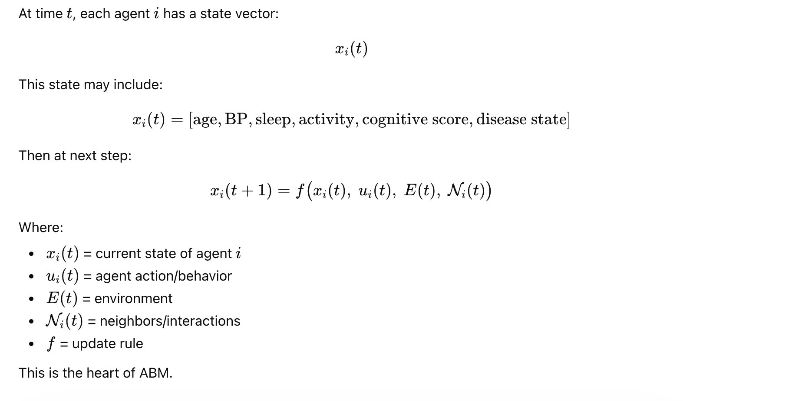
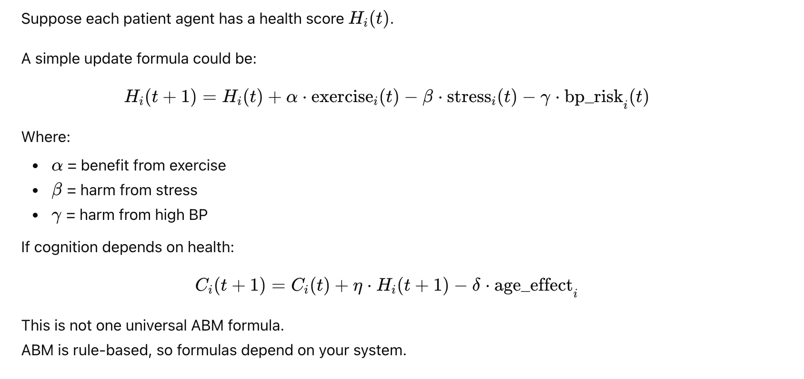
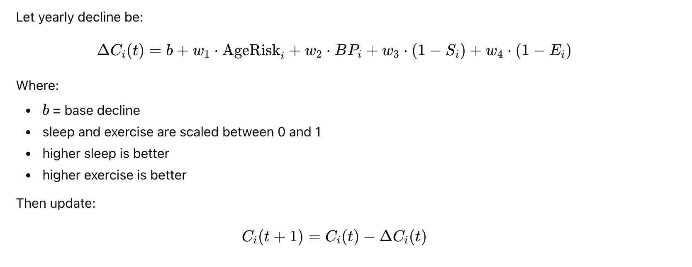
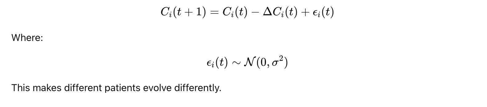
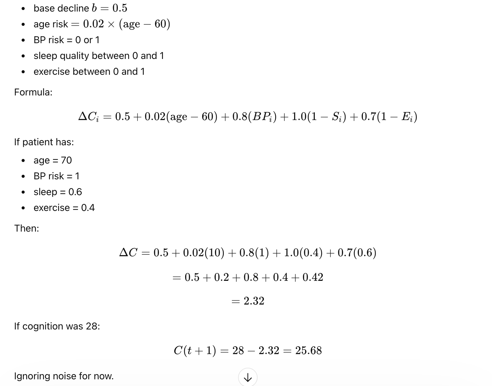

# What is Agent-Based Model (ABM)?

**Agent-Based Model (ABM)** is a simulation method where you model a system as a collection of **individual agents**, and each agent follows rules, interacts with others or environment, and changes over time.

Instead of only modeling the population as averages, ABM models **person by person**.

**1) Core idea**

In ABM, each agent has:

- a state
- attributes
- rules of behavior
- interactions

Examples of agents:

- people
- patients
- cars
- doctors
- neurons
- hospitals

In neuro digital twin context, one agent can be:

- one patient
- or many simulated patients in a virtual population

**2) Why ABM is different**

**Traditional model**

Uses averages:

- average BP
- average cognition
- average risk

**ABM**

Tracks each individual separately:

- Patient A sleeps poorly
- Patient B exercises regularly
- Patient C misses medication
- each one evolves differently

So ABM captures:

- heterogeneity
- interactions
- emergent behavior


**3) Simple definition**



**4) Main components of ABM**

**A) Agents**

Each agent has attributes.

Example patient agent:

- age
- blood pressure
- sleep quality
- activity
- medication adherence
- cognitive score
- disease stage


**B) Environment**

The world where agents exist.

Example:

- pollution
- clinic access
- family support
- stress level
- temperature


**C) Rules**

Rules tell how the agent changes.

Example:

- poor sleep reduces cognitive score
- exercise improves health
- high BP increases decline risk
- medication adherence reduces risk

**D) Time steps**

Simulation moves in steps:

- daily
- weekly
- monthly
- yearly


**5) Formula intuition**



**6) Real example**

Let us build a simple **Neuro Digital Twin ABM**.

We simulate many patients for 5 years.

Each patient has:

- age
- blood pressure risk
- sleep quality
- exercise level
- cognition score

Rule:

- cognition declines each year
- decline is worse if:
    - age is higher
    - BP is high
    - sleep is poor
    - exercise is low

**7) Step-by-step model design**

**Step 1: Define agent state**

For patient i: `xi​(t)=[Ai​, BPi​, Si​, Ei​, Ci​]`

Where:

- Ai = age
- BPi = blood pressure risk
- Si = sleep quality
- Ei = exercise level
- Ci = cognition score

**Step 2: Define yearly cognition decline**



**Step 3: Add small randomness**

Real life is uncertain, so add noise:



**8) Concrete numerical example**

Suppose:



**9) Python code example**

Below is a simple ABM for 100 patients over 5 years.

```
import numpy as np
import pandas as pd

# -----------------------------
# 1. Create a patient population
# -----------------------------
np.random.seed(42)

n_agents = 100
years = 5

patients = pd.DataFrame({
    "agent_id": np.arange(n_agents),
    "age": np.random.randint(60, 81, size=n_agents),              # 60 to 80
    "bp_risk": np.random.binomial(1, 0.4, size=n_agents),         # 40% high BP risk
    "sleep_quality": np.random.uniform(0.4, 0.9, size=n_agents),  # 0 to 1, higher better
    "exercise_level": np.random.uniform(0.2, 0.9, size=n_agents), # 0 to 1, higher better
    "cognition": np.random.uniform(24, 30, size=n_agents),        # initial cognition score
})

# -----------------------------
# 2. Define update rule
# -----------------------------
def cognition_decline(age, bp_risk, sleep_quality, exercise_level):
    """
    Compute one-year cognitive decline.
    Larger decline = worse outcome.
    """
    base_decline = 0.5
    age_effect = 0.02 * max(age - 60, 0)
    bp_effect = 0.8 * bp_risk
    sleep_effect = 1.0 * (1.0 - sleep_quality)
    exercise_effect = 0.7 * (1.0 - exercise_level)
    noise = np.random.normal(0, 0.2)  # random variability

    decline = base_decline + age_effect + bp_effect + sleep_effect + exercise_effect + noise
    return max(decline, 0.0)  # decline cannot be negative

# -----------------------------
# 3. Simulate over time
# -----------------------------
records = []

for year in range(years + 1):
    # store current state
    for _, row in patients.iterrows():
        records.append({
            "year": year,
            "agent_id": int(row["agent_id"]),
            "age": row["age"],
            "bp_risk": row["bp_risk"],
            "sleep_quality": row["sleep_quality"],
            "exercise_level": row["exercise_level"],
            "cognition": row["cognition"]
        })

    # do not update after final year
    if year == years:
        break

    # update each patient
    for idx in patients.index:
        decline = cognition_decline(
            age=patients.loc[idx, "age"],
            bp_risk=patients.loc[idx, "bp_risk"],
            sleep_quality=patients.loc[idx, "sleep_quality"],
            exercise_level=patients.loc[idx, "exercise_level"]
        )

        patients.loc[idx, "cognition"] -= decline
        patients.loc[idx, "cognition"] = max(patients.loc[idx, "cognition"], 0)

        # age increases yearly
        patients.loc[idx, "age"] += 1

        # optional: small drift in sleep and exercise
        patients.loc[idx, "sleep_quality"] += np.random.normal(0, 0.03)
        patients.loc[idx, "exercise_level"] += np.random.normal(0, 0.03)

        # keep within bounds [0,1]
        patients.loc[idx, "sleep_quality"] = np.clip(patients.loc[idx, "sleep_quality"], 0, 1)
        patients.loc[idx, "exercise_level"] = np.clip(patients.loc[idx, "exercise_level"], 0, 1)

# -----------------------------
# 4. Results
# -----------------------------
df = pd.DataFrame(records)

print("First 10 rows:")
print(df.head(10))

# Average cognition by year
summary = df.groupby("year")["cognition"].mean().reset_index()
print("\nAverage cognition by year:")
print(summary)

# Example: show 5 sample patients
sample_ids = [0, 1, 2, 3, 4]
sample_df = df[df["agent_id"].isin(sample_ids)]
print("\nSample patient trajectories:")
print(sample_df[["year", "agent_id", "cognition"]].head(30))
```

**14) Real-world ABM examples**

**Healthcare**

- disease spread
- patient progression
- hospital flow
- medication adherence

**Traffic**

- each car is an agent
- traffic jams emerge from local rules

**Economics**

- each buyer/seller is an agent
- prices emerge from interactions

**Neuro digital twin**

- each simulated patient is an agent
- cognition, BP, sleep, adherence, rehab evolve over time


**15) More realistic neuro ABM**

A better neuro ABM can include:

- age
- APOE genotype
- BP
- glucose
- sleep
- exercise
- depression
- medication adherence
- MRI atrophy
- rehab sessions
- family support


Then a richer formula may be:

`Ci(t+1) = Ci​(t) - (b + w1​AgeRisk + w2​MRIAtrophy + w3​BP + w4​(1−Sleep) + w5​(1−Exercise) + w6​(1−Adherence)) + ϵi(t)`


This becomes a patient-level digital twin engine.


**16) Very important limitation**

ABM is powerful, but:

- rules must be designed carefully
- calibration is hard
- too many assumptions can make it unrealistic
- can be computationally heavy

So ABM is best when:

- individuals differ a lot
- behavior matters
- interactions matter
- averages are not enough


- **Markov**
- **Agent-Based Model (ABM)**
- **Monte Carlo (MC)**
- and a **Hybrid (ABM + Markov + MC)**


## Markov vs ABM vs Monte Carlo — Comparison

| Aspect           | Markov Model                   | Agent-Based Model (ABM)       | Monte Carlo (MC)              |
| ---------------- | ------------------------------ | ----------------------------- | ----------------------------- |
| Core Idea        | State transition probabilities | Individual agents with rules  | Random sampling simulation    |
| Unit of Modeling | States                         | Individuals (agents)          | Repeated simulations          |
| Memory           | Depends only on current state  | Full state (history possible) | Depends on model              |
| Formula          | ( \pi_{t+1} = \pi_t P )        | ( x_i(t+1)=f(x_i(t)) )        | ( X \sim P )                  |
| Deterministic?   | Yes                            | No                            | No                            |
| Variability      | Low                            | High                          | High                          |
| Use Case         | Disease progression states     | Behavior & lifestyle modeling | Uncertainty & risk estimation |
| Strength         | Simple, interpretable          | Realistic, personalized       | Captures uncertainty          |
| Weakness         | Too simplistic                 | Complex rules                 | Needs many runs               |


**Unified Neuro Digital Twin Concept**

We combine:

- **Markov → disease states**
- **ABM → patient features**
- **Monte Carlo → randomness**


States:

- `Stable → At Risk → MCI → Dementia`

## Complete Python Code (With Detailed Docstrings)

```
"""
===========================================================
Neuro Digital Twin Simulation
Markov + ABM + Monte Carlo Hybrid Model
===========================================================

This script demonstrates:

1. Markov Model:
   - Uses transition matrix for disease progression

2. Agent-Based Model (ABM):
   - Each patient has attributes:
     age, BP risk, sleep, exercise, cognition

3. Monte Carlo:
   - Random sampling for uncertainty

4. Hybrid Model:
   - Transition probabilities depend on patient features

-----------------------------------------------------------
States:
0 = Stable
1 = At Risk
2 = MCI
3 = Dementia
-----------------------------------------------------------
"""

import numpy as np
import pandas as pd

# -----------------------------------------------------------
# 1. Define states
# -----------------------------------------------------------
states = ["Stable", "At Risk", "MCI", "Dementia"]
state_to_idx = {s: i for i, s in enumerate(states)}
idx_to_state = {i: s for i, s in enumerate(states)}

# -----------------------------------------------------------
# 2. Base Markov transition matrix
# -----------------------------------------------------------
P_base = np.array([
    [0.75, 0.20, 0.05, 0.00],
    [0.10, 0.65, 0.20, 0.05],
    [0.00, 0.10, 0.65, 0.25],
    [0.00, 0.00, 0.05, 0.95]
])

# -----------------------------------------------------------
# 3. Create patient agents (ABM)
# -----------------------------------------------------------
def create_population(n):
    """
    Create a population of agents (patients)

    Each agent has:
    - age
    - BP risk
    - sleep quality
    - exercise level
    - cognition score
    - current disease state
    """
    return pd.DataFrame({
        "age": np.random.randint(60, 80, n),
        "bp_risk": np.random.binomial(1, 0.4, n),
        "sleep": np.random.uniform(0.4, 0.9, n),
        "exercise": np.random.uniform(0.3, 0.9, n),
        "cognition": np.random.uniform(24, 30, n),
        "state": np.zeros(n, dtype=int)  # start Stable
    })

# -----------------------------------------------------------
# 4. Build patient-specific transition matrix
# (ABM influences Markov)
# -----------------------------------------------------------
def adjust_transition_matrix(P, patient):
    """
    Modify transition probabilities based on patient features

    Higher risk if:
    - older age
    - high BP
    - poor sleep
    - low exercise
    """
    P_adj = P.copy()

    risk = 1.0
    risk += 0.01 * max(patient["age"] - 60, 0)
    risk += 0.2 * patient["bp_risk"]
    risk += 0.3 * (1 - patient["sleep"])
    risk += 0.2 * (1 - patient["exercise"])

    risk = min(risk, 1.5)

    # Increase worsening transitions
    worsening = [(0,1),(0,2),(1,2),(1,3),(2,3)]

    for i,j in worsening:
        P_adj[i,j] *= risk

    # Normalize rows
    for i in range(P_adj.shape[0]):
        P_adj[i] /= P_adj[i].sum()

    return P_adj

# -----------------------------------------------------------
# 5. Update cognition (ABM rule)
# -----------------------------------------------------------
def update_cognition(patient):
    """
    Cognitive decline model

    Formula:
    C(t+1) = C(t) - decline + noise

    decline depends on:
    - age
    - BP
    - sleep
    - exercise
    """
    decline = (
        0.5 +
        0.02 * (patient["age"] - 60) +
        0.8 * patient["bp_risk"] +
        1.0 * (1 - patient["sleep"]) +
        0.7 * (1 - patient["exercise"])
    )

    noise = np.random.normal(0, 0.2)
    patient["cognition"] -= (decline + noise)
    patient["cognition"] = max(patient["cognition"], 0)

# -----------------------------------------------------------
# 6. Map cognition → disease state
# -----------------------------------------------------------
def cognition_to_state(c):
    """
    Convert cognition score to disease state
    """
    if c >= 27:
        return 0
    elif c >= 24:
        return 1
    elif c >= 18:
        return 2
    else:
        return 3

# -----------------------------------------------------------
# 7. Simulation (Monte Carlo + ABM + Markov)
# -----------------------------------------------------------
def simulate(n_agents=100, years=5, runs=1000):
    """
    Run multiple simulations (Monte Carlo)

    For each run:
    - simulate population evolution over time
    - store final states
    """
    final_states = []

    for r in range(runs):

        population = create_population(n_agents)

        for year in range(years):

            for i in population.index:

                patient = population.loc[i]

                # Update cognition (ABM)
                update_cognition(patient)

                # Convert cognition → state
                state = cognition_to_state(patient["cognition"])

                # Build patient-specific transition matrix
                P = adjust_transition_matrix(P_base, patient)

                # Sample next state (Monte Carlo)
                next_state = np.random.choice(len(states), p=P[state])

                population.at[i, "state"] = next_state

                # Age increases
                population.at[i, "age"] += 1

        final_states.extend(population["state"].values)

    return final_states

# -----------------------------------------------------------
# 8. Run simulation
# -----------------------------------------------------------
results = simulate(n_agents=200, years=5, runs=500)

# -----------------------------------------------------------
# 9. Analyze results
# -----------------------------------------------------------
counts = np.bincount(results, minlength=len(states))
probs = counts / len(results)

df_result = pd.DataFrame({
    "State": states,
    "Probability": probs
})

print("\nFinal State Distribution after 5 years:")
print(df_result.round(4))
```

**Step 1 — ABM**

Each patient:

- has age, BP, sleep, exercise, cognition

**Step 2 — Markov**

- transition matrix defines disease progression

**Step 3 — ABM modifies Markov**

- each patient gets personalized transition matrix

**Step 4 — Monte Carlo**

- next state sampled randomly

`St+1 ∼ Categorical(Ppatient​)`

**Step 5 — Repeat over years**

- simulate progression

**Step 6 — Repeat over runs**

- capture uncertainty


**Final Insight**

👉 Markov = structure

👉 ABM = personalization

👉 Monte Carlo = uncertainty


