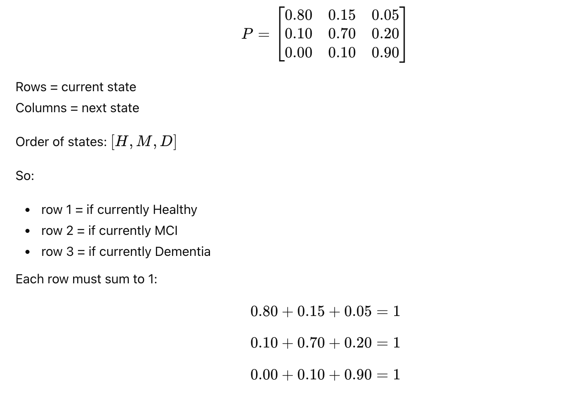
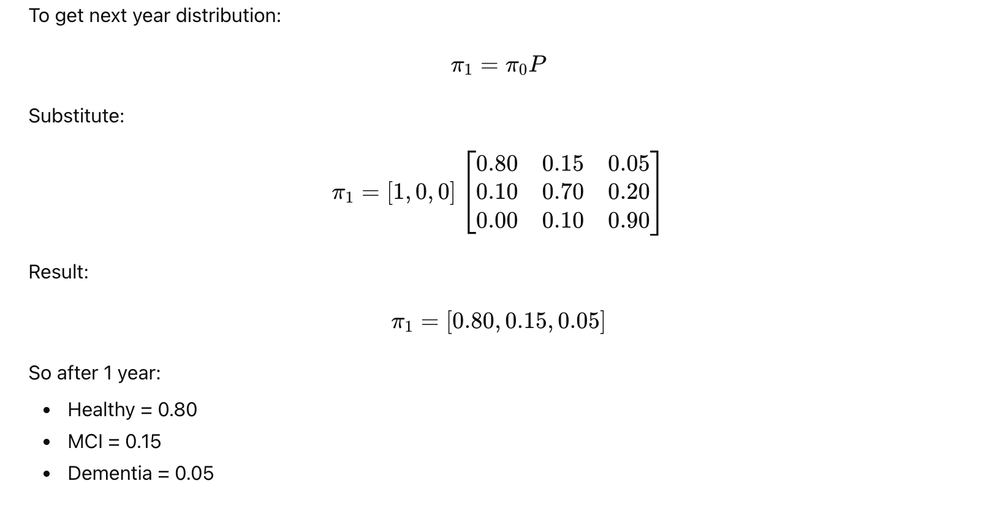
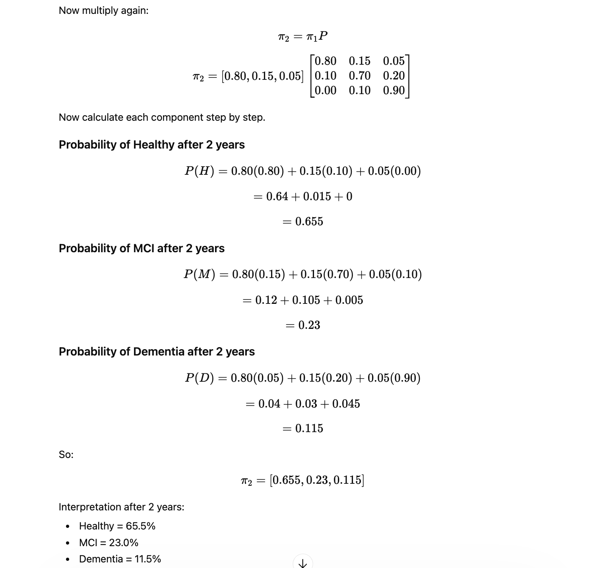
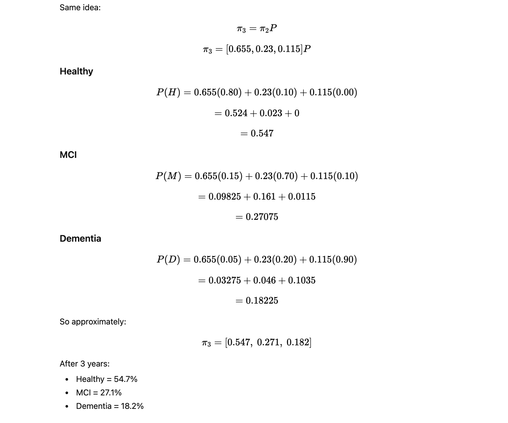
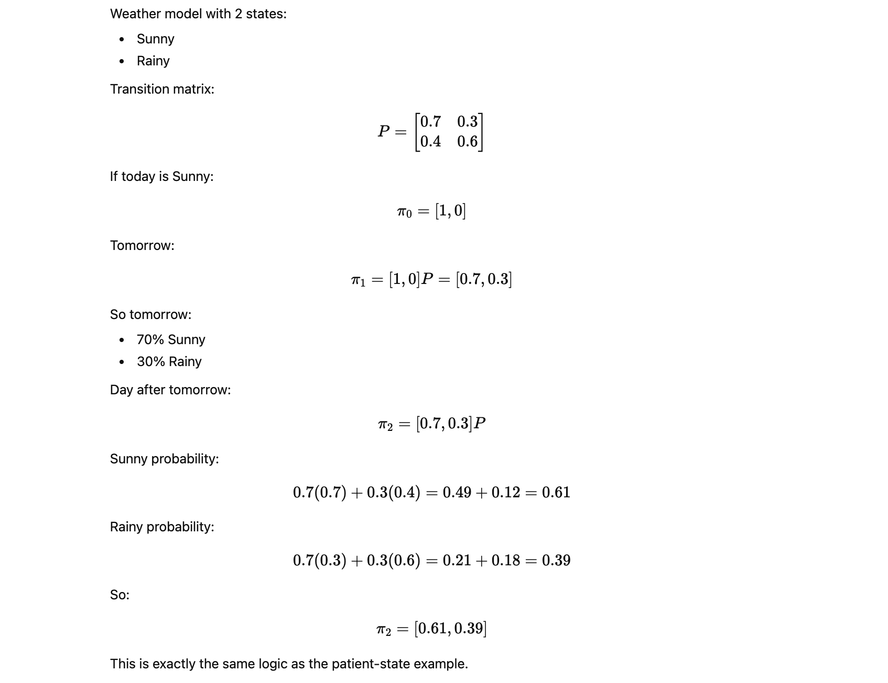
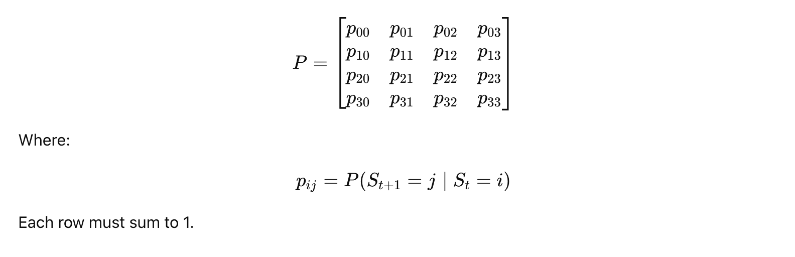

# What is Markov?

**Markov model** is a way to model a system that moves between **states** over time, where the **next state depends only on the current state**, not the full past.

This is called the **Markov property**.

If a patient is in state `St` today, then the probability of tomorrow’s state `St+1` depends only on `St`.

Formula:


Meaning:

- future depends on **present**
- future does **not directly depend on full history**

**2) Real example**

Take a simple neuro health progression model with 3 states:

- `H` = Healthy
- `M` = Mild Cognitive Impairment
- `D` = Dementia

Suppose each year a patient can move between these states with these probabilities:

- If Healthy now:
    - stay Healthy = 0.80
    - move to MCI = 0.15
    - move to Dementia = 0.05

- If MCI now:
    - move back to Healthy = 0.10
    - stay MCI = 0.70
    - move to Dementia = 0.20

- If Dementia now:
    - move to Healthy = 0.00
    - move to MCI = 0.10
    - stay Dementia = 0.90


**3) Transition matrix**

These probabilities are written in a **transition matrix** P:




**4) Initial state vector**

Suppose today the patient is definitely Healthy.

Then initial state vector is:

`π0 = [1,0,0]`

Meaning:

- 100% Healthy
- 0% MCI
- 0% Dementia


**5) After 1 year**




**6) After 2 years**




**7) After 3 years**




**8) What is happening conceptually**

Each year:

- some Healthy patients remain Healthy
- some Healthy move to MCI
- some MCI progress to Dementia
- a small fraction of MCI may improve

The Markov model keeps repeating this transition logic step by step.


**9) General formula**

If initial state vector is π0, then after n time steps:

`πn = π0​Pn`

Where:

- `π0 = initial distribution`
- `P = transition matrix`
- `Pn = matrix multiplied by itself n times`


**10) Simple non-medical example**




**11) Why Markov is useful in Neuro Digital Twin**

For a neuro digital twin, states can be:

- Normal
- At-risk
- MCI
- Moderate decline
- Severe decline

Then transitions depend on things like:

- age
- MRI findings
- MMSE/MoCA
- sleep
- BP
- glucose
- genetics
- medications


**12) Important limitation**

Basic Markov assumes:

- next state depends only on current state
- transition probabilities are fixed

But real patients are more complex.
So in practice people use:

- **time-inhomogeneous Markov models:** probabilities change over time
- **hidden Markov models:** true disease state is hidden
- **Markov + Monte Carlo**
- **Markov + ML risk scores**


**13) Very short summary**

A Markov model is:

- a set of states
- probabilities of moving from one state to another
- repeated over time

Main formulas:


**14) Final practical intuition**

Think like this:

- **state** = where patient is now
- **transition probability** = chance of moving to another state
- **matrix multiplication** = applying those chances repeatedly over time

That is Markov.


## Markov-only model 5-year Neuro Digital Twin

**1) Problem Setup**

We define 4 neuro states:

- `0 = Stable`
- `1 = At Risk`
- `2 = Mild Cognitive Impairment (MCI)`
- `3 = Dementia`

**2) Markov-Only Model**

Concept

A Markov model uses a transition matrix:




**Example transition matrix**

State order:

- Stable
- At Risk
- MCI
- Dementia


Interpretation:

- Stable patients mostly remain stable
- At Risk can improve or worsen
- MCI can worsen to Dementia
- Dementia is mostly persistent

**Python code: 5-year Markov model**

```
import numpy as np
import pandas as pd

# -----------------------------
# 1. Define states
# -----------------------------
states = ["Stable", "At Risk", "MCI", "Dementia"]
state_to_idx = {s: i for i, s in enumerate(states)}

# -----------------------------
# 2. Transition matrix
# Rows = current state
# Cols = next state
# -----------------------------
P = np.array([
    [0.75, 0.20, 0.05, 0.00],  # Stable ->
    [0.10, 0.65, 0.20, 0.05],  # At Risk ->
    [0.00, 0.10, 0.65, 0.25],  # MCI ->
    [0.00, 0.00, 0.05, 0.95],  # Dementia ->
], dtype=float)

# Safety check
row_sums = P.sum(axis=1)
if not np.allclose(row_sums, 1.0):
    raise ValueError(f"Each row of transition matrix must sum to 1. Got: {row_sums}")

# -----------------------------
# 3. Initial patient state
# Suppose patient starts as Stable
# -----------------------------
pi0 = np.array([1.0, 0.0, 0.0, 0.0])

# -----------------------------
# 4. Simulate 5 years
# Formula:
# pi_(t+1) = pi_t @ P
# -----------------------------
years = 5
distributions = [pi0]

current = pi0.copy()
for year in range(1, years + 1):
    current = current @ P
    distributions.append(current)

# -----------------------------
# 5. Convert to DataFrame
# -----------------------------
df_markov = pd.DataFrame(distributions, columns=states)
df_markov.insert(0, "Year", range(0, years + 1))

print("5-Year Neuro Digital Twin (Markov-only) Distribution:")
print(df_markov.round(4))

# -----------------------------
# 6. Most likely state each year
# -----------------------------
df_markov["Most Likely State"] = df_markov[states].idxmax(axis=1)

print("\nMost likely state by year:")
print(df_markov[["Year", "Most Likely State"]])
```

## Markov + Monte Carlo Combined Model

**3) Markov + Monte Carlo Combined**

**Why combine Markov + Monte Carlo?**

Markov alone gives **expected probabilities**.

Monte Carlo adds:

- randomness
- patient-to-patient variability
- uncertainty in transition behavior

So instead of only saying:

- Dementia probability after 5 years = 18%

we can simulate **many possible patient paths**.

Example paths:

- `Stable → Stable → At Risk → MCI → MCI → Dementia`
- `Stable → Stable → Stable → At Risk → At Risk → MCI`

**Step 1: Markov gives transition probabilities**

Example from Stable:

`[0.75, 0.20, 0.05, 0.00]`

**Step 2: Monte Carlo samples one outcome**

For a single patient-year, randomly choose the next state using those probabilities.

**Step 3: Repeat across years**

Do this for 5 years.

**Step 4: Repeat across many runs**

Run 1000 or 10000 simulated patient trajectories.

Then estimate:

- probability of ending in each state
- average time to MCI
- average time to Dementia

## Python code: 5-year Markov + Monte Carlo

```
import numpy as np
import pandas as pd

# -----------------------------
# 1. Define states
# -----------------------------
states = ["Stable", "At Risk", "MCI", "Dementia"]
state_to_idx = {s: i for i, s in enumerate(states)}
idx_to_state = {i: s for i, s in enumerate(states)}

# -----------------------------
# 2. Base transition matrix
# -----------------------------
P_base = np.array([
    [0.75, 0.20, 0.05, 0.00],  # Stable ->
    [0.10, 0.65, 0.20, 0.05],  # At Risk ->
    [0.00, 0.10, 0.65, 0.25],  # MCI ->
    [0.00, 0.00, 0.05, 0.95],  # Dementia ->
], dtype=float)

if not np.allclose(P_base.sum(axis=1), 1.0):
    raise ValueError("Each row in P_base must sum to 1.")

# -----------------------------
# 3. Patient-specific risk factors
# Example digital twin features
# -----------------------------
patient = {
    "age": 67,
    "apoe_e4": 1,         # 1 = positive risk allele
    "hypertension": 1,    # 1 = yes
    "poor_sleep": 1,      # 1 = poor sleep
    "exercise_good": 0,   # 0 = not good
}

# -----------------------------
# 4. Risk adjustment function
# Increase progression risk for:
# - APOE e4
# - hypertension
# - poor sleep
# Decrease progression risk for exercise
# -----------------------------
def build_patient_transition_matrix(P, patient):
    P_adj = P.copy()

    risk_multiplier = 1.0
    if patient["age"] >= 65:
        risk_multiplier += 0.10
    if patient["apoe_e4"] == 1:
        risk_multiplier += 0.15
    if patient["hypertension"] == 1:
        risk_multiplier += 0.10
    if patient["poor_sleep"] == 1:
        risk_multiplier += 0.10
    if patient["exercise_good"] == 1:
        risk_multiplier -= 0.10

    # Clamp to keep stable
    risk_multiplier = max(0.8, min(risk_multiplier, 1.5))

    # Increase worsening transitions:
    # Stable->At Risk, Stable->MCI
    # At Risk->MCI, At Risk->Dementia
    # MCI->Dementia
    worsening_pairs = [
        (0, 1), (0, 2),
        (1, 2), (1, 3),
        (2, 3),
    ]

    for i, j in worsening_pairs:
        P_adj[i, j] *= risk_multiplier

    # Rebalance diagonal so rows still sum to 1
    for i in range(P_adj.shape[0]):
        off_diag_sum = P_adj[i].sum() - P_adj[i, i]
        P_adj[i, i] = max(0.0, 1.0 - off_diag_sum)

        # If row sum drift occurs due to clipping, renormalize safely
        row_sum = P_adj[i].sum()
        if row_sum == 0:
            P_adj[i, i] = 1.0
        else:
            P_adj[i] /= row_sum

    return P_adj

P_patient = build_patient_transition_matrix(P_base, patient)

print("Patient-specific transition matrix:")
print(pd.DataFrame(P_patient, index=states, columns=states).round(4))

# -----------------------------
# 5. One Monte Carlo trajectory
# -----------------------------
def simulate_one_trajectory(P, start_state, years, rng):
    current_state = start_state
    trajectory = [current_state]

    for _ in range(years):
        probs = P[current_state]
        next_state = rng.choice(len(states), p=probs)
        trajectory.append(next_state)
        current_state = next_state

    return trajectory

# -----------------------------
# 6. Simulate many trajectories
# -----------------------------
def simulate_many_trajectories(P, start_state, years, n_runs=1000, seed=42):
    rng = np.random.default_rng(seed)
    all_trajectories = []

    for _ in range(n_runs):
        traj = simulate_one_trajectory(P, start_state, years, rng)
        all_trajectories.append(traj)

    return np.array(all_trajectories)

years = 5
n_runs = 5000
start_state = state_to_idx["Stable"]

trajectories = simulate_many_trajectories(
    P=P_patient,
    start_state=start_state,
    years=years,
    n_runs=n_runs,
    seed=42
)

# -----------------------------
# 7. Distribution at each year
# -----------------------------
results = []
for year in range(years + 1):
    year_states = trajectories[:, year]
    counts = np.bincount(year_states, minlength=len(states))
    probs = counts / n_runs

    row = {"Year": year}
    for i, state in enumerate(states):
        row[state] = probs[i]
    results.append(row)

df_mc = pd.DataFrame(results)

print("\n5-Year Neuro Digital Twin (Markov + Monte Carlo) Distribution:")
print(df_mc.round(4))

# -----------------------------
# 8. Example sample trajectories
# -----------------------------
sample_trajs = trajectories[:10]
pretty = []
for i, traj in enumerate(sample_trajs, start=1):
    pretty.append({
        "Run": i,
        "Trajectory": " -> ".join(idx_to_state[s] for s in traj)
    })

df_sample = pd.DataFrame(pretty)
print("\nSample simulated patient trajectories:")
print(df_sample.to_string(index=False))

# -----------------------------
# 9. Probability of reaching MCI or Dementia by year 5
# -----------------------------
final_states = trajectories[:, -1]
prob_mci_or_worse = np.mean(np.isin(final_states, [state_to_idx["MCI"], state_to_idx["Dementia"]]))
prob_dementia = np.mean(final_states == state_to_idx["Dementia"])

print(f"\nProbability of MCI or worse at Year 5: {prob_mci_or_worse:.4f}")
print(f"Probability of Dementia at Year 5: {prob_dementia:.4f}")

# -----------------------------
# 10. First year reaching MCI
# -----------------------------
def first_reaching_year(trajectory, target_states):
    for year, state in enumerate(trajectory):
        if state in target_states:
            return year
    return None

mci_years = []
for traj in trajectories:
    y = first_reaching_year(traj, {state_to_idx["MCI"], state_to_idx["Dementia"]})
    if y is not None:
        mci_years.append(y)

if mci_years:
    avg_year_to_mci = np.mean(mci_years)
    print(f"Average first year reaching MCI or worse: {avg_year_to_mci:.2f}")
else:
    print("No trajectory reached MCI or worse.")
```

**4) What Markov + Monte Carlo is doing mathematically**

For one patient at year t, if current state is i, then the next state is sampled from:

`St+1 ∼ Categorical(Pi,:​)`

Where:

- `Pi,:` is the row of probabilities for current state i

For example, if patient is `At Risk` and row is: `[0.10,0.65,0.20,0.05]`

then next year is randomly drawn from:

- Stable with probability 0.10
- At Risk with probability 0.65
- MCI with probability 0.20
- Dementia with probability 0.05

Running this many times approximates the full probability distribution.

**5) Difference between the two approaches**

**A) Markov-only**

Uses matrix multiplication: `πt+1 = πt​P`

Output:
- smooth probability distribution
- deterministic result

**B) Markov + Monte Carlo**

Uses random sampling: `St+1 ∼ Categorical(PSt​,:​)`

Output:

- many possible patient paths
- uncertainty and trajectory variation
- closer to real-world simulation


**7) Better clinical extension**

You can improve this model by making probabilities dynamic.

Example:

`p(MCI→Dementia) = base+α1​(Age) + α2​(APOE) + α3​(Atrophy) + α4​(Poor Sleep)`

Example code idea:

```
progression_risk = (
    0.25
    + 0.01 * max(patient["age"] - 60, 0)
    + 0.10 * patient["apoe_e4"]
    + 0.05 * patient["hypertension"]
)
```

Then clip and renormalize row probabilities.

**8) Which one should you use?**

**Use Markov-only when:**

- you want simple explanation
- you want average expected progression
- you want fast deterministic outputs

**Use Markov + Monte Carlo when:**

- you want realistic patient trajectories
- you want uncertainty bands
- you want simulation for digital twin
- you want risk distribution, not one number

For  Neuro Digital Twin, `Markov + Monte Carlo` is better.

