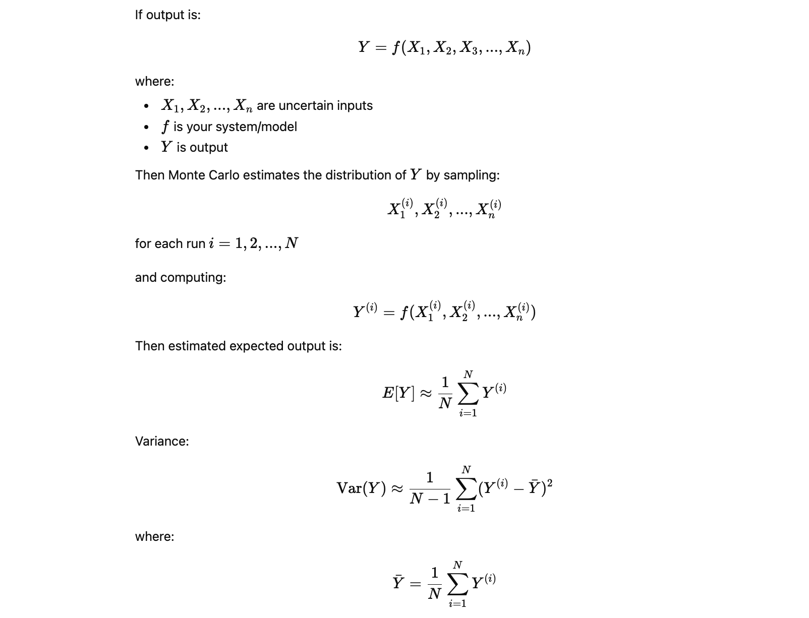
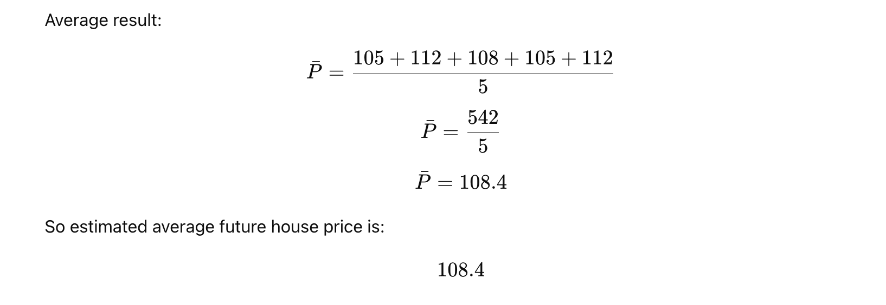
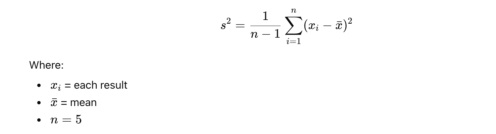
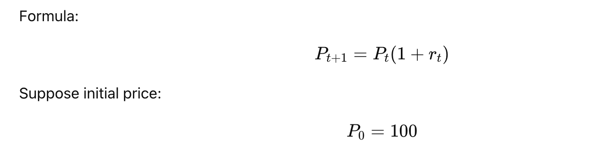
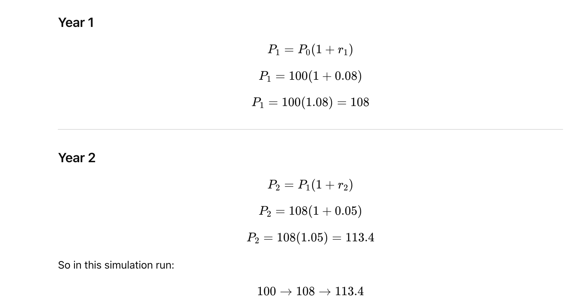
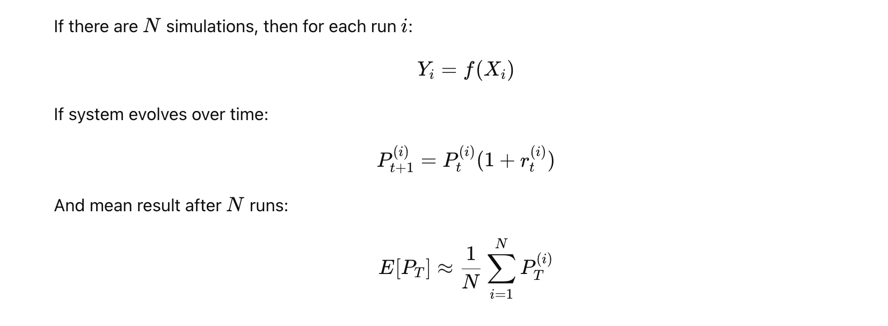
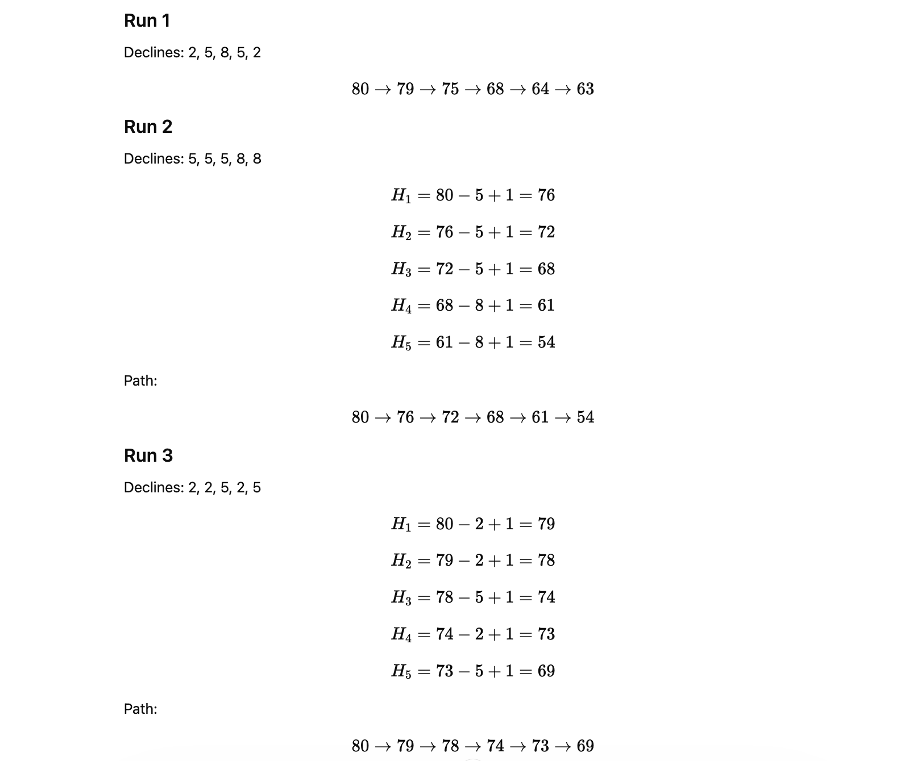
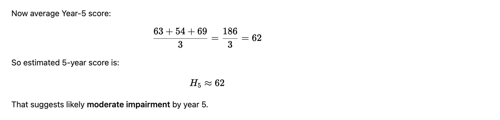

# What is Monte Carlo(MC)?

**Monte Carlo simulation** is a method for solving problems by **repeated random sampling**.

Instead of trying to predict one exact future, it runs the same model many times with random inputs and shows the **distribution of possible outcomes**.

It is used when:

- there is uncertainty
- inputs can vary
- you want risk ranges, not just one number

Examples:

- stock price risk
- delivery time prediction
- disease progression uncertainty
- project cost estimation
- house price scenario analysis

## General formula idea



## Monte Carlo step by step with formula and manual calculation.

## Example: House price after 1 year

Suppose current house price is:
`P0​=100`

Assume yearly growth rate is uncertain.

Possible yearly growth scenarios:

- `5%`
- `8%`
- `12%`

Instead of choosing only one growth rate, Monte Carlo will **randomly sample** one growth rate each run and calculate the future house price.

**1. Formula**

Future price after 1 year: 
`P1​=P0​×(1+r)`

Where:

- `P0` = current price
- `r` = random growth rate
- `P1` = future price


**2. Input values**

Let:

`P0​=100`

Possible random growth rates:

`r∈{0.05, 0.08, 0.12}`

**3. Monte Carlo idea**

Run the same formula multiple times using random values of `r`.

Suppose 5 random simulation runs gave:

- `Run 1 → r=0.05`
- `Run 2 → r=0.12`
- `Run 3 → r=0.08`
- `Run 4 → r=0.05`
- `Run 5 → r=0.12`

Now calculate each run.

**4. Step-by-step calculation**

**Run 1**

Formula:

`P1 = 100 × (1+0.05)`
`P1 = 100 × 1.05`
`P1 = 105`

**Run 2**

`P1 = 100 × (1+0.12)`
`P1 = 100 × 1.12`
`P1 = 112`

**Run 3**

`P1​ = 100 × (1+0.08)`
`P1 = 100 × 1.08`
`P1 = 108`

**Run 4**

`P1 = 100 × (1+0.05)`
`P1 = 100 × 1.05`
`P1 = 105`

**Run 5**

`P1 = 100 × (1+0.12)`
`P1 = 100 × 1.12`
`P1 = 112`

## Results table

| Run | Random Growth Rate (r) | Formula           | Final Price |
| --- | ---------------------: | ----------------- | ----------: |
| 1   |                   0.05 | (100 \times 1.05) |         105 |
| 2   |                   0.12 | (100 \times 1.12) |         112 |
| 3   |                   0.08 | (100 \times 1.08) |         108 |
| 4   |                   0.05 | (100 \times 1.05) |         105 |
| 5   |                   0.12 | (100 \times 1.12) |         112 |


**So Monte Carlo outputs are:**

`105, 112, 108, 105, 112`

**6. Expected value calculation**



**7. Variance and uncertainty**

Now calculate how spread out the results are.

Formula for sample variance:



We already have:

`xˉ = 108.4`

Now differences:

**Run 1**

`105 − 108.4 = −3.4`
`(−3.4)2 = 11.56`

**Run 2**

`112 − 108.4 = 3.6`
`(3.6)2 = 12.96`

**Run 3**

`108 − 108.4 = −0.4`
`(−0.4)2 = 0.16`

**Run 4**

`105 − 108.4 = −3.4`
`(−3.4)2 = 11.56`

**Run 5**

`112 − 108.4 = 3.6`
`(3.6)2 = 12.96`

**Now sum:**

`11.56 + 12.96 + 0.16 + 11.56 + 12.96 = 49.20`

**Variance & Standard deviation:**


So:

- `mean = 108.4`
- `standard deviation ≈ 3.51`


**8. Final interpretation**

This means:

- current price = 100
- expected 1-year price ≈ 108.4
- outcomes vary around this value
- some scenarios give 105
- some scenarios give 112

So Monte Carlo is not giving one fixed answer. It gives a **range of possible answers**.


**9. Slightly more realistic 2-year example**

Now let’s do **2 years**, because this shows how simulation works over time.



Assume for one simulation run:

- `Year 1 growth = 8% = 0.08`
- `Year 2 growth = 5% = 0.05`




**10. Multiple 2-year runs**

Suppose 3 simulation runs:

**Run 1**

- `Year 1 = 8%`
- `Year 2 = 5%`

`P1​ = 100 × 1.08 = 108`
`P2​ = 108 × 1.05 = 113.4`

**Run 2**

- `Year 1 = 12%`
- `Year 2 = 8%`

`P1​ = 100 × 1.12 = 112`
`P2 ​= 112 × 1.08 = 120.96`

**Run 3**

- `Year 1 = 5%`
- `Year 2 = 12%`

`P1​ = 100 × 1.05 = 105`
`P2 ​= 105 × 1.12 = 117.6`

**11. 2-year results table**

| Run | Year 1 Growth | Year 2 Growth | Year 1 Price | Year 2 Price |
| --- | ------------: | ------------: | -----------: | -----------: |
| 1   |            8% |            5% |       108.00 |       113.40 |
| 2   |           12% |            8% |       112.00 |       120.96 |
| 3   |            5% |           12% |       105.00 |       117.60 |


Final 2-year outputs:

`113.4, 120.96, 117.6`


**12. General Monte Carlo formula**



**13. Python code for the same simple example**

```
import random
import statistics

P0 = 100
growth_rates = [0.05, 0.08, 0.12]

results = []

for run in range(1000):
    r = random.choice(growth_rates)
    P1 = P0 * (1 + r)
    results.append(P1)
    print(f"Run {run+1}: r={r}, Final Price={P1}")

mean_result = statistics.mean(results)
std_result = statistics.stdev(results)

print("All results:", results)
print("Mean:", mean_result)
print("Std Dev:", std_result)
```

**14. One more very simple business example**

Suppose a shop’s daily sales depend on customer count.

Formula:

`Sales = Customers × Average Spend`

Assume:

- `average spend = 500`
- `customers can be 80, 100, or 120 randomly`

Then simulation:

**Run 1**

`80 × 500 = 40000`

**Run 2**

`100 × 500 = 50000`

**Run 3**

`120 × 500 = 60000`


This is also Monte Carlo.


Monte Carlo means:

1. choose a formula
2. identify uncertain inputs
3. sample random values
4. calculate output many times
5. use average, spread, and probabilities


## Neuro Digital Twin example for 5 years

**Problem**

Suppose we want to simulate one patient’s **brain health progression** for 5 years.

We define a simple health score:

- `100 = perfectly healthy`
- `0 = very severe decline`

Current patient score:

`H0​ = 80`

We assume every year health may decline because of disease progression.

But decline is `uncertain`, so we simulate it.

**1. Basic formula**

For each year:

`Ht+1 ​= Ht ​− Dt ​+ Tt​`

Where:

- `Ht = health score at year`
- `Dt = disease decline in that year`
- `Tt = treatment benefit in that year`

**2. Example assumptions**

Suppose:

- initial health score = `80`
- yearly disease decline can be:
    - mild = `2`
    - medium = `5`
    - severe = `8`
- yearly treatment benefit = `1`

So formula becomes:

`Ht+1 = Ht ​− Dt ​+ 1`

Net yearly change depends on `Dt`

**3. One 5-year simulation run**

Suppose random yearly declines are:

- `Year 1: D1​ = 2`
- `Year 2: D2​ = 5`
- `Year 3: D3​ = 8`
- `Year 4: D4​ = 5`
- `Year 5: D5 ​= 2`

Now calculate step by step.

**Year 0**

Initial score: `H0 = 80`

**Year 1**

`H1 = H0​ − D1 ​+ 1`
`H1 = 80 − 2 + 1`
`H1 = 79`

**Year 2**

`H2 = H1​ − D2 ​+ 1`
`H2 = 79 − 5 + 1`
`H2 = 75`

**Year 3**

`H3 = H2​ − D3 ​+ 1`
`H3 = 75 − 8 + 1`
`H3 = 68`


**Year 4**

`H4 = H3​ − D4 ​+ 1`
`H4 = 68 − 5 + 1`
`H4 = 64`

**Year 5**

`H5 = H4​ − D5 ​+ 1`
`H5 = 64 − 2 + 1`
`H5 = 63`


**Result table for one patient twin**

| Year | Previous Health | Disease Decline | Treatment Benefit | New Health |
| ---- | --------------: | --------------: | ----------------: | ---------: |
| 0    |               - |               - |                 - |         80 |
| 1    |              80 |               2 |                 1 |         79 |
| 2    |              79 |               5 |                 1 |         75 |
| 3    |              75 |               8 |                 1 |         68 |
| 4    |              68 |               5 |                 1 |         64 |
| 5    |              64 |               2 |                 1 |         63 |


So this one simulation path is:

`80 → 79 → 75 → 68 → 64 → 63`

This is the patient’s **5-year digital twin trajectory**.


**5. Add disease states also**

Now let’s make it more like a real Neuro Digital Twin.

Suppose health score maps to stages:

| Health Score | State               |
| ------------ | ------------------- |
| 85–100       | Normal              |
| 70–84        | Mild Impairment     |
| 50–69        | Moderate Impairment |
| 0–49         | Severe Impairment   |


Now from our result:

- `Year 0: 80 → Mild`
- `Year 1: 79 → Mild`
- `Year 2: 75 → Mild`
- `Year 3: 68 → Moderate`
- `Year 4: 64 → Moderate`
- `Year 5: 63 → Moderate`


So over 5 years, patient moves from Mild to Moderate.


**7. Full Neuro Digital Twin idea**

A practical Neuro Digital Twin can combine:

| Layer                            | Role                             |
| -------------------------------- | -------------------------------- |
| MRI / biomarkers / clinical data | current patient condition        |
| AI model                         | estimate current disease risk    |
| Markov model                     | yearly disease state progression |
| Monte Carlo                      | run many uncertain futures       |
| Digital Twin dashboard           | live patient twin                |


**8. 3 possible 5-year futures**

Now instead of only one run, let’s simulate 3 possible futures.




**9. Table of 3 simulated futures**

| Run | Year 0 | Year 1 | Year 2 | Year 3 | Year 4 | Year 5 |
| --- | -----: | -----: | -----: | -----: | -----: | -----: |
| 1   |     80 |     79 |     75 |     68 |     64 |     63 |
| 2   |     80 |     76 |     72 |     68 |     61 |     54 |
| 3   |     80 |     79 |     78 |     74 |     73 |     69 |





**10. Python code for simple 5-year Neuro Digital Twin**

```
import random
import statistics

# Initial patient health
H0 = 80

# Possible yearly disease declines
declines = [2, 5, 8]

# Fixed yearly treatment benefit
treatment_benefit = 1

# Number of simulation runs
num_runs = 10

all_paths = []

for run in range(num_runs):
    health = H0
    path = [health]

    for year in range(1, 6):
        decline = random.choice(declines)
        health = health - decline + treatment_benefit
        health = max(0, min(100, health))  # keep score between 0 and 100
        path.append(health)

    all_paths.append(path)
    print(f"Run {run+1}: {path}")

# Final scores after 5 years
final_scores = [path[-1] for path in all_paths]

print("\nFinal 5-year scores:", final_scores)
print("Mean final score:", statistics.mean(final_scores))
print("Std Dev:", statistics.stdev(final_scores))
```


**11. Example output meaning**

```
Run 1: [80, 79, 75, 68, 64, 63]
Run 2: [80, 76, 72, 68, 61, 54]
Run 3: [80, 79, 78, 74, 73, 69]
...
Mean final score: 61.8
Std Dev: 5.2
```

Meaning:

- patient starts at 80
- many future paths are simulated
- average 5-year score is around 62
- some runs are better
- some are worse

This is exactly what a digital twin does:

- mirror patient now
- simulate future
- support prediction


**12. More realistic Neuro Digital Twin formula**

A more realistic equation can be:

`Ht+1​ = Ht ​− α − βBt ​− γAt ​+ δTt ​+ ϵt`

Where:

- `Ht = health score`
- `α = natural aging effect`
- `Bt = biomarker burden`
- `β = biomarker impact`
- `At = atrophy / MRI damage`
- `γ = imaging impact`
- `Tt = treatment effect`
- `δ = treatment strength`
- `ϵt = uncertainty/random noise`


This is closer to production use.


**13. Real example with values**

Suppose:

- initial health = 80
- aging effect = 1
- biomarker burden = 2
- biomarker coefficient = 1.5
- MRI atrophy = 1
- MRI coefficient = 2
- treatment effect = 2
- treatment coefficient = 1
- random noise = 1


Then:


So after one year health becomes 75.

This is how a real digital twin score can be computed from patient data.

**14. Enterprise interpretation**

For **Neuro Digital Twin**, the 5-year output can answer questions like:

- probability of decline to moderate stage
- expected year when severe impairment begins
- treatment impact over 5 years
- best case / worst case / average case
- confidence interval for progression

**15. Final understanding**

A **5-year Neuro Digital Twin** example means:

1. start with current patient state

2. define disease progression formula

3. include uncertainty

4. simulate year-by-year future

5. run many possible futures

6. analyze likely outcome


**16. One-line summary**

Example:

`Ht+1 = Ht ​− Dt ​+ Tt​`

Run this for 5 years, many times, and you get the patient’s possible future neurological trajectories.

**Vitals**

| Parameter                | Unit | Sample Value | Remarks                    |
| ------------------------ | ---- | ------------ | -------------------------- |
| Heart Rate (avg)         | bpm  | 72           | Normal resting: 60–100 bpm |
| BP Systolic              | mmHg | 120          | Normal: ~90–120 mmHg       |
| BP Diastolic             | mmHg | 80           | Normal: ~60–80 mmHg        |
| Body Temperature         | °F   | 98.4         | Normal: ~97–99 °F          |
| Oxygen Saturation (SpO₂) | %    | 98           | Normal: 95–100%            |


**Smartwatch / Device**

| Parameter                    | Unit | Sample Value | Remarks                      |
| ---------------------------- | ---- | ------------ | ---------------------------- |
| Resting Heart Rate           | bpm  | 68           | Normal range: 60–100 bpm     |
| Max Heart Rate               | bpm  | 185          | Depends on age (≈ 220 − age) |
| HRV (Heart Rate Variability) | ms   | 55           | Higher is generally better   |
| Stress Level                 | /100 | 35           | Lower is better              |
| Respiratory Rate             | /min | 14           | Normal: 12–20 breaths/min    |
| Skin Temperature             | °F   | 97.7         | Slight variation is normal   |
| UV Exposure (avg/day)        | min  | 25           | Depends on lifestyle         |


**Activity**

| Parameter             | Unit  | Sample Value | Remarks                                |
| --------------------- | ----- | ------------ | -------------------------------------- |
| Daily Steps (avg)     | steps | 8,500        | Good range: 7,000–10,000+ steps/day    |
| Active Minutes (avg)  | min   | 45           | Recommended: ≥30 min/day               |
| Calories Burned (avg) | kcal  | 2,200        | Depends on age, weight, activity level |


**Sleep**

| Parameter           | Unit  | Sample Value | Remarks                         |
| ------------------- | ----- | ------------ | ------------------------------- |
| Sleep Duration      | hrs   | 7.2          | Ideal: 7–9 hours/night          |
| Deep Sleep          | min   | 95           | Typically 15–25% of total sleep |
| REM Sleep           | min   | 105          | Typically 20–25% of total sleep |
| Sleep Quality Score | /100  | 82           | Higher is better (≥80 good)     |
| Awake Times (night) | times | 2            | 0–2 is normal                   |


**Lab Values**

| Parameter               | Unit  | Sample Value | Remarks                      |
| ----------------------- | ----- | ------------ | ---------------------------- |
| Blood Glucose (fasting) | mg/dL | 92           | Normal: 70–99 mg/dL          |
| HbA1c                   | %     | 5.4          | Normal: <5.7%                |
| Total Cholesterol       | mg/dL | 180          | Desirable: <200 mg/dL        |
| HDL Cholesterol         | mg/dL | 55           | Good: ≥40 (men), ≥50 (women) |
| Hemoglobin              | g/dL  | 14.2         | Normal varies by gender      |
| Creatinine              | mg/dL | 1.0          | Normal: ~0.6–1.3 mg/dL       |
| TSH                     | mIU/L | 2.1          | Normal: ~0.4–4.0 mIU/L       |


**Body Metrics**

| Parameter | Unit  | Sample Value | Remarks                        |
| --------- | ----- | ------------ | ------------------------------ |
| Weight    | kg    | 72           | Depends on height, age, gender |
| BMI       | kg/m² | 23.5         | Normal: 18.5 – 24.9            |


**Neurological**

| Parameter     | Unit | Sample Value | Remarks                                          |
| ------------- | ---- | ------------ | ------------------------------------------------ |
| MMSE Score    | /30  | 28           | Normal: 24–30 (higher is better)                 |
| MoCA Score    | /30  | 26           | Normal: ≥26 (used for mild cognitive impairment) |
| Reaction Time | ms   | 280          | Lower is better (faster response)                |


**Clinical Notes / Doctor Visits**

| Date        | Doctor Name         | Specialty  | Key Observations / Notes                                                                                                                            |
| ----------- | ------------------- | ---------- | --------------------------------------------------------------------------------------------------------------------------------------------------- |
| 09 Apr 2025 | Dr. Michael Roberts | Neurology  | Post-stroke rehab review. Motor function improving (mRS 1). Physiotherapy ongoing (3 sessions/week). BP 143/89 mmHg — within target.                |
| 07 May 2025 | Dr. James Wilson    | Cardiology | Secondary prevention clinic. Antiplatelet compliance confirmed. LDL within target on Atorvastatin. No recurrent TIA symptoms.                       |
| 10 Jun 2025 | Dr. Samuel Park     | Rehab      | Neurology follow-up. Aphasia improving with speech therapy. MMSE 23/30. Resuming light activities. Driving restriction continues (6 months).        |
| 09 Jul 2025 | Dr. Emily Patel     | Neurology  | Cardiology review. Atrial fibrillation rate-controlled (Metoprolol). ECG: sinus rhythm with ectopics. Anticoagulation decision pending repeat echo. |
| 08 Aug 2025 | Dr. Rachel Kim      | Cardiology | Rehab progress. Upper limb recovery ~70%. Fine motor improving. Patient motivated and engaged in therapy.                                           |


**Medications**

| Medication           | Dose   | Frequency            | Start Date  | End Date    | Reason                                    | Status  |
| -------------------- | ------ | -------------------- | ----------- | ----------- | ----------------------------------------- | ------- |
| Aspirin              | 100 mg | Once daily with food | 01 Aug 2023 | Ongoing     | Secondary stroke prevention               | Current |
| Clopidogrel          | 75 mg  | Once daily           | 01 Aug 2023 | 31 Aug 2025 | Dual antiplatelet therapy (initial phase) | Past    |
| Atorvastatin         | 40 mg  | Once nightly         | 01 Aug 2023 | Ongoing     | Dyslipidaemia & cerebrovascular risk      | Current |
| Lisinopril           | 10 mg  | Once daily           | 01 May 2022 | Ongoing     | Hypertension & secondary prevention       | Current |
| Metoprolol Succinate | 25 mg  | Twice daily          | 01 Oct 2025 | Ongoing     | Rate control for atrial fibrillation      | Current |


**MRI Scans & Analysis**

| Date        | Scan Type   | Scan ID | Key Findings                                                                                                                                                  |
| ----------- | ----------- | ------- | ------------------------------------------------------------------------------------------------------------------------------------------------------------- |
| 12 Apr 2025 | T1-weighted | Scan 1  | Old infarct in left MCA territory — stable chronic changes. No new acute ischemic lesions. Mild periventricular leukoaraiosis. No hemorrhagic transformation. |
| 09 Jul 2025 | T2          | Scan 2  | Established cortical and subcortical infarcts unchanged. No new lesions. Mild generalized cerebral atrophy consistent with vascular disease.                  |
| 10 Oct 2025 | FLAIR       | Scan 3  | Chronic infarct changes stable. Small vessel disease — Fazekas grade 2. No new ischemic or hemorrhagic events.                                                |
| 09 Jan 2026 | T1-weighted | Scan 4  | Stable lacunar infarcts in basal ganglia and corona radiata. No new acute pathology. Cerebrovascular disease unchanged.                                       |


**Biomarkers**

| Category        | Biomarker                         | Unit        | Normal / Reference | What it Indicates     |
| --------------- | --------------------------------- | ----------- | ------------------ | --------------------- |
| Blood           | Amyloid Beta (Aβ42/Aβ40)          | Ratio       | ↓ in AD            | Plaque deposition     |
| Blood           | Total Tau (t-tau)                 | pg/mL       | Low                | Neuronal damage       |
| Blood           | Phosphorylated Tau (p-tau181/217) | pg/mL       | Low                | Alzheimer’s pathology |
| Blood           | Neurofilament Light (NfL)         | pg/mL       | <10–20             | Axonal injury         |
| Blood           | GFAP                              | pg/mL       | Low                | Astrocyte activation  |
| Blood           | S100B                             | µg/L        | <0.1               | BBB damage            |
| Blood           | CRP                               | mg/L        | <3                 | Inflammation          |
| Blood           | IL-6                              | pg/mL       | Low                | Neuroinflammation     |
| Blood           | Homocysteine                      | µmol/L      | <15                | Stroke/dementia risk  |
| Blood           | Vitamin B12                       | pg/mL       | 200–900            | Cognitive function    |
| Blood           | Folate                            | ng/mL       | >3                 | Neural health         |
| CSF             | Aβ42                              | pg/mL       | ↓                  | Alzheimer’s           |
| CSF             | Total Tau                         | pg/mL       | ↑                  | Neurodegeneration     |
| CSF             | p-tau                             | pg/mL       | ↑                  | Alzheimer’s           |
| CSF             | Neurogranin                       | pg/mL       | ↑                  | Synaptic loss         |
| CSF             | YKL-40                            | ng/mL       | ↑                  | Neuroinflammation     |
| Genetic         | APOE ε4                           | Genotype    | Risk allele        | Alzheimer’s risk      |
| Genetic         | APP Mutation                      | Mutation    | Rare               | Early AD              |
| Genetic         | PSEN1/PSEN2                       | Mutation    | Rare               | Familial AD           |
| Genetic         | BDNF                              | ng/mL       | Normal             | Neuroplasticity       |
| Imaging         | Hippocampal Volume                | mm³         | Stable             | Memory decline        |
| Imaging         | Cortical Thickness                | mm          | Stable             | Neurodegeneration     |
| Imaging         | White Matter Lesions (Fazekas)    | Grade (0–3) | 0–1                | Small vessel disease  |
| Imaging         | Brain Atrophy Rate                | %/year      | <1%                | Degeneration          |
| Imaging         | FDG-PET Metabolism                | SUV         | Normal             | Brain activity        |
| Imaging         | Amyloid PET                       | Pos/Neg     | Negative           | Plaque presence       |
| Imaging         | Tau PET                           | Pos/Neg     | Negative           | Tau pathology         |
| Neurophysiology | EEG Alpha Power                   | Hz          | Normal             | Brain function        |
| Neurophysiology | EEG Beta/Gamma                    | Hz          | Normal             | Cognition             |
| Neurophysiology | P300 Latency                      | ms          | <300               | Processing speed      |
| Neurophysiology | Reaction Time                     | ms          | Lower better       | Cognitive speed       |
| Cognitive       | MMSE                              | /30         | ≥24                | Cognitive status      |
| Cognitive       | MoCA                              | /30         | ≥26                | Mild impairment       |
| Cognitive       | ADAS-Cog                          | Score       | Low                | Alzheimer’s severity  |
| Cognitive       | CDR                               | 0–3         | 0                  | Dementia staging      |
| Digital         | Sleep Efficiency                  | %           | >85%               | Brain recovery        |
| Digital         | HRV                               | ms          | Higher better      | Autonomic function    |
| Digital         | Gait Speed                        | m/s         | >1.0               | Decline risk          |
| Digital         | Typing Variability                | ms          | Stable             | Early decline         |
| Digital         | Speech Analysis                   | —           | Stable             | Neurodegeneration     |

**Patient Family History**

| Relation             | Condition / Disease | Age of Onset | Status   | Notes                        |
| -------------------- | ------------------- | ------------ | -------- | ---------------------------- |
| Father               | Ischemic Stroke     | 62           | Deceased | Hypertension history         |
| Mother               | Alzheimer’s Disease | 70           | Alive    | Mild cognitive decline       |
| Paternal Grandfather | Heart Disease (CAD) | 65           | Deceased | Smoker                       |
| Maternal Grandmother | Dementia            | 75           | Deceased | Late-stage cognitive decline |
| Sibling (Brother)    | Hypertension        | 45           | Alive    | On medication                |
| Sibling (Sister)     | Diabetes Type 2     | 50           | Alive    | Controlled with diet         |

**Genetic Biomarkers with Lab Tests**

| Gene / Marker     | Disease / Risk              | Lab Test Name                 | Sample Type    | Method                | Availability |
| ----------------- | --------------------------- | ----------------------------- | -------------- | --------------------- | ------------ |
| APOE (ε2/ε3/ε4)   | Alzheimer’s risk            | APOE Genotyping               | Blood / Saliva | PCR / SNP Genotyping  | Common       |
| APP               | Early-onset Alzheimer’s     | APP Gene Sequencing           | Blood          | NGS / Sanger          | Specialized  |
| PSEN1             | Familial Alzheimer’s        | PSEN1 Mutation Test           | Blood          | NGS                   | Specialized  |
| PSEN2             | Familial Alzheimer’s        | PSEN2 Mutation Test           | Blood          | NGS                   | Specialized  |
| BDNF (Val66Met)   | Neuroplasticity             | BDNF SNP Test                 | Blood / Saliva | PCR                   | Moderate     |
| MAPT              | Tauopathy                   | MAPT Genotyping               | Blood          | NGS / PCR             | Specialized  |
| LRRK2             | Parkinson’s                 | LRRK2 Mutation Test           | Blood          | NGS                   | Specialized  |
| SNCA              | Parkinson’s                 | SNCA Gene Test                | Blood          | NGS                   | Specialized  |
| PARK2 (PRKN)      | Parkinson’s                 | PARK2 Mutation Test           | Blood          | NGS                   | Specialized  |
| HTT (CAG repeats) | Huntington’s                | HTT Repeat Expansion Test     | Blood          | PCR Fragment Analysis | Common       |
| MTHFR (C677T)     | Stroke risk                 | MTHFR Mutation Test           | Blood          | PCR                   | Common       |
| NOTCH3            | CADASIL (vascular dementia) | NOTCH3 Gene Test              | Blood          | NGS                   | Specialized  |
| TREM2             | Alzheimer’s risk            | TREM2 Variant Test            | Blood          | NGS                   | Specialized  |
| SOD1              | ALS                         | SOD1 Mutation Test            | Blood          | NGS                   | Specialized  |
| C9orf72           | ALS / FTD                   | C9orf72 Repeat Expansion Test | Blood          | PCR                   | Specialized  |
| SCN1A             | Epilepsy                    | SCN1A Gene Test               | Blood          | NGS                   | Specialized  |
| MECP2             | Rett Syndrome               | MECP2 Mutation Test           | Blood          | NGS                   | Specialized  |
| GRIN2B            | Cognitive disorders         | GRIN2B Gene Test              | Blood          | NGS                   | Specialized  |


**AI Twin Prediction & Risk**


## FINAL MASTER DATASET


| Category        | Feature            | Unit     | Example Value | Frequency         | Source          | Data Type   | Quality   |
| --------------- | ------------------ | -------- | ------------- | ----------------- | --------------- | ----------- | --------- |
| Patient         | Patient_ID         | —        | P001          | Static            | System          | ID          | High      |
| Patient         | Age                | years    | 62            | Yearly            | Clinical        | Numeric     | High      |
| Patient         | Gender             | —        | Male          | Static            | Clinical        | Categorical | High      |
| Vitals          | Resting HR         | bpm      | 68            | Hourly/Daily      | Wearable        | Time-series | Medium    |
| Vitals          | HRV                | ms       | 55            | Daily             | Wearable        | Time-series | Medium    |
| Vitals          | Blood Pressure     | mmHg     | 120/80        | Daily             | Device/Clinic   | Time-series | High      |
| Vitals          | SpO₂               | %        | 98            | Hourly/Daily      | Wearable        | Time-series | Medium    |
| Vitals          | Temperature        | °F       | 98.4          | Daily             | Device          | Time-series | High      |
| Activity        | Steps              | steps    | 8500          | Daily             | Wearable        | Time-series | Medium    |
| Activity        | Active Minutes     | min      | 45            | Daily             | Wearable        | Time-series | Medium    |
| Activity        | Calories           | kcal     | 2200          | Daily             | Wearable        | Time-series | Medium    |
| Sleep           | Sleep Duration     | hrs      | 7.2           | Daily             | Wearable        | Time-series | Medium    |
| Sleep           | REM Sleep          | min      | 105           | Daily             | Wearable        | Time-series | Medium    |
| Sleep           | Deep Sleep         | min      | 95            | Daily             | Wearable        | Time-series | Medium    |
| Biomarker       | Glucose            | mg/dL    | 92            | Monthly           | Lab             | Numeric     | High      |
| Biomarker       | HbA1c              | %        | 5.4           | Quarterly         | Lab             | Numeric     | High      |
| Biomarker       | Cholesterol        | mg/dL    | 180           | Quarterly         | Lab             | Numeric     | High      |
| Biomarker       | CRP                | mg/L     | 2.0           | Monthly/Quarterly | Lab             | Numeric     | High      |
| Biomarker       | Vitamin B12        | pg/mL    | 450           | Quarterly         | Lab             | Numeric     | High      |
| Neuro Biomarker | Aβ42/Aβ40          | Ratio    | 0.08          | Yearly            | Specialized Lab | Numeric     | High      |
| Neuro Biomarker | p-tau              | pg/mL    | 18            | Yearly            | Lab             | Numeric     | High      |
| Neuro Biomarker | NfL                | pg/mL    | 12            | Yearly            | Lab             | Numeric     | High      |
| Genetics        | APOE ε4            | 0/1      | 1             | Once (Lifetime)   | DNA Test        | Binary      | Very High |
| Genetics        | PSEN1              | 0/1      | 0             | Once (Lifetime)   | DNA Test        | Binary      | Very High |
| Imaging         | Hippocampal Volume | mm³      | 3200          | Yearly            | MRI + AI        | Numeric     | High      |
| Imaging         | Brain Atrophy Rate | %        | 0.8           | Yearly            | MRI             | Numeric     | High      |
| Imaging         | Fazekas Score      | 0–3      | 2             | Yearly            | MRI             | Ordinal     | High      |
| Cognitive       | MMSE               | /30      | 28            | Quarterly         | Clinical        | Numeric     | High      |
| Cognitive       | MoCA               | /30      | 26            | Quarterly         | Clinical        | Numeric     | High      |
| Mental Health   | PHQ-9              | /27      | 6             | Monthly           | Questionnaire   | Numeric     | Medium    |
| Mental Health   | GAD-7              | /21      | 5             | Monthly           | Questionnaire   | Numeric     | Medium    |
| Lifestyle       | Smoking            | Yes/No   | No            | Quarterly         | Self-report     | Categorical | Low       |
| Lifestyle       | Alcohol            | Level    | Moderate      | Quarterly         | Self-report     | Categorical | Low       |
| Lifestyle       | Diet Type          | Category | Balanced      | Monthly           | App             | Categorical | Medium    |
| Comorbidity     | Diabetes           | 0/1      | 0             | Static            | Clinical        | Binary      | High      |
| Comorbidity     | Hypertension       | 0/1      | 1             | Static            | Clinical        | Binary      | High      |
| Medication      | Adherence          | %        | 90            | Weekly            | App/Pharmacy    | Numeric     | Medium    |
| Medication      | Drug Name          | —        | Aspirin       | Event-based       | Clinical        | Text        | High      |
| Event           | Stroke Event       | 0/1      | 1             | Event-based       | Clinical        | Binary      | Very High |
| Event           | Hospitalization    | Yes/No   | No            | Event-based       | Clinical        | Binary      | High      |
| Event           | Fall Incident      | Yes/No   | No            | Event-based       | Wearable/Report | Binary      | Medium    |
| Event           | Medication Change  | Yes/No   | Yes           | Event-based       | Clinical        | Binary      | High      |
| Family          | Alzheimer History  | 0/1      | 1             | Static            | Patient         | Binary      | Medium    |
| Family          | Stroke History     | 0/1      | 1             | Static            | Patient         | Binary      | Medium    |
| Environment     | PM2.5              | µg/m³    | 80            | Daily             | API             | Time-series | Medium    |
| Environment     | Noise Level        | dB       | 65            | Daily             | Sensor          | Time-series | Low       |
| Functional      | ADL Score          | 0–6      | 5             | Monthly           | Clinical        | Numeric     | High      |
| Functional      | Mobility           | %        | 85            | Monthly           | Wearable        | Numeric     | Medium    |
| System          | Timestamp          | —        | 2026-03-29    | Continuous        | System          | Time        | High      |
| System          | Data Confidence    | 0–1      | 0.92          | Continuous        | System          | Numeric     | High      |


**Total Parameters in Clinical-Grade Neuro Digital Twin**

| Category            | # Parameters |
| ------------------- | ------------ |
| Patient Info        | 3            |
| Vitals              | 5            |
| Activity            | 3            |
| Sleep               | 3            |
| Biomarkers (basic)  | 5            |
| Neuro Biomarkers    | 3            |
| Genetics            | 2            |
| Imaging (MRI basic) | 3            |
| Cognitive           | 2            |
| Mental Health       | 2            |
| Lifestyle           | 3            |
| Comorbidities       | 2            |
| Medication          | 2            |
| Events              | 4            |
| Family History      | 2            |
| Environment         | 2            |
| Functional          | 2            |
| System (metadata)   | 2            |

